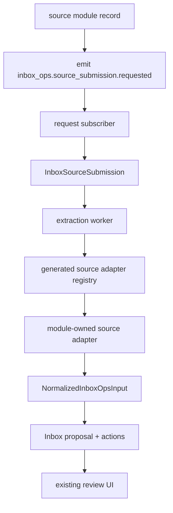

# Inbox Ops

Inbox Ops is a source-oriented proposal engine. Email forwarding remains the built-in compatibility path, but `inbox_ops` no longer assumes every proposal starts from an `InboxEmail` record.

Instead, source modules can submit their own records into Inbox Ops through a shared adapter contract plus one explicit request event. Inbox Ops owns the review and execution workflow; source modules own loading and normalizing their own data.

## Overview

- **Location**: `packages/core/src/modules/inbox_ops/`
- **Shared contract**: `@open-mercato/shared/modules/inbox-ops-sources`
- **Generated registry**: `apps/mercato/.mercato/generated/inbox-ops-sources.generated.ts`
- **Public ingress event**: `inbox_ops.source_submission.requested`
- **Internal intake record**: `InboxSourceSubmission`
- **Built-in adapters**: legacy email (`inbox_ops:inbox_email`) and manual text submission (`inbox_ops:source_submission`)

This keeps Inbox Ops extensible without forcing new source modules to fake email records.

## Source Intake Flow



### Ownership split

**Source modules own:**

- their source entities and artifacts
- `inbox-ops-sources.ts` adapter exports
- readiness rules and normalization logic
- emitting the request event when a record is extraction-ready

**Inbox Ops owns:**

- source-submission persistence and deduplication
- prompt construction and LLM execution
- proposal, action, and discrepancy lifecycle
- review UI and business action execution

## Adding A New Source

### 1. Export `inbox-ops-sources.ts`

Add an optional `inbox-ops-sources.ts` file in your module. Export either `inboxOpsSourceAdapters` or a default array. The generator will discover the file and add it to the runtime registry.

```ts
import type { EntityManager } from '@mikro-orm/postgresql'
import { findOneWithDecryption } from '@open-mercato/shared/lib/encryption/find'
import type {
  InboxOpsSourceAdapter,
  NormalizedInboxOpsInput,
} from '@open-mercato/shared/modules/inbox-ops-sources'
import { PhoneCall } from './data/entities'

function resolveEm(ctx: { resolve: <T = unknown>(name: string) => T }): EntityManager {
  return (ctx.resolve('em') as EntityManager).fork()
}

const phoneCallSourceAdapter: InboxOpsSourceAdapter<PhoneCall> = {
  sourceEntityType: 'phone_calls:call',
  displayKind: 'call',
  displayIcon: 'phone',
  async loadSource(args, ctx) {
    const em = resolveEm(ctx)
    const call = await findOneWithDecryption(
      em,
      PhoneCall,
      {
        id: args.sourceEntityId,
        tenantId: args.tenantId,
        organizationId: args.organizationId,
        deletedAt: null,
      },
      undefined,
      {
        tenantId: args.tenantId,
        organizationId: args.organizationId,
      },
    )

    if (!call) {
      throw new Error(`Phone call not found: ${args.sourceEntityId}`)
    }

    return call
  },
  assertReady(call) {
    if (!call.transcript) {
      throw new Error('Phone call transcript is not ready yet')
    }
  },
  getVersion(call) {
    return call.updatedAt.toISOString()
  },
  buildInput(call, args): NormalizedInboxOpsInput {
    return {
      sourceEntityType: args.sourceEntityType,
      sourceEntityId: call.id,
      sourceVersion: call.updatedAt.toISOString(),
      title: call.subject || undefined,
      body: call.transcript,
      bodyFormat: 'text',
      participants: [],
      capabilities: {
        canDraftReply: false,
        canUseTimelineContext: true,
      },
      sourceMetadata: {
        direction: call.direction,
      },
    }
  },
  buildPromptHints() {
    return {
      sourceLabel: 'phone call',
      sourceKind: 'call transcript',
      primaryEvidence: ['body', 'timeline'],
      participantIdentityMode: 'mixed',
      replySupport: 'none',
    }
  },
  buildSnapshot(call) {
    return {
      startedAt: call.startedAt.toISOString(),
      direction: call.direction,
    }
  },
}

export const inboxOpsSourceAdapters = [phoneCallSourceAdapter]
export default inboxOpsSourceAdapters
```

### 2. Emit the request event

When the source record is ready for extraction, emit `inbox_ops.source_submission.requested` with a descriptor that carries trusted tenant and organization scope.

```ts
import {
  inboxOpsSourceSubmissionRequestedSchema,
  type InboxOpsSourceSubmissionRequested,
} from '@open-mercato/shared/modules/inbox-ops-sources'

const eventBus = ctx.resolve('eventBus') as {
  emitEvent: (
    eventId: string,
    payload: unknown,
    options?: { persistent?: boolean },
  ) => Promise<void>
}

const payload: InboxOpsSourceSubmissionRequested = {
  descriptor: {
    sourceEntityType: 'phone_calls:call',
    sourceEntityId: call.id,
    sourceVersion: call.updatedAt.toISOString(),
    tenantId: call.tenantId,
    organizationId: call.organizationId,
    requestedByUserId: call.userId,
    triggerEventId: 'phone_calls.call.completed',
  },
}

inboxOpsSourceSubmissionRequestedSchema.parse(payload)

await eventBus.emitEvent('inbox_ops.source_submission.requested', payload, {
  persistent: true,
})
```

`initialNormalizedInput` and `initialSourceSnapshot` are optional. They are mainly useful when the caller already has normalized content in hand, such as the manual text extract flow.

Core and app modules in this repo also use `emitSourceSubmissionRequested(...)` as a convenience helper, but the stable contract is the event name plus the shared payload schema above.

### 3. Run the generator

After adding or changing `inbox-ops-sources.ts`, run:

```bash
yarn generate
```

The generator writes `apps/mercato/.mercato/generated/inbox-ops-sources.generated.ts`, which exports:

- `inboxOpsSourceConfigEntries`
- `inboxOpsSourceAdapters`
- `getInboxOpsSourceAdapter(sourceEntityType)`

Inbox Ops resolves adapters through that generated registry at runtime.

## Adapter Contract

Each adapter implements the shared `InboxOpsSourceAdapter` contract:

```ts
export interface InboxOpsSourceAdapter<TLoaded = unknown> {
  sourceEntityType: string
  displayKind?: string
  displayIcon?: string
  loadSource(args, ctx): Promise<TLoaded>
  assertReady?(loaded, args, ctx): Promise<void> | void
  getVersion?(loaded, args, ctx): Promise<string | null> | string | null
  buildInput(loaded, args, ctx): Promise<NormalizedInboxOpsInput> | NormalizedInboxOpsInput
  buildPromptHints?(loaded, args, ctx): Promise<InboxOpsSourcePromptHints | null> | InboxOpsSourcePromptHints | null
  buildSnapshot?(loaded, args, ctx): Promise<Record<string, unknown> | null> | Record<string, unknown> | null
}
```

### What each method is for

| Method | Required | Purpose |
|---|---|---|
| `sourceEntityType` | Yes | Stable source key, typically `module:entity` |
| `loadSource(...)` | Yes | Load the source-owned record using trusted `tenantId` and `organizationId` |
| `buildInput(...)` | Yes | Convert the loaded source into `NormalizedInboxOpsInput` |
| `assertReady?(...)` | No | Fail or defer when upstream artifacts are not ready yet |
| `getVersion?(...)` | No | Provide stable versioning for deduplication and re-submission |
| `buildPromptHints?(...)` | No | Supply declarative source semantics while Inbox Ops still owns final prompt construction |
| `buildSnapshot?(...)` | No | Persist a shallow audit/UI snapshot without copying the full source payload |

## Normalized Input Rules

- `body` is required and capped by `INBOX_OPS_SOURCE_BODY_HARD_LIMIT` in the shared schema.
- `participants`, `timeline`, `attachments`, `facts`, and `sourceMetadata` are additive context, not a replacement for `body`.
- `sourceEntityType`, `sourceEntityId`, and optional `sourceArtifactId` are the canonical source link carried through the pipeline.
- Use open-vocabulary strings for roles, source kinds, directions, and evidence labels.
- Query source data with trusted `tenantId` and `organizationId` from the descriptor. Do not infer scope from user input.

## Events And Compatibility

Inbox Ops now exposes a source-submission lifecycle in addition to the legacy email contract:

- `inbox_ops.source_submission.requested`
- `inbox_ops.source_submission.received`
- `inbox_ops.source_submission.processed`
- `inbox_ops.source_submission.failed`
- `inbox_ops.source_submission.deduplicated`

Compatibility notes:

- Legacy email ingress still works through the same pipeline by using the built-in email adapter.
- `POST /api/inbox_ops/extract` now returns `sourceSubmissionId` and keeps `emailId` as a temporary compatibility alias.
- Proposal APIs expose additive source-link fields so older email-only consumers can keep working while new source-aware consumers adopt the richer contract.

## Existing Examples In This Repo

- `packages/core/src/modules/inbox_ops/inbox-ops-sources.ts` registers the built-in legacy email and manual text adapters.
- `packages/core/src/modules/messages/inbox-ops-sources.ts` shows a non-email source adapter wired from the messages module.
- `apps/mercato/src/modules/example/subscribers/messages-sent-inbox-ops-demo.ts` shows an app-level subscriber that routes selected messages into Inbox Ops.

## See Also

- [User guide: Inbox Ops](/user-guide/inbox-ops)
- [Events overview](/framework/events/overview)
- [Current extension surfaces](/framework/extensibility/current-surfaces)
- [Messages system](/framework/modules/messages)
