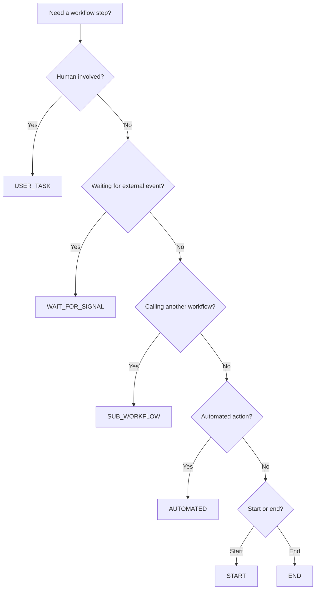

# Step Types

Steps are the building blocks of workflows. Each step type serves a specific purpose in orchestrating your business process. This guide explains when and how to use each type.

## Step Types Overview

| Step Type | Purpose | Execution | When to Use |
|-----------|---------|-----------|-------------|
| **START** | Entry point | Auto-advances immediately | Beginning of every workflow |
| **END** | Exit point | Completes the workflow | End of every workflow path |
| **USER_TASK** | Human decision/input | Waits for user action | Approvals, reviews, manual data entry |
| **AUTOMATED** | Automated processing | Executes activities, then advances | API calls, calculations, data updates |
| **WAIT_FOR_SIGNAL** | External trigger | Waits for signal from outside | Payment confirmations, webhook callbacks |
| **SUB_WORKFLOW** | Call another workflow | Executes child workflow | Reusable processes, modular workflows |

## START

The START step is the entry point for every workflow. When you start a workflow instance, execution begins here.

**Characteristics:**
- Every workflow must have exactly one START step
- Automatically advances to the next step (no waiting)
- Cannot have incoming transitions (it's the beginning)
- Must have at least one outgoing transition

**Use Cases:**
- Initialize workflow context with input data
- Mark the beginning of the process
- Route to the first real step

**Example:**
```json
{
  "stepId": "start",
  "stepName": "Start",
  "stepType": "START"
}
```

## END

The END step marks completion of the workflow. When execution reaches an END step, the workflow instance is marked as COMPLETED.

**Characteristics:**
- Workflows must have at least one END step
- Can have multiple END steps for different outcomes (approved, rejected, cancelled)
- Cannot have outgoing transitions (it's the end)
- Automatically sets workflow status to COMPLETED

**Use Cases:**
- Mark successful completion
- Mark failure or cancellation
- Differentiate between multiple outcomes

**Example:**
```json
{
  "stepId": "end-approved",
  "stepName": "Request Approved",
  "stepType": "END"
}
```

## USER_TASK

USER_TASK steps require human intervention—someone needs to review data, make a decision, or provide input.

**Characteristics:**
- Creates a task in the user's task queue
- Workflow pauses at this step until the task is completed
- Can be assigned to specific users or roles
- Supports custom forms for data collection
- Tracks SLA (service level agreements) and escalation

**Configuration:**

### Assignment

Assign tasks to specific users or roles:

- **Assigned to User**: Direct assignment to a single user by user ID
- **Assigned to Roles**: Any user with the specified role(s) can claim and complete the task
- **Assignment Rules**: Dynamic assignment based on workflow context (e.g., assign to the requester's manager)

### Form Schema

Define fields users must fill when completing the task:

```json
{
  "userTaskConfig": {
    "formSchema": [
      {
        "fieldName": "decision",
        "fieldType": "select",
        "label": "Decision",
        "required": true,
        "options": ["approve", "reject"]
      },
      {
        "fieldName": "comments",
        "fieldType": "textarea",
        "label": "Comments",
        "required": false
      }
    ]
  }
}
```

### SLA and Escalation

- **SLA Duration**: Define how long the task should take (e.g., "2 days")
- **Escalation Rules**: Automatically reassign or notify if the task is overdue

**Use Cases:**
- Approval workflows (purchase orders, expense reports)
- Review processes (content review, code review)
- Data entry (capturing information not available in the system)
- Decision points (route based on human judgment)

[**Learn more about user tasks →**](./user-tasks)

## AUTOMATED

AUTOMATED steps perform automatic processing without human intervention. They execute activities (like calling APIs or sending emails) and automatically advance when complete.

**Characteristics:**
- Executes immediately when reached
- Can run activities during the step or on outgoing transitions
- Automatically advances after activities complete
- Supports async execution for long-running activities

**Configuration:**

Activities can be configured either on the step itself or on outgoing transitions:

```json
{
  "stepId": "process-payment",
  "stepName": "Process Payment",
  "stepType": "AUTOMATED",
  "activities": [
    {
      "activityId": "call-payment-gateway",
      "activityName": "Call Payment Gateway",
      "activityType": "CALL_API",
      "config": {
        "url": "https://payment-gateway.example.com/charge",
        "method": "POST",
        "body": {
          "amount": "{{context.amount}}",
          "currency": "USD"
        }
      }
    }
  ]
}
```

**Use Cases:**
- Call external APIs (payment processing, inventory checks)
- Send notifications (email, SMS)
- Update database records
- Perform calculations or transformations
- Emit domain events

[**Learn more about activities →**](./activities)

## WAIT_FOR_SIGNAL

WAIT_FOR_SIGNAL steps pause workflow execution until an external system sends a specific signal. This is useful for long-running processes that depend on events outside the workflow.

**Characteristics:**
- Workflow pauses at this step
- Waits for a signal with a matching name
- Merges signal payload into workflow context
- Automatically advances when signal is received
- Supports timeouts to avoid waiting indefinitely

**Configuration:**

```json
{
  "stepId": "wait-payment",
  "stepName": "Wait for Payment Confirmation",
  "stepType": "WAIT_FOR_SIGNAL",
  "signalConfig": {
    "signalName": "payment-confirmed",
    "timeout": "7 days"
  }
}
```

**Sending Signals:**

External systems send signals via API:

```typescript
POST /api/workflows/instances/{instanceId}/signal
{
  "signalName": "payment-confirmed",
  "payload": {
    "transactionId": "txn_123",
    "paidAmount": 150.00
  }
}
```

The signal payload is merged into the workflow context, making it available to subsequent steps.

**Use Cases:**
- Wait for payment confirmation from payment gateway
- Wait for external approval from third-party system
- Wait for webhook callbacks (shipping updates, API responses)
- Coordinate with other workflows or systems

[**Learn more about signals →**](./signals)

## SUB_WORKFLOW

SUB_WORKFLOW steps call another workflow as a child process. This enables workflow reuse and modular design.

**Characteristics:**
- Starts a new workflow instance (child)
- Parent workflow waits for child to complete
- Can pass input context to child workflow
- Receives output context from child when it completes
- Supports timeouts to prevent indefinite waiting

**Configuration:**

```json
{
  "stepId": "sub-validate-customer",
  "stepName": "Validate Customer",
  "stepType": "SUB_WORKFLOW",
  "config": {
    "workflowId": "customer-validation-v1",
    "inputMapping": {
      "customerId": "{{context.customerId}}",
      "orderAmount": "{{context.totalAmount}}"
    },
    "timeout": "1 hour"
  }
}
```

**Output Handling:**

When the child workflow completes, its final context is merged into the parent workflow's context under a namespaced key.

**Use Cases:**
- Reusable validation processes
- Modular approval chains
- Multi-tenant processes (each tenant has their own workflow definition)
- Complex processes that benefit from decomposition

## Choosing the Right Step Type



**Quick Decision Guide:**

1. **Starting a workflow?** → Use START
2. **Ending a workflow?** → Use END
3. **Need human input or decision?** → Use USER_TASK
4. **Waiting for external system?** → Use WAIT_FOR_SIGNAL
5. **Calling another workflow?** → Use SUB_WORKFLOW
6. **Automated processing?** → Use AUTOMATED

## Next Steps

- [**Configure activities**](./activities) to perform automated actions in AUTOMATED steps
- [**Set up user tasks**](./user-tasks) for human-in-the-loop workflows
- [**Use signals**](./signals) to integrate with external systems
- [**Add transitions**](./transitions) to connect steps with conditional logic

**See Also:**
- [**Creating Workflows**](./creating-workflows) - Step-by-step workflow creation
- [**Monitoring**](./monitoring) - Track workflow execution and debug issues
- [**Framework Documentation**](/framework/workflows/) - Programmatic workflow integration
