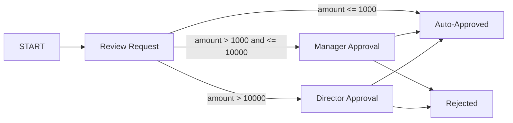

# Transitions

Transitions are the connections between workflow steps. They define how execution moves through your workflow and can include conditions, activities, and priority rules.

## What Are Transitions?

A transition represents a possible path from one step to another. When a step completes, the workflow engine evaluates all outgoing transitions to determine where to go next.

**Key Concepts:**
- Each transition connects a source step (`fromStepId`) to a target step (`toStepId`)
- Transitions can execute activities (send emails, call APIs) during the move
- Conditions determine whether a transition can be taken
- Priority resolves conflicts when multiple transitions are valid

## Trigger Types

Transitions can be triggered in different ways depending on your workflow needs.

### auto (Automatic)

The transition fires immediately when the source step completes.

```json
{
  "transitionId": "start-to-review",
  "fromStepId": "start",
  "toStepId": "review-request",
  "trigger": "auto"
}
```

**Use When:**
- Moving from START to the first real step
- Advancing after AUTOMATED steps complete
- Sequential processing with no branching

### manual (Manual)

The transition requires explicit user action (e.g., clicking "Approve" or "Reject" on a user task).

```json
{
  "transitionId": "review-to-approved",
  "fromStepId": "review-request",
  "toStepId": "end-approved",
  "trigger": "manual",
  "transitionName": "Approve"
}
```

**Use When:**
- Moving from USER_TASK steps
- User chooses which path to take
- Multiple outcomes based on human decision

### signal (Signal-Based)

The transition fires when a specific signal is received.

```json
{
  "transitionId": "wait-to-continue",
  "fromStepId": "wait-for-payment",
  "toStepId": "fulfill-order",
  "trigger": "signal",
  "preConditions": [
    {
      "ruleId": "payment-confirmed",
      "expression": "signal.name === 'payment-confirmed'"
    }
  ]
}
```

**Use When:**
- Moving from WAIT_FOR_SIGNAL steps
- External systems control workflow progression
- Webhook-driven workflows

[**Learn more about signals →**](./signals)

### timer (Timer-Based)

The transition fires after a specified duration.

```json
{
  "transitionId": "escalate-after-delay",
  "fromStepId": "wait-for-response",
  "toStepId": "escalated",
  "trigger": "timer",
  "timerConfig": {
    "duration": "2 days"
  }
}
```

**Use When:**
- Automatic escalation after delays
- Scheduled follow-ups
- Timeout handling

## Conditions

Transitions can have pre-conditions and post-conditions that determine whether they can be taken.

### Pre-Conditions

Evaluated before the transition fires. If any pre-condition fails, the transition is skipped.

```json
{
  "transitionId": "approve-high-value",
  "fromStepId": "review",
  "toStepId": "end-approved",
  "trigger": "manual",
  "preConditions": [
    {
      "ruleId": "amount-check",
      "expression": "context.amount <= 10000"
    }
  ]
}
```

**Use Cases:**
- Route based on workflow data (amount, type, priority)
- Conditional branching (if amount > 5000, escalate)
- Role-based paths (managers can approve up to $10k)

### Post-Conditions

Evaluated after the transition activities execute. If any post-condition fails, the workflow enters an error state.

```json
{
  "transitionId": "charge-payment",
  "fromStepId": "validate",
  "toStepId": "fulfilled",
  "trigger": "auto",
  "postConditions": [
    {
      "ruleId": "payment-success",
      "expression": "activities.charge-payment.output.status === 'succeeded'"
    }
  ]
}
```

**Use Cases:**
- Validate activity results before continuing
- Ensure external API calls succeeded
- Guard against data inconsistencies

### Business Rules Integration

Conditions can reference business rules defined in the business rules module:

```json
{
  "preConditions": [
    {
      "ruleId": "approval-required",
      "ruleReference": "purchase.requires-approval"
    }
  ]
}
```

[**Learn more about business rules →**](/user-guide/business-rules/)

## Priority

When multiple transitions from the same step are valid, priority determines which one is taken.

```json
{
  "transitionId": "high-priority-path",
  "fromStepId": "decision",
  "toStepId": "fast-track",
  "trigger": "auto",
  "priority": 100,
  "preConditions": [
    {
      "ruleId": "urgent",
      "expression": "context.priority === 'urgent'"
    }
  ]
}
```

```json
{
  "transitionId": "normal-priority-path",
  "fromStepId": "decision",
  "toStepId": "standard-process",
  "trigger": "auto",
  "priority": 0
}
```

**Priority Rules:**
- Higher numbers = higher priority (default: 0)
- The workflow engine evaluates transitions in priority order
- The first valid transition (conditions pass) is taken

**Use Cases:**
- Fast-track urgent requests
- Provide fallback paths when conditions fail
- Implement decision trees with clear precedence

## Activities on Transitions

Transitions can execute activities as the workflow moves from one step to another.

```json
{
  "transitionId": "approve-and-notify",
  "fromStepId": "review",
  "toStepId": "end-approved",
  "trigger": "manual",
  "activities": [
    {
      "activityId": "send-approval-email",
      "activityType": "SEND_EMAIL",
      "config": {
        "to": "{{context.requesterEmail}}",
        "subject": "Your request has been approved",
        "body": "Request {{context.requestId}} has been approved."
      }
    },
    {
      "activityId": "update-status",
      "activityType": "UPDATE_ENTITY",
      "config": {
        "entityType": "PurchaseRequest",
        "entityId": "{{context.requestId}}",
        "updates": {
          "status": "APPROVED"
        }
      }
    }
  ]
}
```

**Use Cases:**
- Send notifications when moving to the next step
- Update records as part of the transition
- Call APIs to sync external systems

[**Learn more about activities →**](./activities)

## Example: Multi-Path Approval Workflow

Here's a complete example showing conditional routing:



**Transitions:**

1. **START → Review Request** (auto, no conditions)
2. **Review → Auto-Approved** (auto, priority 100, if amount ≤ $1000)
3. **Review → Manager Approval** (auto, priority 50, if amount ≤ $10,000)
4. **Review → Director Approval** (auto, priority 0, fallback)
5. **Manager → Approved** (manual, sends email)
6. **Manager → Rejected** (manual, sends email)
7. **Director → Approved** (manual, sends email)
8. **Director → Rejected** (manual, sends email)

## Handling Failures

### Compensation

When a transition's post-condition fails or an activity throws an error, compensation activities can roll back changes (saga pattern).

```json
{
  "activities": [
    {
      "activityId": "reserve-inventory",
      "activityType": "CALL_API",
      "config": { "url": "..." },
      "compensate": true,
      "compensationActivity": {
        "activityType": "CALL_API",
        "config": {
          "url": "https://inventory.example.com/release/{{context.productId}}"
        }
      }
    }
  ]
}
```

[**Learn more about compensation →**](/framework/workflows/architecture#compensation-saga-pattern)

### Continue on Failure

By default, if an activity fails, the workflow stops. You can override this:

```json
{
  "transitionId": "attempt-notification",
  "continueOnActivityFailure": true,
  "activities": [
    {
      "activityType": "SEND_EMAIL",
      "config": { "to": "{{context.email}}" }
    }
  ]
}
```

## Next Steps

- [**Configure activities**](./activities) to perform actions during transitions
- [**Set up signals**](./signals) for external triggers
- [**Monitor execution**](./monitoring) to debug transition logic

**See Also:**
- [**Step Types**](./step-types) - Learn about different workflow steps
- [**Business Rules**](/user-guide/business-rules/) - Use rules in transition conditions
- [**Framework Documentation**](/framework/workflows/) - Programmatic workflow control
