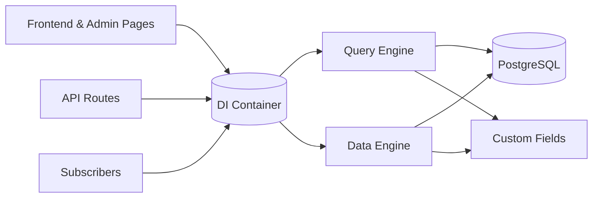

Open Mercato is organised into layers that keep custom code isolated while sharing common infrastructure.

**Presentation layer** – Next.js (App Router) renders frontend and backend routes discovered from modules. Admin-specific pages declare metadata for navigation, RBAC, and features.

**API layer** – REST endpoints are registered through the same module discovery process and usually leverage the [CRUD factory](../framework/api/crud-factory) for consistency.

**Dependency injection** – Awilix provides request-scoped services so APIs, pages, and subscribers share the same business logic without tight coupling.

**Data layer** – MikroORM entities live inside modules. The [query engine](../framework/database/query-engine) unifies access to base tables, extensions, and custom fields, while the [data engine](../framework/runtime/data-engine) persists writes and emits events.

**Events** – The [event bus](../framework/events/overview) propagates domain changes to subscribers (for example, syncing search indexes).

This layered approach keeps module boundaries clear and enables teams to mix-and-match capabilities without sacrificing maintainability.
