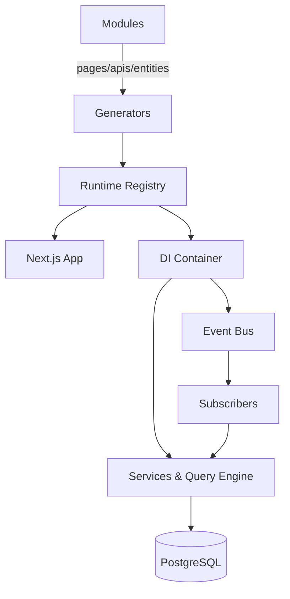
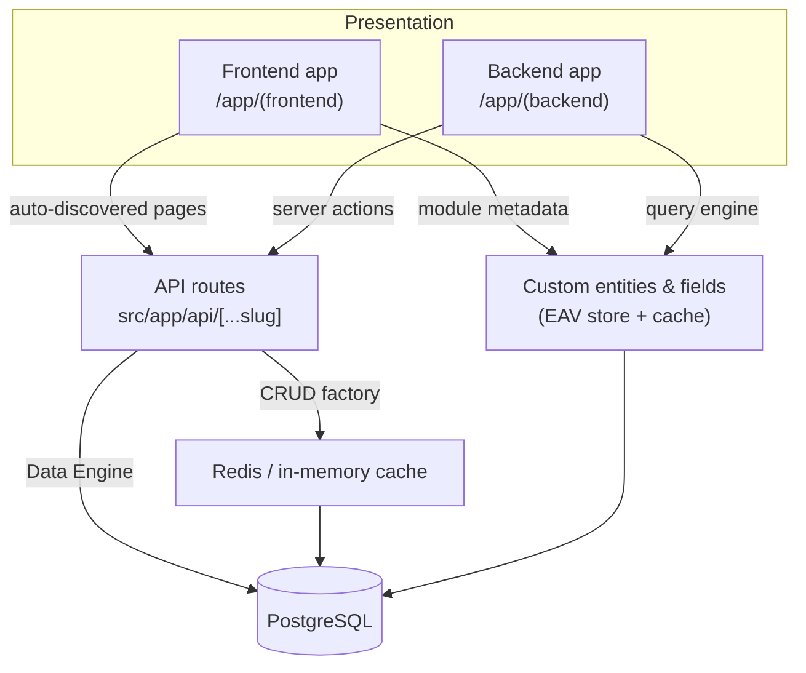
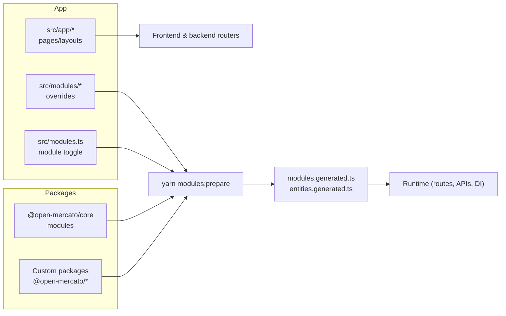

Open Mercato is a modular platform: every capability lives in a module that can be enabled, overridden, or replaced without touching the core runtime. This page highlights the architecture, shows where customisation happens, and links to deeper references.

## Architecture flow at a glance

At build time, module generators collect every page, API handler, entity, subscriber, and feature definition into registries. During runtime, the Next.js App Router loads these registries to render pages, wire API routes, and boot the Awilix dependency-injection container. The container exposes services such as the query engine, data engine, RBAC checks, and event bus to both API handlers and subscribers.

Key principles:

- **Isomorphic modules** – a module exports everything it needs (UI, APIs, DI, migrations) so it can run in isolation or inside larger solutions.
- **Overlay overrides** – files under `src/modules/<module>/...` override their package counterparts, letting apps customize behaviour without forking the package.
- **Generated glue** – tasks like `npm run modules:prepare` regenerate registries so runtime always reflects the filesystem.

## Modular architecture at a glance

- Modules are declared in `packages/<pkg>/src/modules/<module>` (package-supplied) or `src/modules/<module>` (app overrides).
- The application bootstraps modules from `src/modules.ts`. Removing an entry disables the module; adding a new entry enables a custom package.
- Generators (`yarn modules:prepare`) scan all enabled modules, merge overrides, and emit registries that drive routing, DI, entities, dashboards, and CLI discovery.

### Module building blocks

| File / folder | Purpose |
| --- | --- |
| `index.ts` | Module metadata (`id`, `title`, version, optional query-index configuration). |
| `acl.ts` | Feature flags exported as `features` (used by RBAC). |
| `di.ts` | Awilix registrar (`register(container)`) that installs services, repositories, and factories. |
| `backend/*` & `frontend/*` | Next.js App Router pages. Optional `*.meta.ts` files supply navigation + RBAC metadata. |
| `api/<method>/<path>.ts` | REST handlers, usually via the [CRUD factory](../framework/api/crud-factory). |
| `data/entities.ts` & `data/extensions.ts` | MikroORM entities and links to extend other modules. |
| `data/validators.ts` | Zod schemas reused by APIs, CLIs, and forms. |
| `subscribers/*.ts` | Event subscribers with metadata (`event`, `persistent`). |
| `widgets/dashboard/*` | Dashboard widgets auto-discovered by the admin UI. |
| `ce.ts` | Custom entities & fields definitions for the Entities module. |
| `i18n/<locale>.json` | Translation bundles for module-specific copy. |

## Runtime stack

- **Frontend / backend apps** – Catch-all routers in `src/app/(frontend)` and `src/app/(backend)` resolve module pages. Backend pages attach metadata for navigation, RBAC, and features.
- **API** – Requests hit `src/app/api/[...slug]/route.ts`, which loads module handlers and executes the request lifecycle (see [request lifecycle](../framework/runtime/request-lifecycle)).
- **Custom entities & fields layer** – The Entities module stores runtime-defined entities as JSONB. It exposes cached definitions and values to pages, forms, and query helpers.
- **Cache** – Module services can opt into caching (Redis or in-memory) for derived data and queueing subscribers.
- **PostgreSQL** – The authoritative data store. System entities live in module-owned tables; user entities live in EAV tables. The [query engine](../framework/database/query-engine) and [hybrid query engine](../framework/database/hybrid-query-engine) provide fast read paths, while the [data engine](../framework/runtime/data-engine) coordinates writes.

## Custom application architecture

- **`src/app`** – Override or add pages/layouts without touching package sources.
- **`src/modules`** – Provide module-level overrides (backend/frontend pages, APIs, entities, i18n). Files here take precedence over package files with the same relative path.
- **`src/modules.ts`** – Acts as a manifest: enabling/disabling modules reconfigures the application without code changes.
- **Generated registries** – Link together app overrides and package modules. They power auto-discovery for routing, APIs, DI, dashboard widgets, subscribers, and CLI commands.

### Extension points

- **Application reconfiguration** – Swap modules in `src/modules.ts`, override routers in `src/app`, or adjust DI via `src/lib`.
- **Modules** – Ship new modules in `packages/<your-package>` or override core behaviour in `src/modules/<module>`.
- **Custom entities & fields** – Define runtime-managed schemas in `ce.ts` or through the admin UI, then seed them with `yarn mercato entities install`.
- **Entity links** – Use `data/extensions.ts` with `defineLink()` to relate module entities without violating module isolation.

## Request lifecycle

Every request (page load, API call, server action) runs through the same pipeline:

1. **Routing** – Catch-all routers locate the target module file based on metadata from `modules.generated.ts`.
2. **DI scope** – `createRequestContainer` builds a request-scoped Awilix container, registers core services, then applies module `di.ts` registrars.
3. **Auth & RBAC** – `requireAuth`, `requireRoles`, and `requireFeatures` metadata are enforced before handler logic executes.
4. **Business logic** – Handlers typically call module services, the query engine, or the data engine.
5. **Events & subscribers** – Writes emit events that persistent subscribers process (for example, index rebuilds, notifications).

See the dedicated [request lifecycle reference](../framework/runtime/request-lifecycle) for a deeper breakdown.

## Translations

- Modules own their own translation bundles under `modules/<module>/i18n/<locale>.json`. These files are merged at build time.
- Use the shared translation helpers from `@open-mercato/ui` or `@open-mercato/core/lib/i18n` to load strings in pages, APIs, or services.
- Admin users can select locales; the backend UI automatically loads translated labels for module navigation, forms, and custom entities where available.
- When overriding copy in `src/modules`, provide matching `i18n` files to keep language coverage consistent.

---

This architecture lets you assemble enterprise features by combining modules, configure them per tenant or organisation, and override behaviour safely as your product evolves. Continue with the [Framework reference](../framework/modules/overview) to dive into the module APIs in detail.
