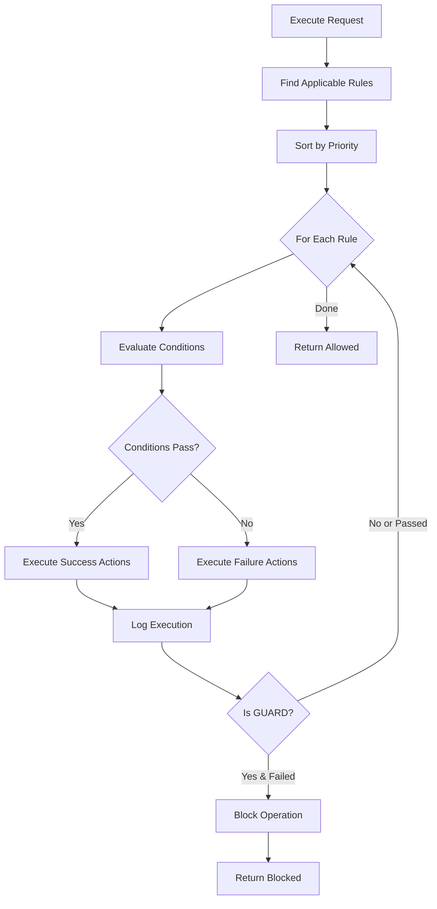

# Business Rules Architecture

The Business Rules Engine is a modular, extensible system for defining and executing business logic. This document explains the architecture, design decisions, and technical implementation.

## Overview

The Business Rules module follows Open Mercato's modular architecture pattern, with clear separation between data, services, UI, and API layers.

## Module Structure

```
packages/core/src/modules/business_rules/
├── index.ts                    # Module metadata
├── acl.ts                      # RBAC feature definitions
├── di.ts                       # Dependency injection registrations
├── data/
│   ├── entities.ts            # MikroORM entities (4)
│   ├── validators.ts          # Zod schemas
│   └── extensions.ts          # Entity extensions
├── lib/
│   ├── expression-evaluator.ts    # Condition evaluation
│   ├── rule-evaluator.ts          # Rule discovery and evaluation
│   ├── action-executor.ts         # Action execution
│   ├── rule-engine.ts             # Orchestration layer
│   ├── value-resolver.ts          # Field and special value resolution
│   └── payload-validation.ts      # Server-side validation
├── components/
│   ├── ConditionBuilder.tsx       # Visual condition builder
│   ├── ActionBuilder.tsx          # Visual action builder
│   └── formConfig.tsx             # Form configuration
├── backend/                       # Admin UI pages (8)
├── api/                           # REST API endpoints (13)
├── migrations/                    # Database migrations (3)
├── i18n/                          # Translations (EN, PL)
└── __tests__/                     # Test suites
```

## Design Principles

### Functional Programming

The engine uses pure functions over classes for core logic:

**Benefits**:
- Easier to test (no state, no side effects)
- Composable and reusable
- Predictable behavior
- Better performance (no object allocation overhead)

**Example**:
```typescript
// Pure function - no state, no side effects
export function evaluateExpression(
  expression: ConditionExpression,
  data: Record<string, any>
): boolean {
  // Logic here
  return result
}
```

### JSONB for Flexibility

Conditions and actions are stored as JSONB in PostgreSQL:

**Why JSONB**:
- ✅ Schema-less storage for dynamic structures
- ✅ Supports complex nested objects
- ✅ Queryable with PostgreSQL JSON operators
- ✅ No schema migrations when adding new operators/actions
- ✅ Fast indexing and querying

**Trade-offs**:
- ❌ Less type safety at database level
- ❌ Requires runtime validation
- ✅ Mitigated by Zod schemas and TypeScript types

### Module Isolation

The Business Rules module is self-contained:

- **No direct entity relationships** with other modules
- **Foreign key IDs** only (tenantId, organizationId, createdBy)
- **Fetches** related data as needed via DI services
- **Can be enabled/disabled** without affecting core functionality

This follows Open Mercato's modular architecture principles.

## Data Layer

### Entities

**BusinessRule**:
- Primary rule definition
- JSONB fields for conditions and actions
- Multi-tenant scoped (tenant_id, organization_id)
- Soft delete support (deleted_at)
- Indexed by: ruleId, entityType, eventType, priority

**RuleExecutionLog**:
- Audit trail of all rule executions
- Records input/output context
- Tracks performance (execution_time_ms)
- Captures errors and warnings
- Linked to BusinessRule via rule_id

**RuleSet**:
- Groups related rules
- Enables bulk management
- Multi-tenant scoped

**RuleSetMember**:
- Junction table between RuleSet and BusinessRule
- Controls execution order (sequence)
- Per-rule enable/disable within set

### Indexes

Critical indexes for performance:

```sql
-- Rule discovery
CREATE INDEX idx_business_rules_entity_event
  ON business_rules(entity_type, event_type, enabled);

-- Priority ordering
CREATE INDEX idx_business_rules_priority
  ON business_rules(priority DESC, created_at);

-- Tenant isolation
CREATE INDEX idx_business_rules_tenant
  ON business_rules(tenant_id, organization_id);

-- Log querying
CREATE INDEX idx_rule_execution_logs_rule
  ON rule_execution_logs(rule_id, executed_at DESC);

CREATE INDEX idx_rule_execution_logs_entity
  ON rule_execution_logs(entity_type, entity_id, executed_at DESC);
```

## Service Layer

### Core Services

#### expression-evaluator

**Purpose**: Evaluate condition expressions against entity data

**Key Functions**:
- `evaluateExpression()` - Recursive condition evaluation
- `applyOperator()` - Execute comparison operators
- `getNestedValue()` - Resolve field paths with dot notation

**Operators Implemented** (15):
- Equality: `=`, `==`, `!=`
- Comparison: `>`, `>=`, `<`, `<=`
- Collection: `IN`, `NOT_IN`, `CONTAINS`, `NOT_CONTAINS`
- String: `STARTS_WITH`, `ENDS_WITH`, `MATCHES`
- Empty: `IS_EMPTY`, `IS_NOT_EMPTY`

**Example**:
```typescript
const condition = {
  operator: 'AND',
  rules: [
    { field: 'status', operator: '=', value: 'ACTIVE' },
    { field: 'total', operator: '>', value: 1000 }
  ]
}

const result = evaluateExpression(condition, {
  status: 'ACTIVE',
  total: 1500
}) // Returns: true
```

#### rule-evaluator

**Purpose**: Discover and evaluate applicable rules

**Key Functions**:
- `evaluate()` - Find and evaluate all applicable rules
- `evaluateSingleRule()` - Evaluate one rule
- Rule filtering by entity type, event type, effective dates
- Priority-based sorting

**Rule Discovery Algorithm**:
1. Filter by tenant/organization
2. Match entity type
3. Match event type (or empty)
4. Check enabled status
5. Check effective date range
6. Sort by priority (descending)
7. Evaluate conditions
8. Return results

#### action-executor

**Purpose**: Execute actions when rule conditions pass/fail

**Key Functions**:
- `executeActions()` - Execute array of actions
- `executeAction()` - Execute single action
- Action handler implementations for 10 action types
- Message interpolation with `{{field}}` syntax

**Action Handlers**:
Each action type has a dedicated handler function:
```typescript
async function handleLogAction(action: Action, context: ExecutionContext) {
  const { level, message } = action.config
  const interpolated = interpolateMessage(message, context.data)
  logger.log(level, interpolated)
}
```

#### rule-engine

**Purpose**: High-level orchestration of rule execution

**Key Functions**:
- `executeRules()` - Main entry point for rule execution
- `findApplicableRules()` - Discover rules to execute
- `logRuleExecution()` - Record execution audit trail
- GUARD rule logic (block operations)

**Execution Flow**:


#### value-resolver

**Purpose**: Resolve field paths and special values

**Key Functions**:
- `getNestedValue()` - Access nested properties with dot notation
- `resolveSpecialValue()` - Replace special `{{tokens}}` with dynamic values

**Supported Tokens**:
- `{{today}}`, `{{now}}`, `{{yesterday}}`, `{{tomorrow}}`
- `{{user.id}}`, `{{user.email}}`, `{{user.name}}`
- `{{entity.id}}`, `{{entity.tenantId}}`, `{{entity.organizationId}}`

#### payload-validation

**Purpose**: Server-side safety checks

**Validations**:
- Maximum condition nesting depth (10 levels)
- Maximum field path length (200 characters)
- Maximum rules per execution (100 rules)
- Valid operator names
- Required action configuration fields

**Prevents**:
- Stack overflow from deeply nested conditions
- ReDoS attacks from malicious regex patterns
- Performance degradation from excessive rules

## Security

### Multi-Tenant Isolation

**All queries automatically scoped** by tenant_id and organization_id:

```typescript
const rules = await em.find(BusinessRule, {
  entityType,
  tenantId,        // Injected from auth context
  organizationId,  // Injected from auth context
  enabled: true,
  deletedAt: null
})
```

**No cross-tenant data access possible**.

### SQL Injection Prevention

- **ORM-based queries** - No raw SQL with user input
- **Parameterized queries** - MikroORM handles escaping
- **ILIKE pattern escaping** - Special characters escaped in search

### ReDoS Protection

- **Regex validation** - Patterns validated before execution
- **Timeout protection** - Regex evaluation has timeouts
- **Complexity limits** - Maximum pattern length enforced

### Sensitive Data Sanitization

Execution logs sanitize sensitive fields (13 patterns):

```typescript
const SENSITIVE_PATTERNS = [
  /password/i, /secret/i, /token/i, /api[_-]?key/i,
  /credit[_-]?card/i, /ssn/i, /social[_-]?security/i,
  /bank[_-]?account/i, /routing[_-]?number/i,
  /pin/i, /cvv/i, /security[_-]?code/i, /private[_-]?key/i
]
```

Fields matching these patterns are replaced with `[REDACTED]` in logs.

### RBAC Integration

Every operation checks required features:

```typescript
// API handler
export const metadata = {
  requireAuth: true,
  requireFeatures: ['business_rules.rules.create']
}
```

Features enforced:
- `business_rules.rules.view`
- `business_rules.rules.create`
- `business_rules.rules.edit`
- `business_rules.rules.delete`
- `business_rules.rules.execute`
- `business_rules.logs.view`

## Performance Optimization

### Indexing Strategy

Strategic indexes for common query patterns:
- Entity type + event type + enabled (rule discovery)
- Priority + created_at (execution order)
- Tenant ID + organization ID (multi-tenant isolation)

### Query Optimization

- **Eager loading** - Load related data in single query where possible
- **Pagination** - All list endpoints support pagination
- **Filtering** - Database-level filtering reduces data transfer
- **Soft deletes** - Excluded via WHERE clauses, not post-query filtering

### Execution Optimization

- **Short-circuit evaluation** - AND conditions stop at first false
- **Timeout protection** - Per-rule (5s) and total (30s) timeouts
- **Priority ordering** - High-priority rules execute first
- **Async actions** - Webhooks/notifications don't block execution

### Caching Considerations

Rule data is **not cached** by default because:
- Rules change frequently
- Stale cache could cause incorrect behavior
- Database performance is sufficient

For high-throughput scenarios, consider:
- Application-level caching with TTL
- Cache invalidation on rule updates
- Redis for distributed caching

## Testing Strategy

### Test Coverage

- **Unit tests**: Core services (expression evaluator, action executor)
- **Integration tests**: Rule engine orchestration
- **API tests**: All 13 endpoints
- **Total**: 279 passing tests

### Test Patterns

**Pure function tests**:
```typescript
describe('evaluateExpression', () => {
  it('evaluates simple equality', () => {
    const expr = { field: 'status', operator: '=', value: 'ACTIVE' }
    const data = { status: 'ACTIVE' }
    expect(evaluateExpression(expr, data)).toBe(true)
  })
})
```

**Integration tests with ORM**:
```typescript
describe('RuleEngine', () => {
  let orm: MikroORM
  let em: EntityManager

  beforeAll(async () => {
    orm = await createTestORM()
    em = orm.em.fork()
  })

  it('executes applicable rules', async () => {
    const rule = createTestRule()
    await em.persistAndFlush(rule)

    const result = await executeRules({ entityType: 'Order', data: {} })
    expect(result.executedRules).toHaveLength(1)
  })
})
```

## Extension Points

The engine is designed for extensibility:

### Custom Operators

Add new comparison operators:

```typescript
// In expression-evaluator.ts
function applyOperator(field: any, operator: string, value: any): boolean {
  switch (operator) {
    // Existing operators...
    case 'CUSTOM_OP':
      return customLogic(field, value)
    default:
      throw new Error(`Unknown operator: ${operator}`)
  }
}
```

### Custom Actions

Implement new action types:

```typescript
// In action-executor.ts
async function executeAction(action: Action, context: ExecutionContext) {
  switch (action.type) {
    // Existing actions...
    case 'CUSTOM_ACTION':
      return await handleCustomAction(action, context)
    default:
      throw new Error(`Unknown action type: ${action.type}`)
  }
}
```

### Custom Special Values

Extend value resolution:

```typescript
// In value-resolver.ts
function resolveSpecialValue(token: string, context: ExecutionContext): any {
  switch (token) {
    // Existing tokens...
    case '{{custom.value}}':
      return getCustomValue(context)
    default:
      return token
  }
}
```

## Migration Strategy

The module includes 3 migrations:

1. **Initial schema** - Create tables and indexes
2. **Add rule sets** - Add RuleSet and RuleSetMember tables
3. **Performance indexes** - Additional indexes for query optimization

**Migration files**: `packages/core/src/modules/business_rules/migrations/`

**Apply migrations**:
```bash
yarn db:migrate
```

## Monitoring and Observability

### Execution Logs

Every rule execution is logged:
- Input context (entity data)
- Output context (modified data)
- Execution time (milliseconds)
- Result (SUCCESS, FAILURE, ERROR)
- Error messages if applicable

### Performance Metrics

Track these metrics for health monitoring:
- Average execution time per rule
- P95/P99 execution times
- Error rate
- Rules executed per minute
- GUARD block rate

### Logging

Structured logging at key points:
- Rule discovery (how many rules found)
- Condition evaluation (pass/fail)
- Action execution (which actions ran)
- Errors and warnings

## Best Practices for Developers

**Keep Services Pure**: Core evaluation logic should be pure functions

**Validate Input**: Use Zod schemas for all external data

**Handle Errors Gracefully**: Rule errors shouldn't crash the system

**Test Thoroughly**: Unit test all operators and actions

**Document Extensions**: When adding operators/actions, update docs

**Monitor Performance**: Track execution times and optimize slow rules

**Secure by Default**: Always check tenant scope, never expose cross-tenant data

## Next Steps

- [**Services Reference**](./services) - Detailed API for core services
- [**Extending**](./extending) - Add custom operators, actions, and values
