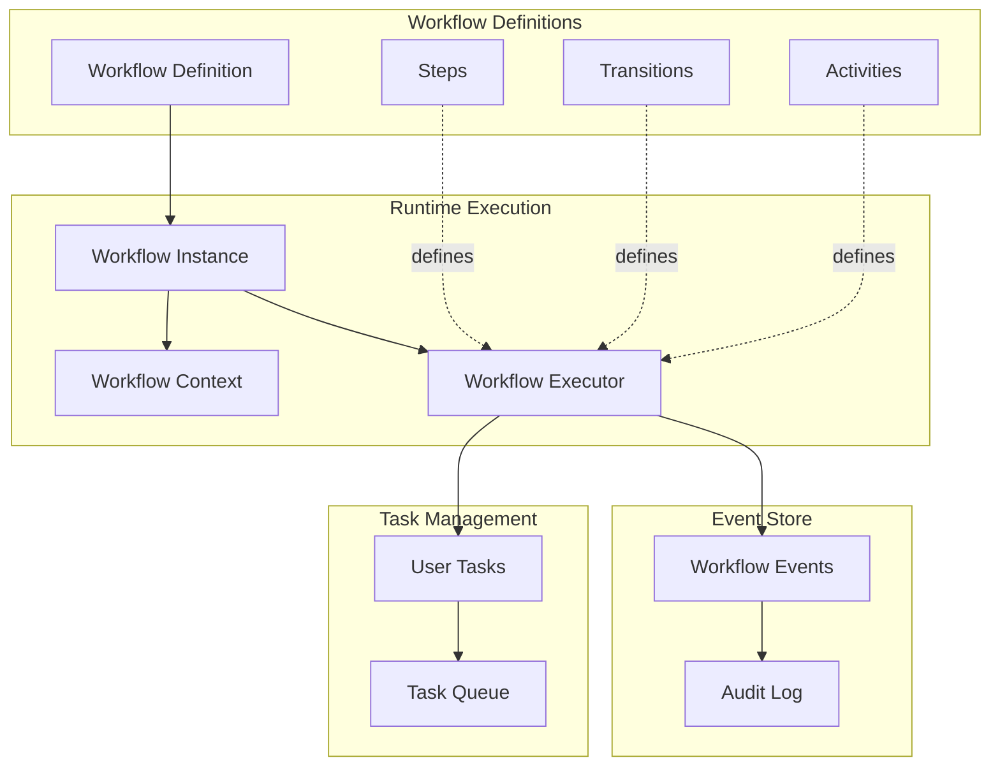
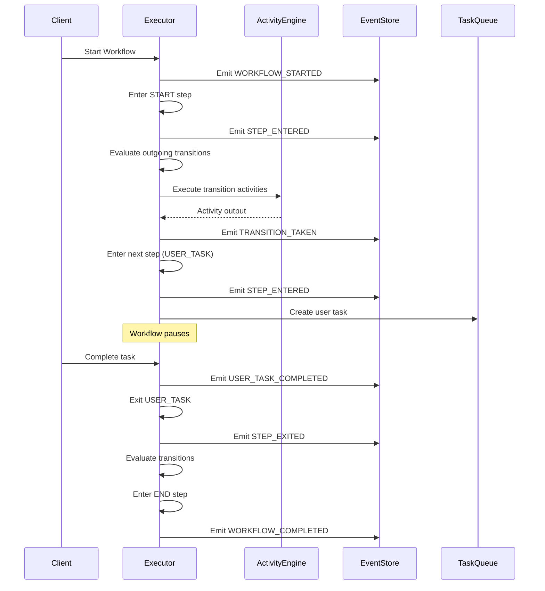
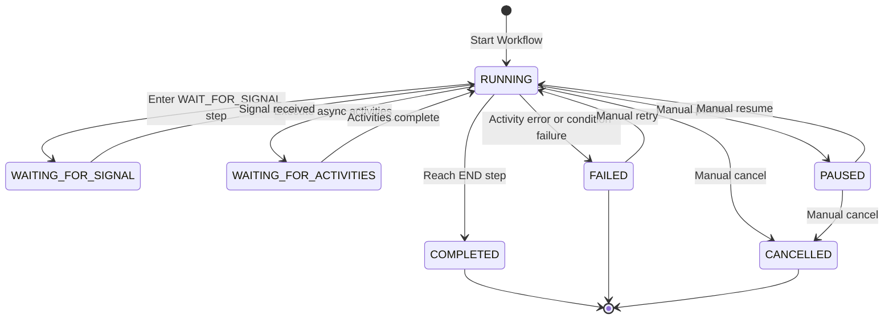

# Workflow Architecture

The workflow engine is a state machine orchestrator built for reliability, auditability, and extensibility. This guide explains the system design, core components, and architectural decisions.

## System Overview

The workflow engine manages long-running business processes through a state machine model. It coordinates steps, transitions, activities, and human interactions while maintaining complete audit trails through event sourcing.

**Key Design Principles:**
- **Event Sourcing**: Every state change is recorded as an immutable event
- **Compensation**: Automatic rollback on failure (saga pattern)
- **Async Activities**: Queue-based execution for long-running tasks
- **Multi-Tenancy**: Complete tenant and organization isolation
- **Extensibility**: Plugin architecture for custom activities and step handlers

## Core Components



### Workflow Definition

A workflow definition is a template that describes the process structure:

- **Steps**: Nodes in the state machine (START, END, USER_TASK, AUTOMATED, etc.)
- **Transitions**: Edges connecting steps with conditions and activities
- **Activities**: Actions that execute during steps or transitions
- **Metadata**: ID, version, name, description, active status

Definitions are immutable once saved. Versioning allows multiple versions to coexist.

### Workflow Instance

A workflow instance is a running execution of a definition:

- **Instance ID**: Unique identifier (UUID)
- **Workflow ID and Version**: Which definition is executing
- **Status**: Current state (RUNNING, COMPLETED, FAILED, etc.)
- **Current Step**: Where execution is paused or progressing
- **Context**: Data payload (JSON object)
- **Correlation Key**: Optional external identifier (order ID, customer ID)
- **Timestamps**: Started at, completed at, updated at

### Workflow Context

The context is a JSON object that stores all workflow data:

```typescript
{
  "orderId": "order-123",
  "customerId": "cust-456",
  "amount": 150.00,
  "decision": "approve",
  "transactionId": "txn_abc123",
  "activities": {
    "send-email": { "output": { "messageId": "msg-123" } },
    "call-payment-api": { "output": { "transactionId": "txn_abc123" } }
  }
}
```

**Context Sources:**
- Initial context provided when starting the workflow
- Form data from user tasks
- Signal payloads from external systems
- Activity outputs (stored under `activities.<activityId>.output`)

### Workflow Executor

The executor is the state machine engine that:

1. Loads the workflow definition and current instance state
2. Evaluates transition conditions to determine next steps
3. Executes activities (sync or async)
4. Emits events for every state change
5. Updates instance status and context
6. Handles errors, retries, and compensation

## Execution Flow



**Step-by-Step Execution:**

1. **Start**: Client calls `/api/workflows/instances` with initial context
2. **Load Definition**: Executor retrieves workflow definition by ID and version
3. **Create Instance**: New workflow instance is persisted with status RUNNING
4. **Emit WORKFLOW_STARTED**: Event recorded in event store
5. **Enter START Step**: Executor moves to the START step
6. **Evaluate Transitions**: Find all outgoing transitions, evaluate conditions
7. **Execute Activities**: Run transition activities (send emails, call APIs)
8. **Take Transition**: Move to next step based on conditions and priority
9. **Repeat**: Continue until END step or error occurs
10. **Complete**: Mark instance as COMPLETED, emit WORKFLOW_COMPLETED

## State Management

### Persistence

Workflow state is persisted in multiple tables:

- **workflow_definitions**: Workflow templates (versioned, immutable)
- **workflow_instances**: Running and completed workflows
- **workflow_events**: Complete event log (event sourcing)
- **user_tasks**: Tasks requiring human action
- **step_instances**: Individual step executions (for tracking)

### State Transitions

Workflow instance status can be:

- **RUNNING**: Active execution
- **COMPLETED**: Finished successfully
- **FAILED**: Encountered error and stopped
- **PAUSED**: Manually paused by user
- **WAITING_FOR_SIGNAL**: Paused at WAIT_FOR_SIGNAL step
- **WAITING_FOR_ACTIVITIES**: Async activities still processing
- **CANCELLED**: Manually cancelled



## Event Sourcing

Every workflow state change emits an immutable event stored in `workflow_events`:

**Event Types:**
- `WORKFLOW_STARTED`, `WORKFLOW_COMPLETED`, `WORKFLOW_FAILED`, `WORKFLOW_CANCELLED`
- `STEP_ENTERED`, `STEP_EXITED`
- `TRANSITION_TAKEN`
- `ACTIVITY_STARTED`, `ACTIVITY_COMPLETED`, `ACTIVITY_FAILED`
- `USER_TASK_CREATED`, `USER_TASK_COMPLETED`, `USER_TASK_CANCELLED`
- `SIGNAL_RECEIVED`

**Event Structure:**

```typescript
{
  id: string
  workflowInstanceId: string
  stepInstanceId: string | null
  eventType: string
  eventData: any
  occurredAt: string
  userId: string | null
  tenantId: string
  organizationId: string
}
```

**Benefits:**
- **Complete Audit Trail**: Know exactly what happened and when
- **Debuggability**: Replay events to understand failures
- **Compliance**: Regulatory requirements for change tracking
- **Replayability**: Reconstruct workflow state from events (future feature)

## Compensation (Saga Pattern)

When activities fail, compensation activities can roll back changes made earlier in the workflow.

**Compensation Flow:**

1. Activity A executes successfully (e.g., reserve inventory)
2. Activity B fails (e.g., charge payment gateway returns error)
3. Workflow executor triggers compensation for Activity A (e.g., release inventory)
4. Workflow enters FAILED state

**Configuring Compensation:**

```typescript
{
  activityId: "reserve-inventory",
  activityType: "CALL_API",
  config: { url: "https://inventory.example.com/reserve" },
  compensate: true,
  compensationActivity: {
    activityType: "CALL_API",
    config: { url: "https://inventory.example.com/release" }
  }
}
```

**Use Cases:**
- Distributed transactions across multiple systems
- Multi-step processes with partial rollback requirements

## Async Activities

Activities can execute asynchronously via a queue to avoid blocking workflow execution.

**Async Execution Flow:**

1. Workflow reaches activity with `async: true`
2. Activity is enqueued (e.g., BullMQ, Redis queue)
3. Workflow continues immediately (status: WAITING_FOR_ACTIVITIES)
4. Worker picks up activity from queue and executes
5. Worker reports result back to workflow executor
6. Workflow resumes from WAITING_FOR_ACTIVITIES to RUNNING

**Configuration:**

```typescript
{
  activityId: "generate-report",
  activityType: "EXECUTE_FUNCTION",
  async: true,
  timeout: "5m",
  config: { functionName: "generateLargeReport" }
}
```

**Benefits:**
- Non-blocking execution for long-running tasks
- Horizontal scaling of activity workers
- Better resource utilization

## Database Schema

### Key Entities

**workflow_definitions**
- `id` (UUID, PK)
- `workflow_id` (string, unique with version)
- `version` (integer)
- `name`, `description`
- `definition` (JSON: steps, transitions, activities)
- `is_active` (boolean)
- `tenant_id`, `organization_id`

**workflow_instances**
- `id` (UUID, PK)
- `workflow_id`, `version`
- `status` (enum: RUNNING, COMPLETED, FAILED, etc.)
- `current_step_id`
- `context` (JSON)
- `correlation_key` (string, indexed)
- `started_at`, `completed_at`, `updated_at`
- `tenant_id`, `organization_id`

**workflow_events**
- `id` (UUID, PK)
- `workflow_instance_id` (FK, indexed)
- `event_type` (string)
- `event_data` (JSON)
- `occurred_at` (timestamp, indexed)
- `user_id`, `tenant_id`, `organization_id`

**user_tasks**
- `id` (UUID, PK)
- `workflow_instance_id` (FK)
- `step_instance_id` (FK)
- `task_name`, `description`
- `status` (enum: PENDING, IN_PROGRESS, COMPLETED, CANCELLED)
- `assigned_to` (user ID or null)
- `assigned_to_roles` (array of role names)
- `form_data` (JSON)
- `due_at`, `completed_at`, `created_at`, `updated_at`
- `tenant_id`, `organization_id`

### Indexes

**Performance-Critical Indexes:**

- `workflow_instances.correlation_key` - Fast lookup by external ID
- `workflow_instances.status` - Filter by status (RUNNING, WAITING_FOR_SIGNAL)
- `workflow_instances.updated_at` - Sort by recent activity
- `workflow_events.workflow_instance_id, occurred_at` - Event timeline queries
- `user_tasks.assigned_to` - User task queue
- `user_tasks.status` - Filter tasks by status

## Performance Considerations

### Indexing Strategy

- Index all foreign keys (`workflow_instance_id`, `step_instance_id`)
- Composite indexes for common filter combinations (e.g., `status + updated_at`)
- Partial indexes for active workflows (`WHERE status IN ('RUNNING', 'WAITING_FOR_SIGNAL')`)

### Context Size

- Workflow context is stored as JSON in the database
- Large contexts (> 100KB) may slow down queries
- Consider storing large payloads externally (S3, blob storage) and referencing by ID

### Event Archival

- Workflow events accumulate over time
- Archive old events (> 90 days) to a separate table or cold storage
- Maintain recent events for active debugging

### Async Activities

- Use async activities for anything > 2-3 seconds
- Scale activity workers horizontally to handle load
- Monitor queue depth to prevent backlogs

## Next Steps

- [**Integrate workflows**](./services) via REST APIs
- [**Extend the engine**](./extending) with custom activities and step handlers
- [**Test workflows**](./testing) programmatically

**See Also:**
- [**User Guide**](/user-guide/workflows/) - User-facing workflow documentation
- [**Activities**](/user-guide/workflows/activities) - Activity configuration reference
- [**Signals**](/user-guide/workflows/signals) - Signal-based integration
