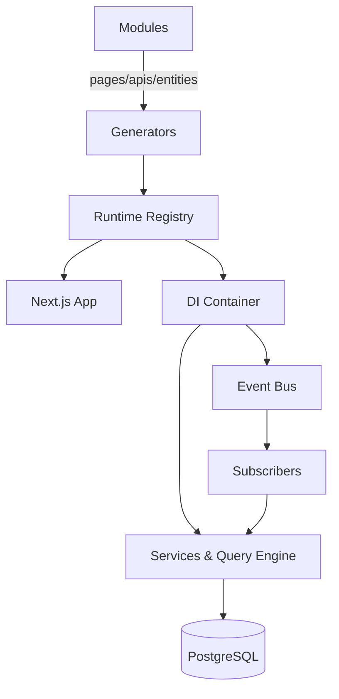

At build time, module generators collect every page, API handler, entity, subscriber, and feature definition into registries. During runtime, Next.js (app directory) loads these registries to render pages, wire API routes, and boot the Awilix dependency-injection container. The container exposes services such as the query engine, data engine, RBAC checks, and event bus to both API handlers and subscribers.

Key principles:

- **Isomorphic modules** – a module exports everything it needs (UI, APIs, DI, migrations) so it can run in isolation or inside larger solutions.
- **Overlay overrides** – files under `src/modules/<module>/...` override their package counterparts, letting apps customize behaviour without forking the package.
- **Generated glue** – tasks like `npm run modules:prepare` regenerate registries so runtime always reflects the filesystem.

Dive deeper into the design in the [system overview](../architecture/system-overview) and the [request lifecycle](../architecture/request-lifecycle).
