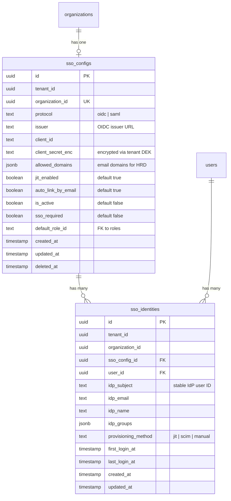

# feat(sso): Module Scaffold and OIDC Login Flow

## Overview

Scaffold the enterprise SSO module at `packages/enterprise/src/modules/sso/` and implement OIDC login with Keycloak as the development IdP. After this milestone, a user can log in to Open Mercato via Keycloak OIDC — the first shippable SSO increment.

No admin UI yet — the SSO config is seeded via `setup.ts` for the dev environment.

## Problem Statement

Open Mercato only supports password-based authentication. Enterprise customers need SSO to authenticate via their corporate IdP. This milestone establishes the foundational module structure and proves the OIDC login flow end-to-end with Keycloak.

## Proposed Solution

Build the SSO module following the same patterns as the auth module (DI, events, ACL, setup) and the MFA provider registry pattern from SPEC-ENT-001. Implement OIDC Authorization Code + PKCE via `openid-client` v6. Use encrypted cookies for flow state (no Redis needed). Issue JWT + session cookies identical to the existing login flow.

---

## Technical Approach

### Architecture

```
packages/enterprise/src/modules/sso/
├── index.ts                          # Module metadata
├── acl.ts                            # RBAC features (M1: sso.config.view)
├── setup.ts                          # defaultRoleFeatures + seedDefaults (Keycloak config)
├── di.ts                             # DI: SsoProviderRegistry, SsoService, etc.
├── events.ts                         # Event declarations
├── data/
│   ├── entities.ts                   # SsoConfig, SsoIdentity
│   └── validators.ts                 # Zod schemas
├── lib/
│   ├── types.ts                      # SsoProtocolProvider interface
│   ├── registry.ts                   # SsoProviderRegistry
│   └── oidc-provider.ts              # OidcProvider (openid-client v6)
├── services/
│   ├── ssoService.ts                 # Orchestrator: initiate → callback → session
│   └── accountLinkingService.ts      # idp_subject → email match → JIT provision
└── api/
    ├── openapi.ts                    # Shared OpenAPI factory
    ├── hrd/route.ts                  # POST /api/sso/hrd
    ├── initiate/route.ts             # GET /api/sso/initiate
    └── callback/
        └── oidc/route.ts             # POST /api/sso/callback/oidc
```

### Data Model (Milestone 1 — 2 tables)



**Key constraints:**
- `UNIQUE(organization_id)` on `sso_configs` — one config per org (M1)
- `UNIQUE(sso_config_id, user_id)` on `sso_identities` — one identity per user per config
- `UNIQUE(sso_config_id, idp_subject)` on `sso_identities` — IdP subject must be unique per config
- `client_secret_enc` encrypted via tenant DEK (use `TenantDataEncryptionService`)

---

## Implementation Phases

### Phase 0: Prerequisite — Auth Event Emission

**Files:** `packages/core/src/modules/auth/api/login.ts`

The core login handler declares `auth.login.success` / `auth.login.failed` events but never emits them. Add event emission so SSO (and future MFA) can subscribe.

- [x] Import `emitAuthEvent` from `@open-mercato/core/modules/auth/events`
- [x] After successful login (line 79, after `signJwt`): `emitAuthEvent('auth.login.success', { userId: user.id, email: user.email, tenantId: resolvedTenantId, orgId: user.organizationId })`
- [x] After password verification failure (line 52): `emitAuthEvent('auth.login.failed', { email: parsed.data.email, reason: 'invalid_password' })`
- [x] After user not found (line 48): `emitAuthEvent('auth.login.failed', { email: parsed.data.email, reason: 'user_not_found' })`

> **Note:** This is the only core module change in the entire SSO feature. It benefits both SSO and MFA (SPEC-ENT-001).
>
> **Spec correction needed:** The SSO spec references `auth.login.attempt` as an integration event, but this event does not exist. The actual events are `auth.login.success` and `auth.login.failed`. Update the spec's Integration Points table (section 3.4) accordingly.

### Phase 1: Module Scaffold

**Goal:** Empty module recognized by the framework.

- [x] **`index.ts`** — Module metadata

```typescript
// Match the enterprise security module pattern (packages/enterprise/src/modules/security/index.ts)
export const metadata = {
  id: 'sso',
  version: '0.1.0',
  enterprise: true,
} as const

export { features } from './acl'
```

- [x] **`acl.ts`** — RBAC features (M1 subset)

```typescript
export const features = [
  { id: 'sso.config.view', title: 'View SSO configuration', module: 'sso' },
  { id: 'sso.config.manage', title: 'Manage SSO configuration', module: 'sso' },
]
```

- [x] **`setup.ts`** — Default role features + optional dev seed

```typescript
import type { ModuleSetupConfig } from '@open-mercato/shared/modules/setup'

export const setup: ModuleSetupConfig = {
  defaultRoleFeatures: {
    superadmin: ['sso.*'],
    admin: ['sso.config.view', 'sso.config.manage'],
  },
  // seedDefaults added in Phase 6 (Keycloak dev config)
}

export default setup
```

- [x] **`events.ts`** — Event declarations

```typescript
import { createModuleEvents } from '@open-mercato/shared/modules/events'

const events = [
  { id: 'sso.login.initiated', label: 'SSO Login Initiated', category: 'lifecycle' },
  { id: 'sso.login.completed', label: 'SSO Login Completed', category: 'lifecycle' },
  { id: 'sso.login.failed', label: 'SSO Login Failed', category: 'lifecycle' },
  { id: 'sso.identity.linked', label: 'SSO Identity Linked', category: 'lifecycle' },
  { id: 'sso.identity.created', label: 'SSO Identity Created (JIT)', category: 'lifecycle' },
  { id: 'sso.config.created', label: 'SSO Config Created', entity: 'sso_config', category: 'crud' },
  { id: 'sso.config.updated', label: 'SSO Config Updated', entity: 'sso_config', category: 'crud' },
  { id: 'sso.config.deleted', label: 'SSO Config Deleted', entity: 'sso_config', category: 'crud' },
] as const

export const eventsConfig = createModuleEvents({ moduleId: 'sso', events })
export const emitSsoEvent = eventsConfig.emit
export type SsoEventId = typeof events[number]['id']
export default eventsConfig
```

- [x] **`di.ts`** — DI registration (services added in Phase 3)

```typescript
import { asClass, asValue } from 'awilix'
import type { AppContainer } from '@open-mercato/shared/lib/di/container'

export function register(container: AppContainer) {
  // Populated in Phase 3
  void container
}
```

- [ ] Run `npm run modules:prepare` to verify module discovery (deferred: requires yarn install)
- [ ] Verify `yarn build:packages` succeeds (deferred: requires yarn install)

### Phase 2: Database Entities + Migration

**Goal:** `sso_configs` and `sso_identities` tables exist.

- [x] **`data/entities.ts`** — MikroORM entity definitions

`SsoConfig` entity:
- UUID PK (`gen_random_uuid()`)
- `tenantId` (uuid, nullable)
- `organizationId` (uuid, unique — one config per org)
- `protocol` (text: 'oidc' | 'saml')
- `issuer` (text, nullable — OIDC issuer URL)
- `clientId` (text, nullable — OIDC client ID)
- `clientSecretEnc` (text, nullable — encrypted OIDC client secret)
- `allowedDomains` (jsonb, default `[]` — email domains for HRD)
- `jitEnabled` (boolean, default true)
- `autoLinkByEmail` (boolean, default true)
- `isActive` (boolean, default false)
- `ssoRequired` (boolean, default false)
- `defaultRoleId` (uuid, nullable — FK to roles table)
- Standard timestamps: `createdAt`, `updatedAt`, `deletedAt`

`SsoIdentity` entity:
- UUID PK
- `tenantId`, `organizationId`
- `ssoConfigId` (uuid FK)
- `userId` (uuid FK)
- `idpSubject` (text — stable IdP user identifier)
- `idpEmail` (text)
- `idpName` (text, nullable)
- `idpGroups` (jsonb, default `[]`)
- `provisioningMethod` (text: 'jit' | 'scim' | 'manual')
- `firstLoginAt`, `lastLoginAt` (timestamps)
- Standard timestamps: `createdAt`, `updatedAt`
- Unique constraints: `(sso_config_id, user_id)`, `(sso_config_id, idp_subject)`

- [x] **`data/validators.ts`** — Zod schemas

```typescript
// ssoConfigSchema — for internal use / seeding
// hrdRequestSchema — { email: string }
// oidcCallbackSchema — { code: string, state: string }
// ssoInitiateSchema — { configId: string, returnUrl?: string }
```

- [ ] Run `yarn db:generate` to create migration (deferred: requires yarn install)
- [ ] Run `yarn db:migrate` to apply (deferred: requires yarn install)
- [ ] Verify tables exist with correct constraints (deferred: requires yarn install)

### Phase 3: Provider Registry + OIDC Provider

**Goal:** Pluggable provider architecture with working OIDC implementation.

- [x] **`lib/types.ts`** — Provider interface

```typescript
export interface SsoProtocolProvider {
  readonly protocol: 'oidc' | 'saml'

  buildAuthUrl(config: SsoConfig, params: {
    state: string
    nonce: string
    redirectUri: string
    codeVerifier?: string
  }): Promise<string>

  handleCallback(config: SsoConfig, params: {
    callbackParams: Record<string, string>
    redirectUri: string
    expectedState: string
    expectedNonce: string
    codeVerifier?: string
  }): Promise<SsoIdentityPayload>

  validateConfig(config: SsoConfig): Promise<{ ok: boolean; error?: string }>
}

export interface SsoIdentityPayload {
  subject: string    // Stable IdP user ID (sub claim)
  email: string
  name?: string
  groups?: string[]
}
```

- [x] **`lib/registry.ts`** — SsoProviderRegistry

```typescript
export class SsoProviderRegistry {
  private providers = new Map<string, SsoProtocolProvider>()

  register(provider: SsoProtocolProvider): void
  resolve(protocol: string): SsoProtocolProvider | undefined
  listAll(): SsoProtocolProvider[]
}
```

- [x] **`lib/oidc-provider.ts`** — OIDC implementation using `openid-client` v6

Key implementation details:
- Use `openid-client` v6 `discovery()` to fetch IdP metadata from `issuer/.well-known/openid-configuration`
- Authorization Code flow with PKCE (always enabled, hardcoded)
- `buildAuthUrl()`: generate `code_verifier` + `code_challenge`, build authorization URL with `scope: 'openid email profile'`
- `handleCallback()`: exchange authorization code for tokens, validate ID token (`iss`, `aud`, `exp`, `nonce`), extract claims (`sub`, `email`, `name`, `groups`)
- `validateConfig()`: attempt discovery fetch, verify required metadata fields
- **Note:** `OidcProvider` receives the plaintext client secret as a parameter — `SsoService` handles decryption via `TenantDataEncryptionService` before calling the provider. This keeps the provider stateless and DI-free (registered as `asValue`, not `asClass`).

- [x] Update **`di.ts`** — register providers and services

```typescript
export function register(container: AppContainer) {
  const registry = new SsoProviderRegistry()
  registry.register(new OidcProvider())

  container.register({
    ssoProviderRegistry: asValue(registry),
    ssoService: asClass(SsoService).scoped(),
    accountLinkingService: asClass(AccountLinkingService).scoped(),
  })
}
```

- [ ] Add `openid-client` v6 to `packages/enterprise/package.json` (deferred: requires yarn install)
- [ ] Verify `yarn build:packages` succeeds (deferred: requires yarn install)

### Phase 4: SsoService + AccountLinkingService

**Goal:** Core orchestration logic for SSO login flow.

- [x] **`services/ssoService.ts`** — SSO orchestrator

Methods:
- `findConfigByEmail(email: string): Promise<SsoConfig | null>` — M1 basic HRD: extract email domain (e.g. `user@example.com` → `example.com`), then `findOneWithDecryption(SsoConfig, { isActive: true })` and check if `allowedDomains` JSON array contains the domain. This works pre-authentication (no user lookup needed). M2 extends this with a proper GIN index on `allowed_domains` for performance at scale.
- `initiateLogin(configId: string, returnUrl?: string): Promise<{ redirectUrl: string, stateCookie: string }>` — resolve provider, build auth URL, create encrypted state cookie containing `{ state, nonce, codeVerifier, configId, returnUrl }`
- `handleOidcCallback(callbackParams: Record<string, string>, stateCookie: string): Promise<{ user: User, token: string, redirectUrl: string }>` — decrypt state cookie, delegate to provider, call AccountLinkingService, issue JWT + session

Session issuance (replicate from `login.ts`):
```typescript
// After account linking resolves a user:
const roles = await authService.getUserRoles(user, tenantId)
const token = signJwt({
  sub: String(user.id),
  tenantId,
  orgId: user.organizationId ? String(user.organizationId) : null,
  email: user.email,
  roles,
})
await authService.updateLastLoginAt(user)
```

- [x] **`services/accountLinkingService.ts`** — Account resolution

Resolution order:
1. **Existing link:** `findOneWithDecryption(SsoIdentity, { ssoConfigId, idpSubject })` → return linked user
2. **Email match:** if `autoLinkByEmail && !existingLink`, `findOneWithDecryption(User, { email: idpEmail, organizationId })` → create SsoIdentity link → return user
3. **JIT provision:** if `jitEnabled && !emailMatch`, create new User (no password) + SsoIdentity → assign default role → return user

Each path emits appropriate events:
- Path 1: `sso.login.completed`
- Path 2: `sso.identity.linked` + `sso.login.completed`
- Path 3: `sso.identity.created` + `sso.login.completed`

Use `em.transactional()` for JIT provisioning (mutates user + creates identity + assigns role in a single transaction). This is the standard MikroORM transaction pattern used throughout the codebase (see `packages/core/src/modules/auth/lib/setup-app.ts` for reference).

### Phase 5: Encrypted State Cookie

**Goal:** Secure OIDC flow state without server-side storage. Must be implemented before API routes (Phase 6) which depend on it.

- [x] Create utility in `lib/state-cookie.ts`

```typescript
// Encrypt: { state, nonce, codeVerifier, configId, returnUrl, expiresAt }
// → AES-256-GCM encrypted, base64url encoded
// Key: derived from JWT_SECRET (or dedicated SSO_STATE_SECRET env var)
// TTL: 5 minutes

export function encryptStateCookie(payload: SsoFlowState): string
export function decryptStateCookie(cookie: string): SsoFlowState | null
```

- Uses `crypto.createCipheriv` / `crypto.createDecipheriv` (Node.js built-in)
- Random IV per encryption
- Validates `expiresAt` on decryption (reject if expired)
- No external dependencies needed

### Phase 6: API Routes

**Goal:** Three endpoints that complete the OIDC flow.

- [x] **`api/hrd/route.ts`** — `POST /api/sso/hrd`

```
Input:  { email: string }
Output: { hasSso: boolean, configId?: string, protocol?: string }
```

- No auth required (called from login page before authentication)
- Calls `ssoService.findConfigByEmail(email)`
- Returns minimal info (avoids leaking org details)
- Rate limit consideration: basic IP-based throttling (use existing middleware if available)

- [x] **`api/initiate/route.ts`** — `GET /api/sso/initiate`

```
Input:  ?configId=uuid&returnUrl=/backend (query params)
Output: 302 redirect to IdP + Set-Cookie: sso_state (encrypted)
```

- No auth required
- Validates `configId` exists and `isActive`
- Calls `ssoService.initiateLogin(configId, returnUrl)`
- Sets encrypted `sso_state` cookie (httpOnly, sameSite: lax, maxAge: 300s)
- Redirects to IdP authorization URL

- [x] **`api/callback/oidc/route.ts`** — `POST /api/sso/callback/oidc` (also handle GET for some IdPs)

```
Input:  { code, state } (query params or form body)
Cookie: sso_state (encrypted state from initiate)
Output: 302 redirect to returnUrl + Set-Cookie: auth_token, session_token
```

- No auth required (this IS the login)
- Reads `sso_state` cookie, validates state match
- Calls `ssoService.handleOidcCallback(params, stateCookie)`
- Sets `auth_token` cookie (same options as login.ts: httpOnly, path: '/', sameSite: lax, secure in production, maxAge: 8h)
- Always creates persistent session + sets `session_token` cookie (30d default) — SSO logins are treated as `remember=true` because SSO users expect session persistence and the IdP controls the authentication lifetime (intentional divergence from password login which only persists when user opts in)
- Clears `sso_state` cookie
- Redirects to `returnUrl` or `/backend`
- On error: redirect to `/login?error=sso_failed`

- [x] **`api/openapi.ts`** — Shared OpenAPI definitions (inlined in each route file)

- [x] All routes export `openApi` for documentation generation
- [ ] Run `npm run modules:prepare` (deferred: requires yarn install)

### Phase 7: Keycloak Docker Setup

**Goal:** Local Keycloak instance for development and testing.

- [x] Add Keycloak service to `docker-compose.fullapp.dev.yml` (dev-only services file, already exists at repo root)

```yaml
keycloak:
  image: quay.io/keycloak/keycloak:26.1
  command: start-dev
  environment:
    KEYCLOAK_ADMIN: admin
    KEYCLOAK_ADMIN_PASSWORD: admin
  ports:
    - "8080:8080"
```

- [ ] Document realm setup in `packages/enterprise/src/modules/sso/README.md`:
  - Create realm `open-mercato`
  - Create OIDC client `open-mercato-app` (confidential, authorization code flow)
  - Set redirect URI: `http://localhost:3000/api/sso/callback/oidc`
  - Create test user `testuser@example.com`

- [x] Add Keycloak dev seed in `setup.ts` `seedDefaults` (only in dev mode):

```typescript
async seedDefaults({ em, tenantId, organizationId }) {
  if (process.env.NODE_ENV !== 'development') return
  if (process.env.SSO_DEV_SEED !== 'true') return
  // Seed SsoConfig for Keycloak with:
  //   protocol: 'oidc'
  //   issuer: 'http://localhost:8080/realms/open-mercato'
  //   clientId: 'open-mercato-app'
  //   clientSecretEnc: encrypted('dev-secret')
  //   allowedDomains: ['example.com']
  //   isActive: true, jitEnabled: true
}
```

### Phase 8: Integration Test

**Goal:** End-to-end OIDC login verified against Keycloak.

- [ ] Create Playwright test at `.ai/qa/tests/sso/` (matches existing test location pattern: `.ai/qa/tests/admin/`, `.ai/qa/tests/integration/`)

Test scenario: **OIDC Login with Keycloak**
1. Start with user not logged in
2. Navigate to login page
3. Enter email `testuser@example.com`
4. Verify HRD detects SSO (call `POST /api/sso/hrd`)
5. Click SSO login → redirected to Keycloak
6. Authenticate at Keycloak
7. Redirected back to callback URL
8. Verify JWT issued (auth_token cookie set)
9. Verify user is logged in (can access `/backend`)
10. Verify SsoIdentity record created in database

Test scenario: **Password login still works**
1. User with org that has no SSO config
2. Login with email + password → works as before

Test scenario: **JIT Provisioning**
1. New user (email not in system) logs in via Keycloak
2. Verify user record created with `passwordHash: null`
3. Verify SsoIdentity created with `provisioningMethod: 'jit'`
4. Verify default role assigned

Test scenario: **Email-based Account Linking**
1. Existing user (created via password) logs in via Keycloak
2. Verify SsoIdentity linked to existing user
3. Verify user can still log in with password (SSO not enforced yet)

---

## System-Wide Impact

### Interaction Graph

- **SSO initiate** → `SsoService.initiateLogin()` → `SsoProviderRegistry.resolve('oidc')` → `OidcProvider.buildAuthUrl()` → set encrypted cookie → redirect
- **SSO callback** → decrypt cookie → `OidcProvider.handleCallback()` → `AccountLinkingService.resolveUser()` → `signJwt()` → set auth cookies → redirect
- **HRD lookup** → `SsoService.findConfigByEmail()` → `findOneWithDecryption(SsoConfig, ...)` → return config info
- **Auth events** (new): `auth.login.success`/`auth.login.failed` emitted from core login handler

### Error Propagation

| Error | Source | Handling |
|-------|--------|----------|
| IdP unreachable | `openid-client` discovery | Return error response, redirect to `/login?error=idp_unreachable` |
| Invalid callback state | State cookie decryption | Redirect to `/login?error=invalid_state` |
| Expired state cookie | TTL check in decrypt | Redirect to `/login?error=session_expired` |
| Token validation failure | ID token verification | Redirect to `/login?error=token_invalid` |
| JIT provision failure | User creation | Log error, redirect to `/login?error=provisioning_failed` |
| Encryption service unavailable | DEK decrypt | Service-level error, logged |

### State Lifecycle Risks

- **Partial JIT provision:** User created but identity link fails → use `em.transactional()` to wrap user creation + identity creation + role assignment in a single DB transaction
- **Stale state cookie:** 5-minute TTL prevents replay; cookie cleared on callback
- **Concurrent SSO logins:** Same user, two tabs → both get valid tokens (idempotent identity link)

### API Surface Parity

- `POST /api/sso/hrd` — new, no existing equivalent
- `GET /api/sso/initiate` — new, no existing equivalent
- `POST /api/sso/callback/oidc` — new, parallel to `POST /api/auth/login` (issues same JWT)

### Integration Test Scenarios

1. Full OIDC flow: login page → HRD → Keycloak → callback → JWT → logged in
2. JIT provision: unknown user → Keycloak → new user + identity created → logged in
3. Account linking: existing user → Keycloak → identity linked → logged in
4. Password login unaffected: org without SSO → password login works
5. Invalid state: tampered cookie → error redirect, no session issued

---

## Acceptance Criteria

### Functional Requirements

- [ ] User enters email → HRD detects SSO → redirected to Keycloak → authenticates → redirected back → JWT issued → logged in
- [ ] Existing password login still works for orgs without SSO
- [ ] New user JIT-provisioned on first SSO login (no password, assigned default role)
- [ ] Existing user linked by email on first SSO login
- [ ] SSO state managed via encrypted cookie (no server-side state store needed)

### Non-Functional Requirements

- [ ] PKCE always enabled for OIDC (hardcoded, not optional)
- [ ] Client secret encrypted at rest via tenant DEK
- [ ] State cookie expires after 5 minutes
- [ ] No core auth module changes beyond event emission
- [ ] All API routes export `openApi` for documentation

### Quality Gates

- [ ] `yarn build:packages` succeeds
- [ ] `yarn lint` passes
- [ ] `npm run modules:prepare` succeeds
- [ ] Integration test passes with Keycloak Docker
- [ ] No `any` types in new code

---

## Dependencies & Prerequisites

| Dependency | Type | Status |
|------------|------|--------|
| `openid-client` ^6.x | npm package | To install |
| Keycloak Docker image | Dev environment | To set up |
| Auth event emission | Core change (Phase 0) | To implement |
| Tenant DEK encryption | Existing infrastructure | Available |
| `signJwt` utility | `@open-mercato/shared/lib/auth/jwt` | Available |

---

## Risk Analysis & Mitigation

| Risk | Impact | Likelihood | Mitigation |
|------|--------|------------|------------|
| `openid-client` v6 API breaking changes | Medium | Low | Pin exact version, test thoroughly |
| Keycloak Docker setup complexity | Low | Medium | Document step-by-step, provide seed script |
| Encrypted cookie too large | Low | Low | Cookie holds minimal state (~200 bytes encrypted) |
| IdP clock skew | Medium | Medium | 30-second tolerance in token validation |
| Tenant DEK not available in dev | Medium | Medium | Fallback to plaintext in dev mode if DEK disabled |

---

## References & Research

### Internal References

- Auth login handler: `packages/core/src/modules/auth/api/login.ts`
- JWT signing: `packages/shared/src/lib/auth/jwt.ts`
- Auth service: `packages/core/src/modules/auth/services/authService.ts`
- Auth events: `packages/core/src/modules/auth/events.ts`
- Auth DI: `packages/core/src/modules/auth/di.ts`
- Enterprise security module: `packages/enterprise/src/modules/security/index.ts`
- Provider registry pattern: `packages/core/src/modules/sales/lib/providers/registry.ts`
- MFA provider registry: `.ai/specs/enterprise/SPEC-ENT-001-2026-02-17-security-module-enterprise-mfa.md`
- SSO spec: `.ai/specs/enterprise/sso_spec.md`
- Milestones brainstorm: `docs/brainstorms/2026-02-19-sso-implementation-milestones-brainstorm.md`
- Transaction pattern: `packages/core/src/modules/auth/lib/setup-app.ts` → `em.transactional()`

### External References

- openid-client v6 docs: https://github.com/panva/openid-client
- Keycloak Docker: https://www.keycloak.org/getting-started/getting-started-docker
- OIDC spec (Authorization Code + PKCE): RFC 7636, RFC 6749

### Key Imports

```typescript
// JWT + Auth
import { signJwt } from '@open-mercato/shared/lib/auth/jwt'
import { AuthService } from '@open-mercato/core/modules/auth/services/authService'

// DI
import { asClass, asValue } from 'awilix'
import type { AppContainer } from '@open-mercato/shared/lib/di/container'
import { createRequestContainer } from '@open-mercato/shared/lib/di/container'

// Events
import { createModuleEvents } from '@open-mercato/shared/modules/events'

// Encryption
import { findWithDecryption, findOneWithDecryption } from '@open-mercato/shared/lib/encryption/find'

// i18n
import { resolveTranslations } from '@open-mercato/shared/lib/i18n/server'

// Zod
import { z } from 'zod'

// OIDC
import * as client from 'openid-client'
```
