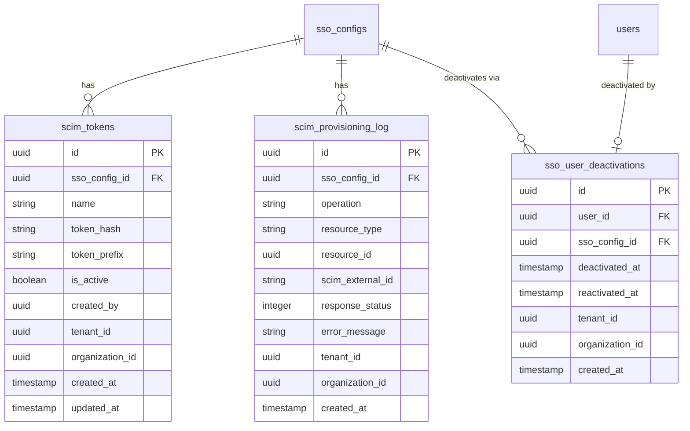

# feat: SCIM 2.0 Provisioning Endpoint

## Overview

Implement a SCIM 2.0 server endpoint in the SSO module so that identity providers (Microsoft Entra ID, JumpCloud, Okta) can push user lifecycle changes (create, update, deactivate) to Open Mercato. This enables automated directory sync — when an admin adds/removes a user in the IdP, the change propagates without manual intervention.

**Scope**: User provisioning only. Group/role mapping deferred to a future milestone (see Deferred section).

## Problem Statement

Today, SSO users are only provisioned via JIT (just-in-time) on first login. This means:
- Users must log in at least once before they exist in Open Mercato
- There is no way to pre-provision users before they need access
- When a user is removed from the IdP, their Open Mercato account remains active until manually deactivated

SCIM 2.0 User CRUD solves all three by providing a standard inbound API for user lifecycle management.

---

## Design Decisions

### D1: SCIM resource `id` = `SsoIdentity.id`

The SCIM `id` returned in responses maps to `SsoIdentity.id` (the junction record linking IdP subject to Open Mercato user). The IdP uses this for subsequent GET/PATCH/DELETE calls.

`SsoIdentity` also gains an `externalId` column (indexed, unique per `sso_config_id`) — Entra ID uses `externalId` heavily for reconciliation and sends `filter=externalId eq "..."` during sync.

### D2: User deactivation via extension entity `SsoUserDeactivation`

~~Using `deleted_at` for SCIM deactivation~~ (rejected by review — conflates "deactivated in IdP" with "permanently deleted"). Instead, the SSO module owns an `SsoUserDeactivation` extension entity:

```
sso_user_deactivations(id, user_id, sso_config_id, deactivated_at, reactivated_at, tenant_id, organization_id)
```

- `deactivated_at` set when SCIM sends `active: false`
- `reactivated_at` set when SCIM sends `active: true` (clears deactivation)
- Session revocation happens immediately on deactivation
- Auth middleware check: the SCIM auth context (and future login flow) checks this table. Deactivated users cannot log in but remain visible in admin user lists, audit logs, and assignment history.
- Follows the "zero auth module changes" principle — owned entirely by the SSO module via `data/extensions.ts`

### D3: Duplicate email handling = auto-link or 409

When `POST /Users` receives an email matching an existing user:
- If the user has no SSO identity for this config → auto-link (create `SsoIdentity`), return `201 Created`
- If the user already has an SSO identity for this config → return `409 Conflict` (uniqueness)
- If the user exists in a different organization → return `409 Conflict`

**Idempotency**: If `POST /Users` sends the same `externalId` that already exists for this SSO config, return the existing resource (200), not a duplicate.

### D4: SCIM token format = `omscim_<hex>`

Token format: `omscim_` prefix + 32 bytes random hex (~71 chars total). Prefix column stores first 12 chars for fast DB lookup before bcrypt compare. Follows the existing `api_keys` module pattern (`omk_`).

No `expires_at` — SCIM tokens are long-lived infrastructure credentials. Entra ID does not support token rotation or expiration-aware provisioning. Tokens are either active or revoked.

### D5: Reject SCIM requests when parent `SsoConfig.isActive = false`

Return `403 Forbidden` with SCIM error body. The token itself is valid, but the config is deactivated.

### D6: Bulk operations = `false` in ServiceProviderConfig

Not needed for Entra ID or JumpCloud. Advertise as unsupported.

### D7: SCIM is optional per SSO config

Not every IdP supports SCIM (e.g., Google Workspace has no SCIM push). SCIM is entirely opt-in — enabled implicitly by generating a SCIM token. No `scimEnabled` flag on `SsoConfig`. SSO configs without tokens continue with JIT-only provisioning.

### D8: Discovery endpoints — `/ServiceProviderConfig` only for v1

`/Schemas` and `/ResourceTypes` are not consumed by IdPs at runtime. Entra only hits `/ServiceProviderConfig` during "Test Connection". Add the other two only if an IdP integration fails without them.

---

## Technical Approach

### Architecture

```
IdP (Entra ID / JumpCloud / Okta)
  │
  │  SCIM 2.0 over HTTPS
  │  Authorization: Bearer <token>
  ▼
┌──────────────────────────────────────┐
│  SCIM API Layer                      │
│  /api/sso/scim/v2/...               │
│                                      │
│  ┌─────────────┐ ┌────────────────┐  │
│  │ SCIM Auth   │ │ SCIM Routes    │  │
│  │ (bearer     │→│ /Users         │  │
│  │  token)     │ │ /ServiceProv.. │  │
│  └─────────────┘ └────────────────┘  │
│        │                │            │
│        ▼                ▼            │
│  ┌───────────┐  ┌──────────────┐     │
│  │ ScimToken │  │ ScimService  │     │
│  │ Service   │  │ (user CRUD,  │     │
│  │           │  │  filter,     │     │
│  │           │  │  PATCH)      │     │
│  └───────────┘  └──────────────┘     │
│                       │              │
│                       ▼              │
│               ┌──────────────┐       │
│               │ Account      │       │
│               │ Linking      │       │
│               │ Service      │       │
│               └──────────────┘       │
└──────────────────────────────────────┘
```

### ERD: New Entities



### Changes to existing `SsoIdentity` entity

Add column:
- `externalId` — `string, nullable, unique per (sso_config_id, external_id)` — Entra uses this for reconciliation

---

### Implementation Phases

#### Phase 1: Data Model + SCIM Token Management

**New entities** in `packages/enterprise/src/modules/sso/data/entities.ts`:
- `ScimToken` — bearer token storage (bcrypt hash + prefix, `is_active`, no expiry)
- `SsoUserDeactivation` — SCIM deactivation state (extension entity)
- `ScimProvisioningLog` — append-only audit log with index on `(sso_config_id, created_at DESC)`

**Modify existing entity** `SsoIdentity`:
- Add `externalId` column with unique compound index on `(ssoConfigId, externalId)`

**New validators** in `packages/enterprise/src/modules/sso/data/validators.ts`:
- `createScimTokenSchema` — `{ ssoConfigId: uuid, name: string }`
- `scimTokenListSchema` — pagination query params

**New service** `packages/enterprise/src/modules/sso/services/scimTokenService.ts`:
- `generateToken(ssoConfigId, name, scope)` — generate `omscim_<hex>`, hash with bcrypt(10), store hash + prefix, return raw token once
- `verifyToken(rawToken)` — extract prefix (first 12 chars), lookup by prefix + `is_active`, bcrypt.compare, return `{ ssoConfigId, organizationId, tenantId }` or null
- `revokeToken(tokenId, scope)` — set `is_active = false`
- `listTokens(ssoConfigId, scope)` — return tokens (name, prefix, created date — no hashes)
- Timing-safe: always bcrypt.compare against dummy hash when prefix not found

**New API routes** (admin auth via `resolveSsoAdminContext`):
- `api/scim/tokens/route.ts` — `GET` (list), `POST` (create)
- `api/scim/tokens/[id]/route.ts` — `DELETE` (revoke)
- All admin routes export `openApi` per codebase convention

**ACL additions** to `acl.ts`:
- `sso.scim.manage` — manage SCIM tokens

**Setup additions** to `setup.ts`:
- `defaultRoleFeatures.superadmin` → add `sso.scim.manage`
- `defaultRoleFeatures.admin` → add `sso.scim.manage`

**DI additions** to `di.ts`:
- Register `scimTokenService`

**Migration**: Run `yarn db:generate` after entity changes.

**Acceptance criteria:**
- [ ] Admin can generate a SCIM token from the API (show-once flow)
- [ ] Admin can list active tokens (prefix + name + created date, no hashes)
- [ ] Admin can revoke a token
- [ ] Revoked tokens rejected with 401
- [ ] `SsoIdentity.externalId` column exists with compound unique index

---

#### Phase 2: SCIM Auth Middleware + Discovery

**New file** `packages/enterprise/src/modules/sso/api/scim/context.ts`:
- `resolveScimContext(req)` — extract `Authorization: Bearer <token>`, call `scimTokenService.verifyToken()`, check `SsoConfig.isActive`, return `{ ssoConfigId, organizationId, tenantId }` or throw 401/403
- Timing-safe dummy comparison when token prefix not found
- Returns 401 with `WWW-Authenticate: Bearer` header on auth failure
- Returns 403 with SCIM error body when config is inactive

**Discovery route**:
- `api/scim/v2/ServiceProviderConfig/route.ts` — static JSON: patch=true, bulk=false, filter=true (maxResults=200), sort=false, etag=false, changePassword=false, `authenticationSchemes: [{ type: 'oauthbearertoken' }]`

**New file** `packages/enterprise/src/modules/sso/lib/scim-response.ts`:
- `buildScimError(status, detail, scimType?)` — RFC 7644 error format with `urn:ietf:params:scim:api:messages:2.0:Error` schema
- `buildListResponse(resources, totalResults, startIndex, itemsPerPage)` — pagination wrapper
- `SCIM_CONTENT_TYPE = 'application/scim+json'`
- `scimHeaders()` — returns `{ 'Content-Type': 'application/scim+json' }`

All SCIM responses use `Content-Type: application/scim+json`. Accept both `application/scim+json` and `application/json` on requests.

**Acceptance criteria:**
- [ ] `GET /api/sso/scim/v2/ServiceProviderConfig` returns valid SCIM config JSON
- [ ] Invalid bearer token returns 401 with `WWW-Authenticate: Bearer` header
- [ ] Inactive SSO config returns 403 with SCIM error body
- [ ] Missing `Authorization` header returns 401

---

#### Phase 3a: SCIM User Create + Read

**New service** `packages/enterprise/src/modules/sso/services/scimService.ts`:
- `createUser(scimPayload, scope)` — map SCIM attrs to User, handle duplicate email (D3 logic), handle duplicate `externalId` (idempotent return), create `SsoIdentity` with `provisioningMethod: 'scim'` and `externalId`, log to provisioning log
- `getUser(scimId, scope)` — lookup by `SsoIdentity.id`, return SCIM User resource with `meta` object (`resourceType`, `created`, `lastModified`, `location`)
- `listUsers(filter?, startIndex?, count?, scope)` — parse filter, query users scoped to org, return ListResponse with pagination
- `toScimUserResource(user, ssoIdentity)` — map internal models to SCIM JSON including `meta` object

**New file** `packages/enterprise/src/modules/sso/lib/scim-mapper.ts`:
- `toScimUserResource(user, identity, baseUrl)` — maps User + SsoIdentity to SCIM User JSON with `meta`, `schemas`, `externalId`
- `fromScimUserPayload(payload)` — maps SCIM User JSON to internal create params with strict attribute allowlist
- Keeps ScimService focused on orchestration

**New file** `packages/enterprise/src/modules/sso/lib/scim-filter.ts`:
- Parse SCIM filter expressions: support `eq` operator (case-insensitive for strings, case-insensitive operator keyword) and `and` combinator
- Supported attribute paths: `userName`, `externalId`, `displayName`, `active`
- Returns structured filter object convertible to MikroORM query conditions

**SCIM User routes** (SCIM bearer auth via `resolveScimContext`):
- `api/scim/v2/Users/route.ts` — `POST` (create), `GET` (list with filter + pagination)
- `api/scim/v2/Users/[id]/route.ts` — `GET` (single user)

**Provisioning log**: Each create/read operation logged to `scim_provisioning_log` (operation, resource_type, resource_id, response_status, error_message).

**DI additions**: Register `scimService`

**Acceptance criteria:**
- [ ] `POST /Users` creates user + SsoIdentity with `provisioningMethod: 'scim'`
- [ ] `POST /Users` returns `201 Created` with `Location` header
- [ ] `POST /Users` with existing email auto-links if no SSO identity, `409` if already linked
- [ ] `POST /Users` with duplicate `externalId` returns existing resource (idempotent)
- [ ] `GET /Users/{id}` returns SCIM User resource with `meta` object
- [ ] `GET /Users?filter=userName eq "x"` returns matching users in ListResponse
- [ ] `GET /Users?filter=externalId eq "x"` works (Entra reconciliation)
- [ ] Empty filter results return `200` with empty `Resources` array, not `404`
- [ ] All responses use `Content-Type: application/scim+json`
- [ ] `externalId` stored on `SsoIdentity` and queryable via filter

---

#### Phase 3b: SCIM User Patch + Delete

**New file** `packages/enterprise/src/modules/sso/lib/scim-patch.ts`:
- Parse SCIM PatchOp operations array
- Case-insensitive `op` values (handle Entra's PascalCase: `"Replace"`, `"Add"`, `"Remove"`)
- Support path syntax: simple (`active`), dotted (`name.familyName`), no-path (value object)
- Boolean leniency: accept `"False"`/`"True"` strings as booleans (Entra quirk)
- Strict attribute allowlist: only map known SCIM attrs → internal fields. Reject/ignore `tenantId`, `organizationId`, `id`, `meta`, etc.
- All operations in a single PATCH are atomic — if any fails, roll back all

**Add to `scimService.ts`**:
- `patchUser(scimId, operations, scope)` — parse PATCH ops via `scim-patch.ts`, apply changes atomically, handle `active: false` → create `SsoUserDeactivation` + revoke sessions, handle `active: true` → set `reactivated_at` on deactivation record
- `deleteUser(scimId, scope)` — create `SsoUserDeactivation` + revoke sessions, log. Does NOT hard-delete.

**Session revocation on deactivation**:
- When `active` set to `false` or DELETE called: `em.nativeDelete(Session, { user: userId })` (pattern from auth module `commands/users.ts:273`)

**Add to User route**:
- `api/scim/v2/Users/[id]/route.ts` — add `PATCH` (update), `DELETE` (deactivate)

**Acceptance criteria:**
- [ ] `PATCH /Users/{id}` with `active: false` creates deactivation record and revokes all sessions
- [ ] `PATCH /Users/{id}` with `active: true` reactivates (clears deactivation)
- [ ] `PATCH /Users/{id}` handles Entra's PascalCase ops (`"Replace"`)
- [ ] `PATCH /Users/{id}` handles string booleans (`"False"`)
- [ ] `PATCH /Users/{id}` with no `path` (value object) works
- [ ] `PATCH` operations are atomic — partial failure rolls back all changes
- [ ] `DELETE /Users/{id}` deactivates and revokes sessions (no hard delete)
- [ ] `PATCH /Users/{id}` returns `200` with updated resource
- [ ] `DELETE /Users/{id}` returns `204 No Content`
- [ ] Attribute allowlist prevents injection of `organizationId`, `tenantId`, etc.
- [ ] All operations logged to `scim_provisioning_log`

---

#### Phase 4: Admin UI — Provisioning Tab

**Add tab to SSO config detail page** (`backend/sso/config/[id]/page.tsx`):

**"Provisioning" tab:**
- SCIM token list (name, prefix, created date)
- "Generate Token" button → show-once modal with copy-to-clipboard
- "Revoke" action per token with confirmation dialog
- SCIM endpoint URL display (copy-to-clipboard): `{baseUrl}/api/sso/scim/v2`
- "Not configured" empty state explaining SCIM is optional
- Simple provisioning log table (last 50 entries: timestamp, operation, status, error)

**Acceptance criteria:**
- [ ] Admin can generate/revoke SCIM tokens from the UI
- [ ] Token shown once with copy button, never retrievable again
- [ ] SCIM endpoint URL displayed for easy IdP configuration
- [ ] Provisioning log entries visible with recent operations
- [ ] "Not configured" state shown when no tokens exist

---

## Integration Tests

Following the existing test naming convention in the SSO module:

| Test ID | File | Covers |
|---------|------|--------|
| TC-SSO-011 | `scim-token-lifecycle.spec.ts` | Token generate, list, revoke, auth rejection |
| TC-SSO-012 | `scim-user-create.spec.ts` | POST /Users: create, auto-link, duplicate, idempotent externalId |
| TC-SSO-013 | `scim-user-read.spec.ts` | GET /Users/{id}, GET /Users?filter=..., ListResponse pagination |
| TC-SSO-014 | `scim-user-patch.spec.ts` | PATCH active:false, active:true, name update, Entra quirks |
| TC-SSO-015 | `scim-user-delete.spec.ts` | DELETE deactivation, session revocation |
| TC-SSO-016 | `scim-auth-middleware.spec.ts` | Bearer token auth, invalid token, inactive config, timing safety |

Tests must be self-contained: create SSO config + SCIM token in setup, clean up in teardown.

---

## Entra ID SCIM Compatibility Notes

The SCIM implementation must handle these Entra-specific behaviors:

| Behavior | Handling |
|----------|----------|
| PascalCase `op` values (`"Replace"`) | Case-insensitive `op` parsing in `scim-patch.ts` |
| String booleans (`"False"` instead of `false`) | Parse both string and boolean in `scim-patch.ts` |
| `application/scim+json` and `application/json` Content-Type | Accept both on requests |
| Mixed-case filter operators (`Eq` vs `eq`) | Case-insensitive filter parsing in `scim-filter.ts` |
| `externalId` used for reconciliation | Indexed column on `SsoIdentity`, supported in filter |
| Sync every 20-40 minutes, initial sync can take hours | No token expiry, generous throughput |
| Expects 25 req/s minimum throughput | No artificial rate limiting in v1 (bcrypt ~100ms is natural throttle) |
| PATCH without `path` (value object) | Supported in `scim-patch.ts` |

## Security Considerations

1. **Bearer tokens**: bcrypt(10) hashed, prefix-based lookup, timing-safe dummy comparison when prefix not found
2. **Tenant isolation**: every SCIM query scoped by `organizationId` resolved from token → `SsoConfig`
3. **Attribute allowlist**: PATCH operations go through strict mapping in `scim-patch.ts`, preventing injection of `tenantId`, `organizationId`, etc.
4. **Session revocation**: immediate on deactivation/deletion via `em.nativeDelete(Session, { user: userId })`
5. **Minimal error messages**: 401 responses don't reveal whether token exists
6. **Audit trail**: all SCIM operations logged to `scim_provisioning_log`
7. **HTTPS**: SCIM endpoints should reject non-HTTPS in production

## Dependencies & Prerequisites

- M1 (OIDC login) and M2 (Admin UI) completed
- Microsoft Entra ID free tenant set up with OIDC app registration + test users — see `docs/guides/entra-id-setup.md`
- Existing entities: `SsoConfig`, `SsoIdentity`, `User`, `Session`, `Role`, `UserRole`
- Existing services: `AccountLinkingService`, `SsoConfigService`, `AuthService`
- Existing infrastructure: bcrypt, DI container, event bus

---

## Deferred to Future Milestones

### SCIM Group CRUD + Role Mapping

**Why deferred**: User CRUD alone solves the three core problems (pre-provisioning, user existence, deactivation). Group/role mapping is a separate feature that doubles entity count, adds a `ScimGroupService`, introduces the complex `source: 'scim'` role tracking problem, and requires a `scim_group_members` junction table (JSONB members rejected by review — race condition on concurrent PATCH). No customer has requested it yet.

**When to implement**: When a customer needs IdP-driven role assignment. The SCIM endpoint already returns `501 Not Implemented` for `/Groups` endpoints.

**Scope when implemented**:
- `ScimGroup` entity with `scim_group_members` junction table (not JSONB)
- `SsoGroupRoleMapping` entity (FK to `ScimGroup.id`, not string `idp_group_id`)
- `scim_role_grants` table to track SCIM-managed role assignments (never touch manual roles)
- `ScimGroupService` for group CRUD + role reconciliation
- Group Mappings admin UI tab
- SCIM Group routes: POST/GET/PATCH/DELETE `/Groups`

### `/Schemas` and `/ResourceTypes` Discovery Endpoints

Add only if an IdP integration fails without them. Not consumed at runtime by Entra ID.

### Rate Limiting

Defer SCIM-specific rate limiting. Bcrypt verification (~100ms per request) is a natural throttle. Add infrastructure-level rate limiting (nginx/CDN) if abuse is observed.

### SCIM Events

No events declared — no subscribers exist yet. Add events (`sso.scim.user.created`, etc.) when a feature needs to react to SCIM operations. The provisioning log table covers audit.

---

## Testing Guide

### Dev IdP: Microsoft Entra ID (Free Tenant)

Entra ID is the primary dev IdP. It supports both OIDC and SCIM outbound provisioning, allows `http://localhost` redirect URIs for OIDC, and is the most common enterprise IdP. See `docs/guides/entra-id-setup.md` for setup instructions.

**Note**: SCIM provisioning from Entra requires a publicly reachable URL (use ngrok for local dev). OIDC redirect works with `http://localhost`.

### Testing Strategy

| Phase | Method | Purpose |
|-------|--------|---------|
| Phase 1-2 (tokens + discovery) | curl | Fast iteration, full control |
| Phase 3a-3b (user CRUD) | curl first, then Entra ID "Provision on demand" | Validate with real IdP |
| Phase 4 (admin UI) | Entra ID | End-to-end: admin generates token in UI → configures Entra → users sync |
| M4 (Entra validation) | Microsoft Entra ID | Quirks testing, production readiness |

### Option A: Manual Testing with curl (Development)

**1. Generate a SCIM token:**

```bash
curl -X POST http://localhost:3000/api/sso/scim/tokens \
  -H "Content-Type: application/json" \
  -H "Cookie: <session_cookie>" \
  -d '{ "ssoConfigId": "<your-sso-config-id>", "name": "Dev Test Token" }'

# Response (token shown once):
# { "token": "omscim_abc123...", "id": "...", "prefix": "omscim_abc1" }
```

**2. Test discovery:**

```bash
curl http://localhost:3000/api/sso/scim/v2/ServiceProviderConfig \
  -H "Authorization: Bearer omscim_abc123..."
```

**3. Create a user:**

```bash
curl -X POST http://localhost:3000/api/sso/scim/v2/Users \
  -H "Authorization: Bearer omscim_abc123..." \
  -H "Content-Type: application/scim+json" \
  -d '{
    "schemas": ["urn:ietf:params:scim:schemas:core:2.0:User"],
    "userName": "jane.doe@example.com",
    "name": { "givenName": "Jane", "familyName": "Doe" },
    "displayName": "Jane Doe",
    "emails": [{ "value": "jane.doe@example.com", "type": "work", "primary": true }],
    "externalId": "ext-12345",
    "active": true
  }'
```

**4. Query users:**

```bash
# By username
curl "http://localhost:3000/api/sso/scim/v2/Users?filter=userName%20eq%20%22jane.doe%40example.com%22" \
  -H "Authorization: Bearer omscim_abc123..."

# By externalId
curl "http://localhost:3000/api/sso/scim/v2/Users?filter=externalId%20eq%20%22ext-12345%22" \
  -H "Authorization: Bearer omscim_abc123..."
```

**5. Deactivate a user:**

```bash
curl -X PATCH http://localhost:3000/api/sso/scim/v2/Users/<scim-id> \
  -H "Authorization: Bearer omscim_abc123..." \
  -H "Content-Type: application/scim+json" \
  -d '{
    "schemas": ["urn:ietf:params:scim:api:messages:2.0:PatchOp"],
    "Operations": [{ "op": "replace", "path": "active", "value": false }]
  }'
```

**6. Test Entra-style PATCH (PascalCase, string booleans):**

```bash
curl -X PATCH http://localhost:3000/api/sso/scim/v2/Users/<scim-id> \
  -H "Authorization: Bearer omscim_abc123..." \
  -H "Content-Type: application/scim+json" \
  -d '{
    "schemas": ["urn:ietf:params:scim:api:messages:2.0:PatchOp"],
    "Operations": [{ "op": "Replace", "path": "active", "value": "False" }]
  }'
```

**7. Reactivate a user:**

```bash
curl -X PATCH http://localhost:3000/api/sso/scim/v2/Users/<scim-id> \
  -H "Authorization: Bearer omscim_abc123..." \
  -H "Content-Type: application/scim+json" \
  -d '{
    "schemas": ["urn:ietf:params:scim:api:messages:2.0:PatchOp"],
    "Operations": [{ "op": "replace", "path": "active", "value": true }]
  }'
```

### Option B: Microsoft Entra ID (Primary Dev IdP — OIDC + SCIM)

See `docs/guides/entra-id-setup.md` for full step-by-step setup. Summary:

**1. Create a free Azure account** at https://azure.microsoft.com/free

**2. Register OIDC application:**
- Entra admin center → App registrations → New registration
- Add redirect URI: `http://localhost:3000/api/sso/callback/oidc` (localhost works for OIDC!)
- Note the **Application (client) ID** and **Directory (tenant) ID**
- Create a client secret under Certificates & secrets
- Add `email` optional claim to ID token (Token configuration)
- Issuer URL: `https://login.microsoftonline.com/<tenant-id>/v2.0`

**3. Configure SCIM provisioning:**
- Enterprise applications → Open Mercato → Provisioning → Get started
- Provisioning Mode: "Automatic"
- Admin Credentials:
  - Tenant URL: `https://<ngrok-url>/api/sso/scim/v2` (SCIM requires public URL — use ngrok)
  - Secret Token: SCIM bearer token from Open Mercato admin UI
- Click "Test Connection" → validates `/ServiceProviderConfig`
- Configure attribute mappings (verify defaults work)
- Set Provisioning Status to "On"

**4. Test the provisioning flow:**
- Use "Provision on demand" for instant testing (no 40-minute wait)
- Assign a user → user should appear in Open Mercato
- Update the user's name → change should propagate
- Block sign-in → user should be deactivated in Open Mercato, sessions revoked

**5. Test OIDC + SCIM together:**
- Assign a user in Entra → SCIM creates them in Open Mercato (pre-provisioned)
- User logs in via OIDC → existing SCIM-provisioned account is used (no JIT needed)
- Block sign-in in Entra → SCIM deactivates them → user can no longer log in via OIDC

**6. Validate Entra quirks during development:**
- [ ] PascalCase `op` values handled (`"Replace"` instead of `"replace"`)
- [ ] String booleans (`"False"`) parsed correctly
- [ ] `externalId` reconciliation works
- [ ] Mixed-case filter operators handled (`Eq` instead of `eq`)

---

## References

### Internal
- SSO module: `packages/enterprise/src/modules/sso/`
- API keys module (token pattern): `packages/core/src/modules/api_keys/`
- Auth entities: `packages/core/src/modules/auth/data/entities.ts`
- Session deletion pattern: `packages/core/src/modules/auth/commands/users.ts:273`
- Spec: `.ai/specs/enterprise/SPEC-ENT-002-2026-02-19-sso-directory-sync.md`

### External
- [RFC 7643 — SCIM Core Schema](https://www.rfc-editor.org/rfc/rfc7643)
- [RFC 7644 — SCIM Protocol](https://www.rfc-editor.org/rfc/rfc7644)
- [Microsoft Entra ID — Known SCIM Compliance Issues](https://learn.microsoft.com/en-us/entra/identity/app-provisioning/application-provisioning-config-problem-scim-compatibility)
- [Microsoft Entra ID — Develop a SCIM Endpoint](https://learn.microsoft.com/en-us/entra/identity/app-provisioning/use-scim-to-provision-users-and-groups)
- [Entra ID Setup Guide](docs/guides/entra-id-setup.md)
