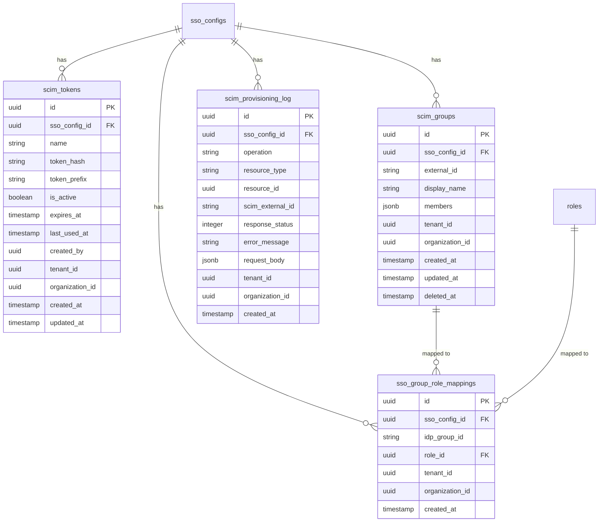

# feat: SCIM 2.0 Provisioning Endpoint

## Overview

Implement a SCIM 2.0 server endpoint in the SSO module so that identity providers (Zitadel, Microsoft Entra ID) can push user lifecycle changes (create, update, deactivate) and group membership changes to Open Mercato. This enables automated directory sync — when an admin adds/removes a user in the IdP, the change propagates to Open Mercato without manual intervention.

## Problem Statement

Today, SSO users are only provisioned via JIT (just-in-time) on first login. This means:
- Users must log in at least once before they exist in Open Mercato
- There is no way to pre-provision users or sync group/role assignments from the IdP
- When a user is removed from the IdP, their Open Mercato account remains active until manually deactivated
- No automated role assignment based on IdP group membership

SCIM 2.0 solves all of these by providing a standard inbound API for identity lifecycle management.

## Design Decisions

### D1: SCIM resource `id` = `SsoIdentity.id`

The SCIM `id` returned in responses maps to `SsoIdentity.id` (the junction record linking IdP subject to Open Mercato user). This is the SCIM-specific resource — the IdP uses it for subsequent GET/PATCH/DELETE calls.

### D2: User deactivation via `deleted_at` (soft-delete)

Rather than adding `is_active` to the core `User` entity (violating "zero auth module changes"), SCIM deactivation sets `User.deleted_at`. Reactivation (`active: true`) clears `deleted_at`. The existing auth middleware already rejects soft-deleted users. This is pragmatic for v1 — if full deactivation semantics are needed later, an extension entity can be added.

### D3: Duplicate email handling = auto-link if no SSO identity, 409 if already linked

When `POST /Users` receives an email matching an existing user:
- If the user has no SSO identity for this config → auto-link (create `SsoIdentity` pointing to existing user), return 200 with the linked resource
- If the user already has an SSO identity for this config → return `409 Conflict` (uniqueness)
- If the user exists in a different organization → return `409 Conflict`

### D4: Group-to-role mapping is reconciled, but only for SCIM-managed roles

When group membership changes, roles are reconciled against the current `sso_group_role_mappings`. SCIM only manages roles that it granted (tracked via `source: 'scim'` on `UserRole`). Manually-assigned roles are never touched by SCIM.

### D5: Groups stored in a `scim_groups` table

SCIM requires groups to be first-class resources (GET/POST/PATCH/DELETE). A `scim_groups` entity stores group state with a `members` JSONB column for member IDs.

### D6: SCIM token format = `omscim_<hex>`

Token format: `omscim_` prefix + 32 bytes random hex (total ~71 chars). Prefix column stores first 12 chars for fast DB lookup before bcrypt compare. Max 5 active tokens per SSO config.

### D7: Reject SCIM requests when parent `SsoConfig.isActive = false`

Return `403 Forbidden` with SCIM error body. The token itself is valid, but the config is deactivated.

### D8: Bulk operations = `false` in ServiceProviderConfig

Not needed for Entra ID or Zitadel. Advertise as unsupported.

### D9: SCIM is optional per SSO config

Not every IdP supports SCIM (e.g., Google Workspace has no SCIM push). SCIM provisioning is entirely opt-in per SSO config — an admin only enables it by generating a SCIM token. SSO configs without tokens continue to work with JIT-only provisioning. The admin UI shows the Provisioning tab for all configs, but with a clear "not configured" state and explanation that SCIM is optional. The `SsoConfig` entity does NOT get a `scimEnabled` flag — the presence of active `ScimToken` records is the implicit enablement signal.

---

## Technical Approach

### Architecture

```
IdP (Entra ID / Zitadel)
  │
  │  SCIM 2.0 over HTTPS
  │  Authorization: Bearer <token>
  ▼
┌─────────────────────────────────────────┐
│  SCIM API Layer                         │
│  /api/sso/scim/v2/...                   │
│                                         │
│  ┌─────────────┐  ┌──────────────────┐  │
│  │ SCIM Auth   │  │ SCIM Router      │  │
│  │ Middleware   │→ │ /Users, /Groups  │  │
│  │ (bearer     │  │ /ServiceProvider │  │
│  │  token)     │  │  Config, etc.    │  │
│  └─────────────┘  └──────────────────┘  │
│         │                  │             │
│         ▼                  ▼             │
│  ┌─────────────┐  ┌──────────────────┐  │
│  │ ScimToken   │  │ ScimService      │  │
│  │ Service     │  │ (user CRUD,      │  │
│  │ (auth,      │  │  group CRUD,     │  │
│  │  generate,  │  │  filter parsing, │  │
│  │  revoke)    │  │  PATCH handler)  │  │
│  └─────────────┘  └──────────────────┘  │
│                          │               │
│              ┌───────────┼───────────┐   │
│              ▼           ▼           ▼   │
│  ┌──────────────┐ ┌───────────┐ ┌─────┐ │
│  │ Account      │ │ ScimGroup │ │ Log │ │
│  │ Linking      │ │ Service   │ │     │ │
│  │ Service      │ │           │ │     │ │
│  └──────────────┘ └───────────┘ └─────┘ │
└─────────────────────────────────────────┘
```

### ERD: New Entities



### Implementation Phases

#### Phase 1: Data Model + SCIM Token Management

**New entities** in `packages/enterprise/src/modules/sso/data/entities.ts`:
- `ScimToken` — bearer token storage (bcrypt hash + prefix)
- `ScimGroup` — SCIM group resources
- `SsoGroupRoleMapping` — IdP group to Open Mercato role
- `ScimProvisioningLog` — append-only audit log

**New validators** in `packages/enterprise/src/modules/sso/data/validators.ts`:
- `createScimTokenSchema` — name, expiresAt (optional)
- `scimTokenListSchema` — pagination query

**New service** `packages/enterprise/src/modules/sso/services/scimTokenService.ts`:
- `generateToken(ssoConfigId, name, expiresAt?)` — generate `omscim_<hex>`, hash with bcrypt(10), store hash + prefix, return raw token once
- `verifyToken(rawToken)` — extract prefix (first 12 chars), lookup by prefix + is_active + not expired, bcrypt.compare, return `{ ssoConfigId, organizationId, tenantId }` or null
- `revokeToken(tokenId, scope)` — set `is_active = false`
- `listTokens(ssoConfigId, scope)` — return tokens (without hashes) for admin display
- Timing-safe: always bcrypt.compare against dummy hash when prefix not found

**New API routes**:
- `api/scim/tokens/route.ts` — `GET` (list), `POST` (create) — admin auth via `resolveSsoAdminContext`
- `api/scim/tokens/[id]/route.ts` — `DELETE` (revoke) — admin auth

**ACL additions** to `acl.ts`:
- `sso.scim.manage` — manage SCIM tokens and group mappings
- `sso.provisioning.view` — view provisioning logs

**Setup additions** to `setup.ts`:
- `defaultRoleFeatures.superadmin` → add `sso.scim.manage`, `sso.provisioning.view`
- `defaultRoleFeatures.admin` → add `sso.scim.manage`, `sso.provisioning.view`

**DI additions** to `di.ts`:
- Register `scimTokenService`

**Migration**: Run `yarn db:generate` after entity changes.

**Acceptance criteria:**
- [ ] Admin can generate a SCIM token from the API (show-once flow)
- [ ] Admin can list active tokens (prefix + name + created date, no hashes)
- [ ] Admin can revoke a token
- [ ] Max 5 active tokens per SSO config enforced
- [ ] Expired/revoked tokens rejected with 401

---

#### Phase 2: SCIM Auth Middleware + Discovery Endpoints

**New file** `packages/enterprise/src/modules/sso/api/scim/context.ts`:
- `resolveScimContext(req)` — extract `Authorization: Bearer <token>`, call `scimTokenService.verifyToken()`, check `SsoConfig.isActive`, return `{ ssoConfigId, organizationId, tenantId }` or throw 401/403
- Timing-safe dummy comparison when token prefix not found
- Update `ScimToken.lastUsedAt` on successful auth

**Discovery routes** (no auth required per RFC, but accept auth gracefully):
- `api/scim/v2/ServiceProviderConfig/route.ts` — static JSON: patch=true, bulk=false, filter=true (maxResults=200), sort=false, etag=false, changePassword=false
- `api/scim/v2/Schemas/route.ts` — User + EnterpriseUser + Group schema definitions
- `api/scim/v2/ResourceTypes/route.ts` — User + Group resource type metadata

All SCIM responses use `Content-Type: application/scim+json`.

**Acceptance criteria:**
- [ ] `GET /api/sso/scim/v2/ServiceProviderConfig` returns valid SCIM config
- [ ] `GET /api/sso/scim/v2/Schemas` returns User, EnterpriseUser, Group schemas
- [ ] `GET /api/sso/scim/v2/ResourceTypes` returns User + Group types
- [ ] Invalid bearer token returns 401 with `WWW-Authenticate: Bearer` header
- [ ] Inactive SSO config returns 403 with SCIM error body

---

#### Phase 3: SCIM User CRUD

**New service** `packages/enterprise/src/modules/sso/services/scimService.ts`:
- `createUser(scimPayload, scope)` — map SCIM attrs to User, handle duplicate email (auto-link or 409), create SsoIdentity with `provisioningMethod: 'scim'`, log to provisioning log
- `getUser(scimId, scope)` — lookup by `SsoIdentity.id`, return SCIM resource representation
- `listUsers(filter?, startIndex?, count?, scope)` — parse filter, query users, return ListResponse
- `patchUser(scimId, operations, scope)` — parse PATCH ops, apply changes, handle `active: false` → soft-delete + revoke sessions
- `deleteUser(scimId, scope)` — soft-delete user, revoke sessions, log
- `toScimUserResource(user, ssoIdentity)` — map internal models to SCIM JSON

**New file** `packages/enterprise/src/modules/sso/lib/scim-filter.ts`:
- Parse SCIM filter expressions: support `eq` operator (case-insensitive) and `and` combinator
- Attribute paths: `userName`, `externalId`, `displayName`, `name.familyName`, `name.givenName`, `active`
- Returns a structured filter object that can be converted to MikroORM query conditions

**New file** `packages/enterprise/src/modules/sso/lib/scim-patch.ts`:
- Parse SCIM PatchOp operations array
- Case-insensitive `op` values (handle Entra's PascalCase)
- Support path syntax: simple (`active`), dotted (`name.familyName`), bracket-filter (`members[value eq "..."]`)
- Boolean leniency: accept `"False"`/`"True"` strings as booleans
- Strict attribute allowlist to prevent injection (only map known SCIM attrs to internal fields)

**New file** `packages/enterprise/src/modules/sso/lib/scim-response.ts`:
- `buildScimError(status, detail, scimType?)` — RFC 7644 error format
- `buildListResponse(resources, totalResults, startIndex, itemsPerPage)` — pagination wrapper
- `SCIM_CONTENT_TYPE = 'application/scim+json'`

**SCIM User routes**:
- `api/scim/v2/Users/route.ts` — `POST` (create), `GET` (list with filter + pagination)
- `api/scim/v2/Users/[id]/route.ts` — `GET` (single), `PATCH` (update), `DELETE` (deactivate)

**Session revocation on deactivation**:
- When `active` set to `false` or DELETE called: `em.nativeDelete(Session, { user: userId })` (pattern from auth module `commands/users.ts:273`)
- Emit `sso.scim.user.deactivated` event

**Rate limiting**:
- Apply existing `checkRateLimit` helper with config: `{ points: 25, duration: 1, keyPrefix: 'scim' }` keyed by token ID
- Return `429` with `Retry-After: 1` header when exceeded

**DI additions**: Register `scimService`

**Events additions** to `events.ts`:
- `sso.scim.user.created`
- `sso.scim.user.updated`
- `sso.scim.user.deactivated`
- `sso.scim.user.deleted`
- `sso.scim.token.created`
- `sso.scim.token.revoked`

**Acceptance criteria:**
- [ ] `POST /Users` creates user + SsoIdentity with `provisioningMethod: 'scim'`
- [ ] `POST /Users` with existing email auto-links if no SSO identity, 409 if already linked
- [ ] `GET /Users/{id}` returns SCIM User resource with `meta` object
- [ ] `GET /Users?filter=userName eq "x"` returns matching users in ListResponse
- [ ] `PATCH /Users/{id}` with `active: false` soft-deletes user and revokes all sessions
- [ ] `PATCH /Users/{id}` handles Entra's PascalCase ops and string booleans
- [ ] `DELETE /Users/{id}` soft-deletes and revokes sessions
- [ ] All operations logged to `scim_provisioning_log`
- [ ] Rate limited at 25 req/s per token with 429 + Retry-After
- [ ] `201 Created` includes `Location` header
- [ ] All responses use `Content-Type: application/scim+json`
- [ ] `externalId` is stored on `SsoIdentity` and queryable via filter

---

#### Phase 4: SCIM Group CRUD + Role Mapping

**New service** `packages/enterprise/src/modules/sso/services/scimGroupService.ts`:
- `createGroup(scimPayload, scope)` — create `ScimGroup`, apply member role mappings
- `getGroup(groupId, scope)` — return SCIM Group resource
- `listGroups(filter?, startIndex?, count?, scope)` — filter by `displayName`
- `patchGroup(groupId, operations, scope)` — add/remove members, handle Entra's non-standard member removal format
- `deleteGroup(groupId, scope)` — soft-delete group, optionally revoke SCIM-granted roles
- `reconcileRoles(userId, scope)` — recalculate user roles based on current group memberships and `sso_group_role_mappings`

**Group-to-role mapping admin API** (admin auth):
- `api/scim/group-mappings/route.ts` — `GET` (list), `POST` (create mapping)
- `api/scim/group-mappings/[id]/route.ts` — `DELETE` (remove mapping)

**SCIM Group routes** (SCIM bearer auth):
- `api/scim/v2/Groups/route.ts` — `POST` (create), `GET` (list with filter)
- `api/scim/v2/Groups/[id]/route.ts` — `GET` (single), `PATCH` (update members), `DELETE`

**Role source tracking**:
- Add `source` field to `UserRole` tracking: when SCIM assigns a role, record it as `source: 'scim'` (via a `scim_role_grants` table or metadata on the role assignment)
- On group membership reconciliation, only add/remove roles with `source: 'scim'`

**RBAC cache invalidation**:
- After role changes, invalidate RBAC cache for affected users (use existing cache invalidation pattern if available)

**Events additions**:
- `sso.scim.group.created`
- `sso.scim.group.updated`
- `sso.scim.group.deleted`

**DI additions**: Register `scimGroupService`

**Acceptance criteria:**
- [ ] `POST /Groups` creates group, applies role mappings to members
- [ ] `PATCH /Groups/{id}` add/remove members updates user roles
- [ ] Entra's non-standard member removal format handled
- [ ] Role reconciliation only touches SCIM-granted roles, not manual ones
- [ ] Admin can configure group-to-role mappings via API
- [ ] `GET /Groups?filter=displayName eq "x"` returns matching groups

---

#### Phase 5: Admin UI

**New tab on SSO config detail page** (`backend/sso/config/[id]/page.tsx`):

**"Provisioning" tab:**
- SCIM token list (name, prefix, created date, last used, expires)
- "Generate Token" button → show-once modal with copy-to-clipboard
- "Revoke" action per token with confirmation dialog
- SCIM endpoint URL display (copy-to-clipboard): `{baseUrl}/api/sso/scim/v2`

**"Group Mappings" tab:**
- Table: IdP Group ID → Open Mercato Role
- Add mapping form (group ID input + role select)
- Remove mapping action

**"Provisioning Log" tab:**
- DataTable: timestamp, operation, resource type, resource ID, status, error
- Filter by operation type and status
- Pagination

**New backend page** `backend/sso/scim/log/page.tsx`:
- Full provisioning log viewer across all SSO configs (for superadmin)
- `page.meta.ts` with `requireFeatures: ['sso.provisioning.view']`

**Acceptance criteria:**
- [ ] Admin can generate/revoke SCIM tokens from the UI
- [ ] Token shown once with copy button, never retrievable again
- [ ] SCIM endpoint URL displayed for easy IdP configuration
- [ ] Admin can add/remove group-to-role mappings
- [ ] Provisioning log viewable with filtering and pagination

---

## Entra ID SCIM Compatibility Notes

The SCIM implementation must handle these Entra-specific behaviors:

| Behavior | Handling |
|----------|----------|
| PascalCase `op` values (`"Replace"`) | Case-insensitive `op` parsing |
| String booleans (`"False"` instead of `false`) | Parse both string and boolean |
| Non-standard member removal (value array instead of path filter) | Handle both formats in PATCH |
| `application/scim+json` and `application/json` Content-Type | Accept both |
| Mixed-case filter operators (`Eq` vs `eq`) | Case-insensitive filter parsing |
| `externalId` used for reconciliation | Store on SsoIdentity, index, support in filters |
| Sync every 20-40 minutes, initial sync can take hours | Rate limit is generous (25/s), no token short-expiry |
| Expects 25 req/s minimum throughput | Rate limiter set at 25/s per token |

## Security Considerations

1. **Bearer tokens**: bcrypt(10) hashed, prefix-based lookup, timing-safe dummy comparison
2. **Tenant isolation**: every query scoped by `organizationId` resolved from token
3. **Attribute allowlist**: PATCH operations go through strict mapping, preventing injection of `tenantId`, `organizationId`, etc.
4. **Session revocation**: immediate on deactivation/deletion — no stale sessions
5. **HTTPS only**: SCIM endpoints should reject non-HTTPS in production
6. **Rate limiting**: 25 req/s per token with `429 + Retry-After`
7. **Audit trail**: all SCIM operations logged to `scim_provisioning_log`
8. **Minimal error messages**: 401 responses don't reveal whether token exists

## Dependencies & Prerequisites

- M1 (OIDC login) and M2 (Admin UI) completed
- Existing entities: `SsoConfig`, `SsoIdentity`, `User`, `Session`, `Role`, `UserRole`
- Existing services: `AccountLinkingService`, `SsoConfigService`, `AuthService`
- Existing infrastructure: rate limiting, bcrypt, DI container, event bus

---

## Zitadel Configuration Guide (for Testing)

### Important Note on Zitadel SCIM Client Support

As of early 2026, Zitadel's **outbound SCIM provisioning** (pushing users to your endpoint) may still be in development (see [issue #6601](https://github.com/zitadel/zitadel/issues/6601)). Zitadel's SCIM **server** (receiving provisioning) is available. Check the current status before testing.

If Zitadel outbound SCIM is not yet available, you can test with:
- **Manual SCIM requests** via curl/Postman (recommended for development)
- **Microsoft Entra ID** free tenant (for real-world IdP testing in M4)

### Option A: Manual Testing with curl

This is the recommended approach for development and integration testing.

**1. Generate a SCIM token:**

```bash
# Via the admin API (requires session auth)
curl -X POST http://localhost:3000/api/sso/scim/tokens \
  -H "Content-Type: application/json" \
  -H "Cookie: <session_cookie>" \
  -d '{ "ssoConfigId": "<your-sso-config-id>", "name": "Dev Test Token" }'

# Response includes the raw token (shown once):
# { "token": "omscim_abc123...", "id": "...", "prefix": "omscim_abc1" }
```

**2. Test discovery endpoints:**

```bash
# ServiceProviderConfig
curl http://localhost:3000/api/sso/scim/v2/ServiceProviderConfig \
  -H "Authorization: Bearer omscim_abc123..."

# Schemas
curl http://localhost:3000/api/sso/scim/v2/Schemas \
  -H "Authorization: Bearer omscim_abc123..."
```

**3. Create a user via SCIM:**

```bash
curl -X POST http://localhost:3000/api/sso/scim/v2/Users \
  -H "Authorization: Bearer omscim_abc123..." \
  -H "Content-Type: application/scim+json" \
  -d '{
    "schemas": ["urn:ietf:params:scim:schemas:core:2.0:User"],
    "userName": "jane.doe@example.com",
    "name": { "givenName": "Jane", "familyName": "Doe" },
    "displayName": "Jane Doe",
    "emails": [{ "value": "jane.doe@example.com", "type": "work", "primary": true }],
    "externalId": "ext-12345",
    "active": true
  }'
```

**4. Query users:**

```bash
# By username
curl "http://localhost:3000/api/sso/scim/v2/Users?filter=userName%20eq%20%22jane.doe%40example.com%22" \
  -H "Authorization: Bearer omscim_abc123..."

# List all
curl "http://localhost:3000/api/sso/scim/v2/Users?startIndex=1&count=20" \
  -H "Authorization: Bearer omscim_abc123..."
```

**5. Deactivate a user:**

```bash
curl -X PATCH http://localhost:3000/api/sso/scim/v2/Users/<scim-id> \
  -H "Authorization: Bearer omscim_abc123..." \
  -H "Content-Type: application/scim+json" \
  -d '{
    "schemas": ["urn:ietf:params:scim:api:messages:2.0:PatchOp"],
    "Operations": [{ "op": "replace", "path": "active", "value": false }]
  }'
```

**6. Test Entra-style PATCH (PascalCase, string booleans):**

```bash
curl -X PATCH http://localhost:3000/api/sso/scim/v2/Users/<scim-id> \
  -H "Authorization: Bearer omscim_abc123..." \
  -H "Content-Type: application/scim+json" \
  -d '{
    "schemas": ["urn:ietf:params:scim:api:messages:2.0:PatchOp"],
    "Operations": [{ "op": "Replace", "path": "active", "value": "False" }]
  }'
```

**7. Create and manage groups:**

```bash
# Create group
curl -X POST http://localhost:3000/api/sso/scim/v2/Groups \
  -H "Authorization: Bearer omscim_abc123..." \
  -H "Content-Type: application/scim+json" \
  -d '{
    "schemas": ["urn:ietf:params:scim:schemas:core:2.0:Group"],
    "displayName": "Engineering",
    "externalId": "eng-group-001",
    "members": [{ "value": "<scim-user-id>" }]
  }'

# Add member to group
curl -X PATCH http://localhost:3000/api/sso/scim/v2/Groups/<group-id> \
  -H "Authorization: Bearer omscim_abc123..." \
  -H "Content-Type: application/scim+json" \
  -d '{
    "schemas": ["urn:ietf:params:scim:api:messages:2.0:PatchOp"],
    "Operations": [{ "op": "add", "path": "members", "value": [{ "value": "<scim-user-id>" }] }]
  }'
```

### Option B: Zitadel Outbound SCIM (if available)

**1. Check if outbound SCIM is available:**
- Go to your Zitadel Console → Settings → Identity Providers or Provisioning
- Look for "SCIM Provisioning" or "Outbound Provisioning" option
- If not available, use Option A (curl) or Option C (Entra ID)

**2. If available, configure:**
- Navigate to SCIM Provisioning settings
- Set the SCIM endpoint URL: `https://<your-domain>/api/sso/scim/v2`
- Paste the bearer token generated from the admin UI
- Enable provisioning for Users and Groups
- Trigger a test sync

### Option C: Microsoft Entra ID (Free Tenant)

This is the best real-world test. Instructions for M4 (Entra ID milestone), but can be used earlier:

**1. Create a free Azure account** at https://azure.microsoft.com/free

**2. Set up Entra ID:**
- Go to Azure Portal → Microsoft Entra ID
- Create a test user and group

**3. Register a non-gallery enterprise application:**
- Entra ID → Enterprise Applications → New Application → Create your own application
- Name: "Open Mercato SCIM Test"
- Select "Integrate any other application you don't find in the gallery"

**4. Configure provisioning:**
- Go to the app → Provisioning → Get started
- Set Provisioning Mode to "Automatic"
- Admin Credentials:
  - Tenant URL: `https://<your-domain>/api/sso/scim/v2`
  - Secret Token: paste the SCIM bearer token from the admin UI
- Click "Test Connection" — Entra will hit your `/ServiceProviderConfig` endpoint
- Save

**5. Configure attribute mappings:**
- Entra auto-maps most attributes
- Verify: `userPrincipalName` → `userName`, `displayName` → `displayName`
- Remove any mappings for attributes you don't support

**6. Start provisioning:**
- Set Provisioning Status to "On"
- Entra will run an initial sync (may take 20-40 minutes for the first cycle)
- Monitor the provisioning logs in both Entra and your admin UI

---

## References

### Internal
- SSO module: `packages/enterprise/src/modules/sso/`
- API keys module (token pattern): `packages/core/src/modules/api_keys/`
- Auth entities: `packages/core/src/modules/auth/data/entities.ts`
- Session deletion pattern: `packages/core/src/modules/auth/commands/users.ts:273`
- Rate limiting: `packages/shared/src/lib/ratelimit/`
- Spec: `.ai/specs/enterprise/SPEC-ENT-002-2026-02-19-sso-directory-sync.md`

### External
- [RFC 7643 — SCIM Core Schema](https://www.rfc-editor.org/rfc/rfc7643)
- [RFC 7644 — SCIM Protocol](https://www.rfc-editor.org/rfc/rfc7644)
- [Microsoft Entra ID — Known SCIM Compliance Issues](https://learn.microsoft.com/en-us/entra/identity/app-provisioning/application-provisioning-config-problem-scim-compatibility)
- [Microsoft Entra ID — Develop a SCIM Endpoint](https://learn.microsoft.com/en-us/entra/identity/app-provisioning/use-scim-to-provision-users-and-groups)
- [Zitadel SCIM v2 API](https://zitadel.com/docs/apis/scim2)
- [Zitadel Outbound SCIM (Issue #6601)](https://github.com/zitadel/zitadel/issues/6601)
