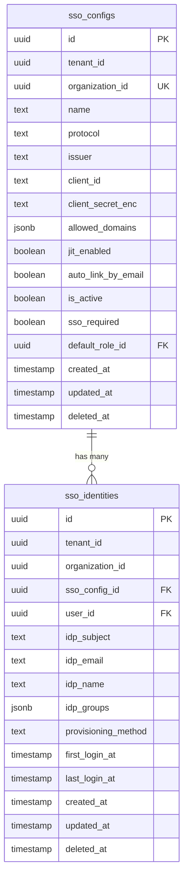

# SSO Admin UI + Config Management

## Overview

Milestone 2 of the SSO implementation. Admins can configure SSO connections through the backend UI instead of seeded data. The entire admin UI lives in `packages/enterprise/src/modules/sso/` — the core auth module remains untouched.

**Key constraint:** Plugin architecture. The core auth module cannot know about SSO. All SSO admin pages self-register via the module auto-discovery system (`backend/*.tsx` → routes, `acl.ts` → features, `setup.ts` → role defaults). No code changes in `packages/core/`.

**Access model:**
- **SuperAdmin** (`isSuperAdmin`): sees SSO configs across ALL tenants/orgs. Can manage any org's SSO.
- **Admin** (`sso.config.manage` feature): sees and manages SSO config for their own organization only.

## Proposed Solution

### Architecture

The SSO module already has a `dist/` with pre-designed admin pages/APIs (from the enterprise build). This plan ports that design to `src/` with refinements for the superadmin cross-tenant access pattern.

All new files live under `packages/enterprise/src/modules/sso/`:

```
├── acl.ts                          # UPDATE: add new features
├── setup.ts                        # UPDATE: add new role defaults
├── di.ts                           # UPDATE: register new services
├── api/
│   ├── config/
│   │   ├── get.ts                  # GET /api/sso/config — list configs
│   │   ├── post.ts                 # POST /api/sso/config — create config
│   │   ├── [id]/
│   │   │   ├── get.ts              # GET /api/sso/config/:id — single config
│   │   │   ├── put.ts              # PUT /api/sso/config/:id — update config
│   │   │   ├── delete.ts           # DELETE /api/sso/config/:id — soft delete
│   │   │   ├── activate/
│   │   │   │   └── post.ts         # POST /api/sso/config/:id/activate
│   │   │   ├── domains/
│   │   │   │   ├── get.ts          # GET /api/sso/config/:id/domains
│   │   │   │   ├── post.ts         # POST /api/sso/config/:id/domains
│   │   │   │   └── delete.ts       # DELETE /api/sso/config/:id/domains
│   │   │   └── test/
│   │   │       └── post.ts         # POST /api/sso/config/:id/test
├── backend/
│   │── page.tsx                    # SSO config list (settings sidebar)
│   │── page.meta.ts                # pageContext: 'settings', pageGroup: 'Auth'
│   └── config/
│       ├── new/
│       │   ├── page.tsx            # OIDC setup wizard
│       │   └── page.meta.ts
│       └── [id]/
│           ├── page.tsx            # Config detail (tabbed: General, Domains, Activity)
│           └── page.meta.ts
├── services/
│   ├── ssoConfigService.ts         # NEW: config CRUD operations
│   └── hrdService.ts               # NEW: domain-based HRD lookup
└── lib/
    └── domains.ts                  # NEW: domain normalization utilities
```

### SuperAdmin vs Admin Scoping

Follow the same pattern as `packages/core/src/modules/auth/backend/users/page.tsx`:

1. **API layer**: Each config API route resolves the caller's auth context. If `isSuperAdmin`, queries are unscoped (all orgs). If admin, queries filter by `organizationId` from session.
2. **List page**: SuperAdmin sees a Tenant/Organization column. Admin sees only their org's configs.
3. **Create page**: SuperAdmin can select which tenant/org to create a config for. Admin creates for their own org (implicit).
4. **Detail/Edit page**: SuperAdmin can view/edit any config. Admin can only access their own org's config (API enforces this).

### Admin Context Helper

Create `api/admin-context.ts` — a shared utility for all SSO admin routes:

```typescript
// Resolves auth + scope for SSO admin endpoints
export async function resolveSsoAdminContext(req: Request) {
  const auth = await resolveAuth(req)  // existing auth resolution
  const isSuperAdmin = auth.user.isSuperAdmin

  return {
    auth,
    isSuperAdmin,
    // SuperAdmin: scope from query param; Admin: from session
    organizationId: isSuperAdmin
      ? req.query.organizationId ?? null  // optional filter
      : auth.organizationId,             // always scoped
    tenantId: isSuperAdmin
      ? req.query.tenantId ?? null
      : auth.tenantId,
  }
}
```

## Technical Considerations

### Security
- All config routes guarded by `sso.config.view` (read) or `sso.config.manage` (write)
- `clientSecretEnc` never returned in API responses — only a `hasClientSecret: boolean` flag
- SuperAdmin scope enforcement at API layer, not just UI
- Domain uniqueness validation: no two active configs can claim the same email domain

### Data Model
- No new entities needed — `SsoConfig` and `SsoIdentity` from M1 are sufficient
- `SsoConfig.allowedDomains` (jsonb array) managed via dedicated domain endpoints
- Soft delete via `deletedAt` — deactivate before delete

### Plugin Isolation
- Zero imports from `@open-mercato/core/modules/auth` in admin pages (except generic auth resolution)
- SSO pages register themselves via auto-discovery (`backend/*.tsx`)
- SSO features declared in `acl.ts`, defaults in `setup.ts`
- The Settings sidebar picks up SSO pages automatically via `pageContext: 'settings'`

## Acceptance Criteria

### Functional Requirements
- [x] Admin creates an OIDC config for Zitadel via the setup wizard
- [x] Admin tests the connection (initiates a test OIDC discovery)
- [x] Admin activates the config → HRD starts routing users to the IdP
- [x] Admin adds/removes allowed email domains
- [x] Admin deactivates/deletes an SSO config
- [x] Non-admin users cannot access SSO config pages (feature guard)
- [x] SuperAdmin sees configs across all tenants with org/tenant column
- [x] SuperAdmin can create a config for any tenant/org
- [x] Admin sees only their own org's config

### Error & Edge Case Requirements
- [x] Admin cannot create a second config for the same org (unique constraint → clear error message)
- [x] Admin cannot activate a config with zero domains (400 with descriptive error)
- [x] Admin cannot activate a config that fails discovery test (400 with IdP error details)
- [x] Admin cannot delete an active config (must deactivate first)
- [x] Client secret is never exposed in API responses (only `hasClientSecret` flag)
- [x] Updating a config without touching the secret field preserves the existing secret
- [x] Admin accessing another org's config via URL manipulation gets 403
- [x] SuperAdmin can filter configs by tenant/org in the list view
- [x] Wizard abandonment leaves no orphan records (client-side state only until final save)

### Non-Functional Requirements
- [x] No code changes in `packages/core/`
- [x] All strings use i18n (`useT()`)
- [ ] All forms follow `Cmd/Ctrl+Enter` submit, `Escape` cancel
- [x] All API routes export `openApi` specs

## Implementation Phases

### Phase 1: Services + API Routes

**Files:**

1. `services/ssoConfigService.ts` — CRUD operations:
   - `list(scope, query)` — paginated, searchable by issuer/domain, tenant-scoped or unscoped for superadmin
   - `getById(scope, id)` — single config fetch
   - `create(scope, input)` — validate domain uniqueness, encrypt client secret
   - `update(scope, id, input)` — partial update
   - `delete(scope, id)` — soft delete + deactivate
   - `activate(scope, id, active)` — test connection before activating
   - `testConnection(scope, id)` — OIDC discovery probe
   - `addDomain(scope, id, domain)` / `removeDomain(scope, id, domain)`
   - `toPublic(config)` — strips `clientSecretEnc`, adds `hasClientSecret` flag

2. `services/hrdService.ts` — domain lookup:
   - `findActiveConfigByEmailDomain(email)` — SQL with GIN index on `allowed_domains`

3. `lib/domains.ts` — `normalizeDomain(domain)`, `validateDomain(domain)`, `uniqueDomains(list)`

4. `api/admin-context.ts` — shared auth resolution helper

5. `api/config/get.ts` — list configs
6. `api/config/post.ts` — create config
7. `api/config/[id]/get.ts` — single config
8. `api/config/[id]/put.ts` — update config
9. `api/config/[id]/delete.ts` — soft delete
10. `api/config/[id]/activate/post.ts` — activate/deactivate
11. `api/config/[id]/domains/get.ts` — list domains
12. `api/config/[id]/domains/post.ts` — add domain
13. `api/config/[id]/domains/delete.ts` — remove domain
14. `api/config/[id]/test/post.ts` — test connection

15. `data/validators.ts` — UPDATE: add zod schemas for config CRUD inputs

16. `di.ts` — UPDATE: register `ssoConfigService`, `hrdService`

17. `acl.ts` — already has `sso.config.view` and `sso.config.manage` (verify sufficient)

### Phase 2: Backend Pages — List + Create Wizard

**Files:**

1. `backend/page.tsx` — SSO config list page:
   - `DataTable` with columns: Name/Issuer, Protocol, Domains, Status (active/inactive), Created
   - SuperAdmin: additional Tenant/Org column
   - `RowActions`: Edit, Test Connection, Activate/Deactivate, Delete
   - Empty state with "Configure SSO" CTA
   - Guard: `sso.config.view`

2. `backend/page.meta.ts`:
   ```typescript
   export const metadata = {
     requireAuth: true,
     requireFeatures: ['sso.config.view'],
     pageTitle: 'sso.admin.title',
     pageGroup: 'Auth',
     pageGroupKey: 'settings.sections.auth',
     pageOrder: 520,
     pageContext: 'settings' as const,
     icon: 'ShieldCheck',
   }
   ```

3. `backend/config/new/page.tsx` — OIDC setup wizard:
   - Step 1: Protocol selection (OIDC only for now, SAML greyed/coming soon)
   - Step 2: Credentials (issuer URL, client ID, client secret)
   - Step 3: Domains (add allowed email domains)
   - Step 4: Options (JIT provisioning toggle, auto-link by email toggle, default role selector)
   - Step 5: Test + Activate (test connection, then activate)
   - Uses `CrudForm` with groups or a custom stepper component
   - SuperAdmin: tenant/org selector at top

4. `backend/config/new/page.meta.ts`

### Phase 3: Backend Pages — Detail + Edit

**Files:**

1. `backend/config/[id]/page.tsx` — Config detail page with tabs:
   - **General tab**: Edit form (issuer, client ID, client secret, JIT, auto-link, default role)
   - **Domains tab**: Domain list with add/remove, domain validation
   - **Activity tab**: Recent SSO logins for this config (query `sso_identities` by `ssoConfigId`, show `lastLoginAt`)
   - Top section: Status badge (active/inactive), Test Connection button, Activate/Deactivate toggle
   - Guard: `sso.config.view` (read), `sso.config.manage` (write actions)

2. `backend/config/[id]/page.meta.ts`

### Phase 4: HRD Service Upgrade

Replace the naive `SsoService.findConfigByEmail()` loop with `HrdService.findActiveConfigByEmailDomain()` using GIN-indexed SQL. Update the HRD API route (`api/hrd/post.ts`) to use the new service. This makes domain lookup O(1) instead of scanning all configs.

### Phase 5: i18n + Polish

- Add all SSO admin strings to locale files (en + pl)
- Verify all pages use `useT()` consistently
- Add OpenAPI specs to all new API routes
- Run `yarn generate` to update auto-discovered files

## Key Design Decisions

These were surfaced by spec-flow analysis and must be resolved before implementation:

### D1: Wizard persistence timing
**Decision:** Config is persisted only at the final step (step 5 "Save"). Steps 1–4 are client-side state only. This avoids orphan draft configs hitting the `UNIQUE(organization_id)` constraint.

### D2: Activation requires successful test
**Decision:** `activate(scope, id, true)` calls `testConnection()` internally before activating. If discovery fails, activation is rejected with a descriptive error. The admin cannot activate a broken config.

### D3: Activation requires at least one domain
**Decision:** Activation with zero `allowedDomains` is blocked at the API level (400 error). A config with no domains is useless for HRD routing.

### D4: Deletion requires deactivation first
**Decision:** `DELETE /api/sso/config/:id` returns 400 if `isActive = true`. Admin must deactivate first. Soft delete does NOT cascade to `sso_identities` — they remain as historical records. If the org creates a new config later, `AccountLinkingService` will match by email (not by config ID), so no duplicate users.

### D5: Deactivation does NOT revoke sessions (M2 scope)
**Decision:** For M2, deactivation only stops new SSO logins. Existing JWT/session tokens remain valid until natural expiry. Session revocation on deactivation is an M3 concern (enforcement mode). This is the simpler approach and avoids coupling M2 to session management.

### D6: Client secret update semantics
**Decision:** On PUT, if `clientSecret` field is **omitted** from the body → keep existing encrypted value. If `clientSecret` is an **empty string** → validation error (400). If `clientSecret` is a **new value** → re-encrypt and replace. The edit form shows a "Change client secret" optional field (collapsed by default) to prevent accidental overwrites.

### D7: Test connection scope
**Decision:** "Test Connection" performs OIDC discovery only (fetches `.well-known/openid-configuration`). It does NOT verify client credentials or redirect URIs. The UI button label is "Verify Discovery" and the success message reads "Issuer reachable — discovery document valid." A tooltip explains what was and was not verified.

### D8: Domain format rules
**Decision:** Only valid DNS hostnames accepted (no wildcards, no IP addresses, no punycode for v1). Each subdomain is a separate entry (`mail.company.com` ≠ `company.com`). Regex: `/^[a-z0-9]([a-z0-9-]{0,61}[a-z0-9])?(\.[a-z0-9]([a-z0-9-]{0,61}[a-z0-9])?)*$/`. Max 20 domains per config.

### D9: Add `name` field to SsoConfig entity
**Decision:** Add a `name` text field (e.g., "Zitadel Production", "Google Workspace") for admin-friendly display. The list page shows this name instead of the raw issuer URL. This requires a small migration in Phase 1.

### D10: Add M2-specific events
**Decision:** Add to `events.ts`: `sso.config.activated`, `sso.config.deactivated`, `sso.domain.added`, `sso.domain.removed`. These enable future audit subscribers without breaking changes.

### D11: Wizard "Copy Redirect URI" helper
**Decision:** The wizard credential step includes a read-only field showing the OIDC callback URL (`{baseUrl}/api/sso/callback/oidc`) with a copy button. This reduces IdP misconfiguration.

## Dependencies & Risks

**Dependencies:**
- M1 complete (entities, base services, OIDC provider)
- Widget injection system (already in place from decoupling PR)

**Risks:**
- Domain uniqueness across tenants: two tenants might both claim `example.com`. Decision: allowed — HRD resolves to the tenant's own config. Cross-tenant domain conflicts are flagged but not blocked.
- SuperAdmin UX: managing configs across many tenants needs good filtering/search. Mitigate with searchable `DataTable`.

## References

- Brainstorm: `docs/brainstorms/2026-02-19-sso-implementation-milestones-brainstorm.md`
- SSO Spec: `.ai/specs/enterprise/SPEC-ENT-002-2026-02-19-sso-directory-sync.md`
- Decoupling plan: `docs/plans/2026-02-21-refactor-decouple-sso-from-core-auth-plan.md`
- Auth users list (superadmin pattern): `packages/core/src/modules/auth/backend/users/page.tsx`
- Widget injection docs: `packages/core/AGENTS.md` → Widgets section
- Reference CRUD module: `packages/core/src/modules/customers/`

## ERD



One entity change: add `name` text field to `sso_configs` (D9). All other M1 entities are sufficient.
