# AI Assistant Module

AI-powered assistance capabilities for Open Mercato, featuring a Raycast-style command palette interface, agentic AI chat with tool execution, and MCP (Model Context Protocol) integration.

## Features

- **Command Palette** - Raycast-style single dialog interface (Cmd+K)
- **Agentic AI Chat** - AI that can use tools to perform actions
- **MCP Server** - Exposes tools from all modules to external AI clients
- **OpenCode Backend** - AI processing via OpenCode with MCP tool integration
- **Tool Auto-Discovery** - Automatically registers tools from all modules
- **ACL-Based Access Control** - Tools filtered by user permissions

## Architecture Overview

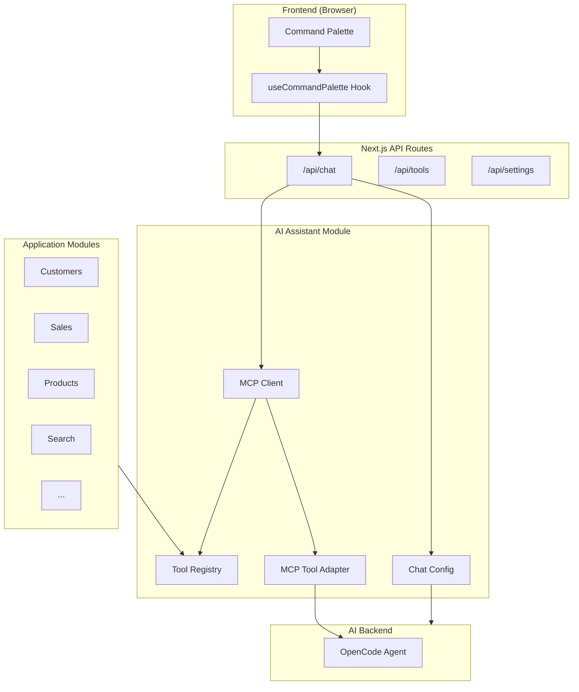

## User Interaction Flow

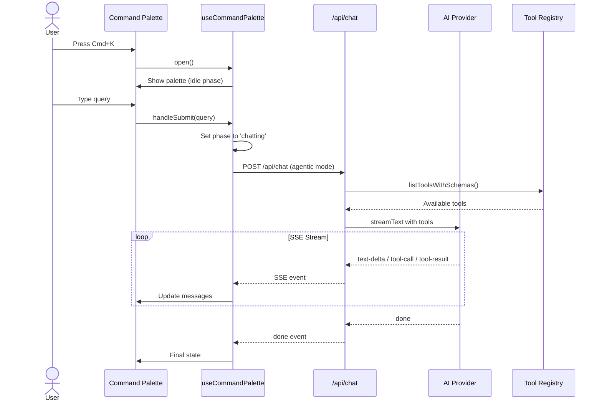

## Tool Execution Flow

```mermaid
flowchart TD
    subgraph User Query
        A[User asks: "Find all customers in New York"]
    end

    subgraph AI Processing
        B[AI receives query + available tools]
        C{AI decides to call tool}
        D[AI calls search_query tool]
    end

    subgraph Server Side Execution
        E[Tool executed via MCP Client]
        F[Tool Registry finds handler]
        G[Handler executes with auth context]
        H[Results returned to AI]
    end

    subgraph AI Response
        I[AI interprets results]
        J[AI generates human-friendly response]
        K["Response: 'I found 15 customers in New York...'"]
    end

    A --> B
    B --> C
    C -->|Yes| D
    D --> E
    E --> F
    F --> G
    G --> H
    H --> I
    I --> J
    J --> K
    C -->|No| J
```

## SSE Streaming Protocol


## Tool Registration Flow

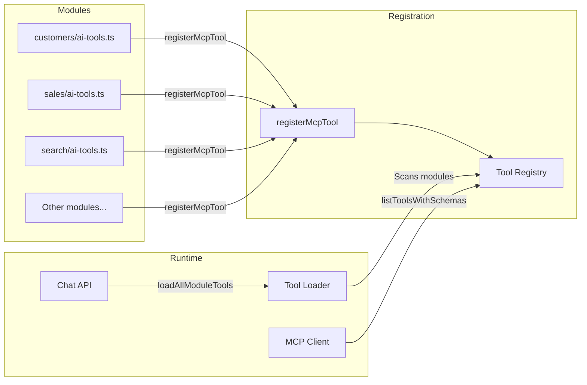

## Command Palette State Machine

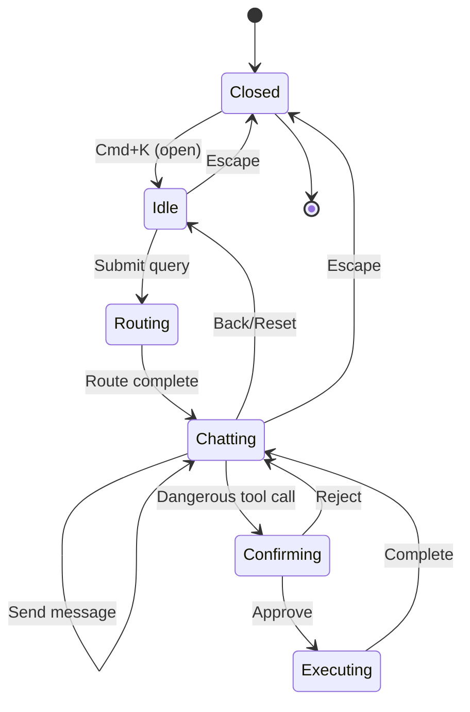

## Component Architecture

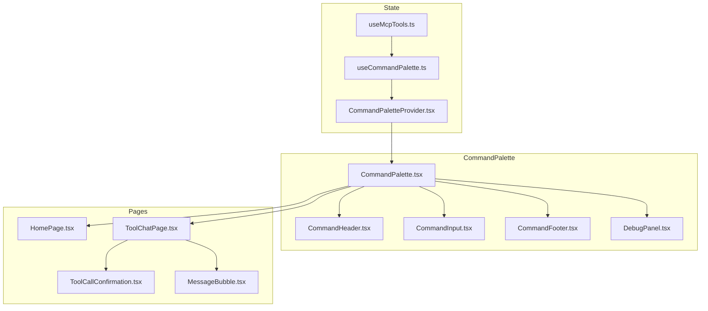

## Chat Modes

| Mode      | Description                | Tool Execution         | Use Case            |
| --------- | -------------------------- | ---------------------- | ------------------- |
| `agentic` | AI has access to all tools | Server-side, automatic | Main chat interface |
| `default` | Simple text streaming      | N/A                    | Fallback mode       |

## Tool Safety Classification

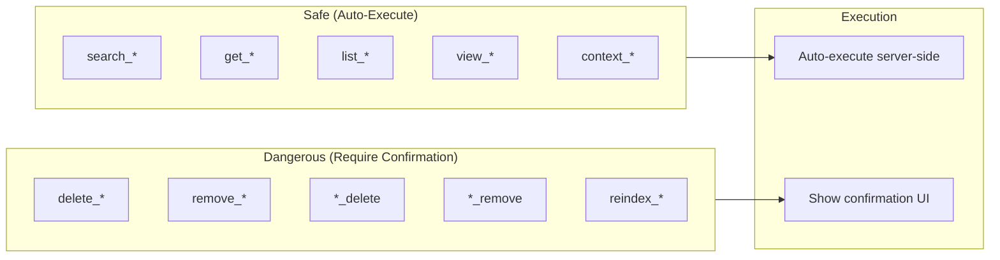

## API Routes

| Route                  | Method         | Description                             |
| ---------------------- | -------------- | --------------------------------------- |
| `/api/chat`            | POST           | Streaming chat with AI (supports modes) |
| `/api/tools`           | GET            | List all available tools                |
| `/api/tools/execute`   | POST           | Execute a specific tool                 |
| `/api/settings`        | GET/POST       | AI provider configuration               |
| `/api/mcp-servers`     | GET/POST       | External MCP server list/create         |
| `/api/mcp-servers/[id]`| GET/PUT/DELETE | Single MCP server operations            |

## Quick Start

### 1. Configure Environment Variables

Set the required environment variables:

```bash
# MCP Server Authentication (required for AI chat)
MCP_SERVER_API_KEY=your-secure-server-key-here

# OpenCode URL (default: http://localhost:4096)
OPENCODE_URL=http://localhost:4096
```

> **Note:** The `MCP_SERVER_API_KEY` must also be configured in OpenCode's `opencode.jsonc` as the `x-api-key` header. OpenCode handles AI provider configuration internally - see the OpenCode documentation for provider setup.

### 2. Register a Tool

```typescript
import { registerMcpTool } from '@open-mercato/ai-assistant/tools'
import { z } from 'zod'

registerMcpTool({
  name: 'my_module_action',
  description: 'Description of what this tool does',
  inputSchema: z.object({
    param1: z.string().describe('Description of param1'),
    param2: z.number().optional(),
  }),
  requiredFeatures: ['my_module.action'],
  handler: async (input, ctx) => {
    // Access DI container
    const service = ctx.container.resolve('myService')
    // Execute logic
    return { success: true, data: result }
  }
}, { moduleId: 'my_module' })
```

### 3. Use Command Palette

Press `Cmd+K` (or `Ctrl+K`) to open the command palette and start chatting with the AI.

## Debug Mode

Click the "Debug" button in the command palette footer to see:
- Tool call events
- Tool result events
- SSE stream events
- Connection status

## Directory Structure

```
packages/ai-assistant/
├── src/
│   ├── frontend/
│   │   ├── components/CommandPalette/  # UI components
│   │   ├── hooks/                       # React hooks
│   │   └── types.ts                     # Frontend types
│   │
│   └── modules/ai_assistant/
│       ├── lib/
│       │   ├── mcp-tool-adapter.ts     # Zod schema conversion
│       │   ├── in-process-client.ts    # MCP client
│       │   ├── tool-registry.ts        # Tool registration
│       │   └── chat-config.ts          # Provider config
│       │
│       └── frontend/components/         # Settings page
│
├── AGENTS.md                            # Technical guide for AI agents
└── README.md                            # This file
```

## Technical Notes

### Zod 4 Schema Handling

The module includes a fix for "Date cannot be represented in JSON Schema" errors when using Zod 4 with the Vercel AI SDK. See [AGENTS.md](./AGENTS.md) for details.

### SSE Event Types

```typescript
type SSEEvent =
  | { type: 'text', content: string }
  | { type: 'tool-call', id: string, toolName: string, args: object }
  | { type: 'tool-result', id: string, toolName: string, result: unknown }
  | { type: 'error', error: string }
  | { type: 'done' }
```

---

## OpenCode Integration

The AI Assistant uses **OpenCode** as the AI agent backend. OpenCode is a headless AI coding agent that connects to our MCP server for tool access.

### System Architecture with OpenCode

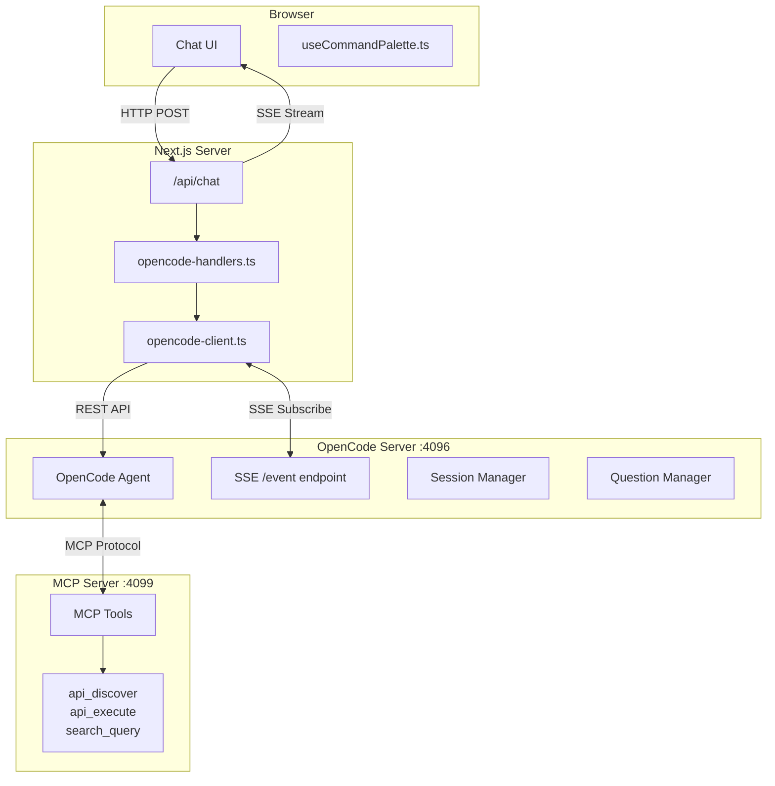

### Complete Message Flow


### Question/Answer Flow (Confirmations)

When OpenCode needs user confirmation (e.g., before creating/updating/deleting data):


### OpenCode SSE Events

Events received from OpenCode's `/event` endpoint:

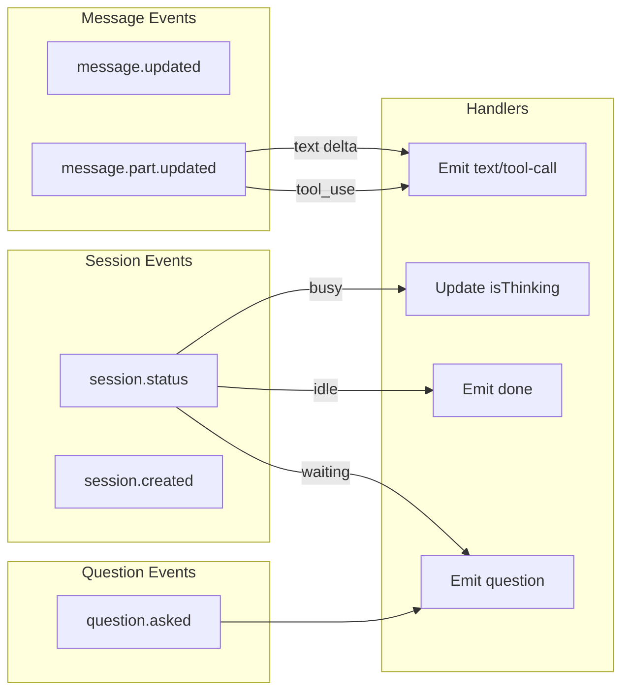

### Key State Variables

| Variable                | Type                       | Purpose                     |
| ----------------------- | -------------------------- | --------------------------- |
| `messages`              | `ChatMessage[]`            | All chat messages           |
| `isStreaming`           | `boolean`                  | API request in progress     |
| `isThinking`            | `boolean`                  | OpenCode is processing      |
| `pendingQuestion`       | `OpenCodeQuestion \| null` | Question awaiting answer    |
| `opencodeSessionId`     | `string \| null`           | Persists conversation       |
| `shouldStartNewMessage` | `Ref<boolean>`             | Create new msg after answer |
| `answeredQuestionIds`   | `Ref<Set<string>>`         | Prevent duplicate questions |

### Message State Machine

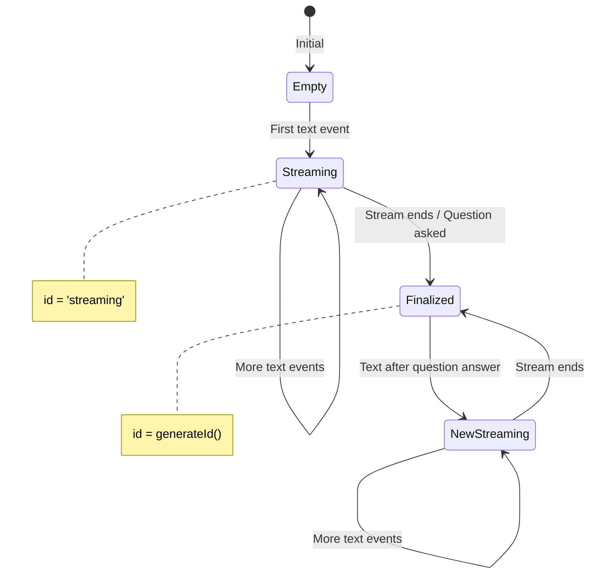

### OpenCode API Reference

| Endpoint                | Method | Purpose                |
| ----------------------- | ------ | ---------------------- |
| `/event`                | GET    | SSE event stream       |
| `/session`              | POST   | Create new session     |
| `/session/{id}`         | GET    | Get session            |
| `/session/{id}/message` | POST   | Send message           |
| `/question`             | GET    | List pending questions |
| `/question/{id}/reply`  | POST   | Answer question        |
| `/question/{id}/reject` | POST   | Reject question        |
| `/global/health`        | GET    | Health check           |
| `/mcp`                  | GET    | MCP connection status  |

### Answer Question Format

```typescript
// POST /question/{requestID}/reply
{
  "answers": [
    ["selected label"]  // Array of selected option labels
  ]
}

// Example - single selection
{ "answers": [["Yes, create it"]] }

// Example - multi-selection (if supported)
{ "answers": [["Option A", "Option B"]] }

// Example - multiple questions
{
  "answers": [
    ["Answer to Q1"],
    ["Answer to Q2"]
  ]
}
```

### Debugging Tips

#### Enable Debug Panel
Click "Debug" in the chat footer to see all SSE events in real-time.

#### Console Log Prefixes
- `[startAgenticChat]` - Initial chat setup
- `[sendAgenticMessage]` - Follow-up messages
- `[answerQuestion]` - Question answering
- `[OpenCode SSE]` - Backend SSE processing
- `[OpenCode Client]` - API client calls
- `[AI Chat]` - API route handling

#### Common Issues

| Issue                   | Cause                    | Solution                                                   |
| ----------------------- | ------------------------ | ---------------------------------------------------------- |
| Loader stays on         | `isThinking` not reset   | Ensure text events call `setIsThinking(false)`             |
| Text appends to old msg | Same content variable    | Check `shouldStartNewMessage` flag                         |
| Question not answered   | Wrong endpoint/format    | Use `/question/{id}/reply` with `{"answers": [["label"]]}` |
| Duplicate questions     | Same question emitted    | Track in `answeredQuestionIds` ref                         |
| Stream never ends       | Heartbeat not triggering | Check session status polling                               |

---

## Authentication & Authorization

The AI Assistant implements a two-tier authentication system for secure tool execution:

### Architecture Overview

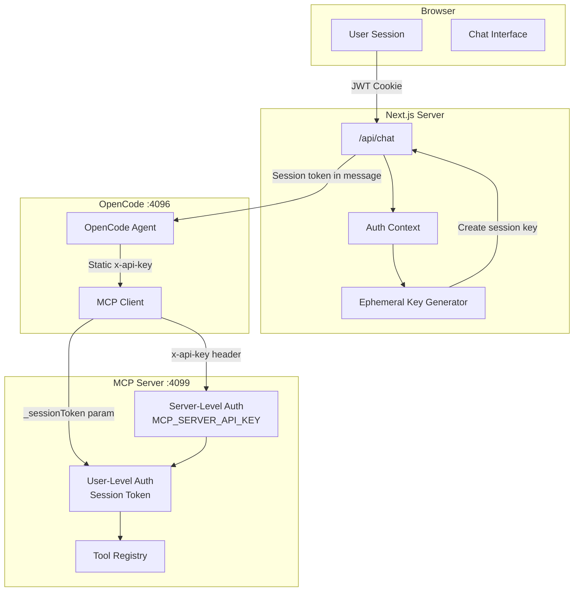

### Two-Tier Authentication

#### Tier 1: Server-Level Authentication

The MCP server validates that requests come from a trusted source (OpenCode) using a static API key.

```bash
# .env
MCP_SERVER_API_KEY=your-secure-server-key-here
```

**OpenCode Configuration (`opencode.jsonc`):**
```jsonc
{
  "mcp": {
    "open-mercato": {
      "url": "http://host.docker.internal:3001/mcp",
      "headers": {
        "x-api-key": "your-secure-server-key-here"
      }
    }
  }
}
```

#### Tier 2: User-Level Authorization (Session Tokens)

Each chat session creates an ephemeral API key that inherits the user's permissions.

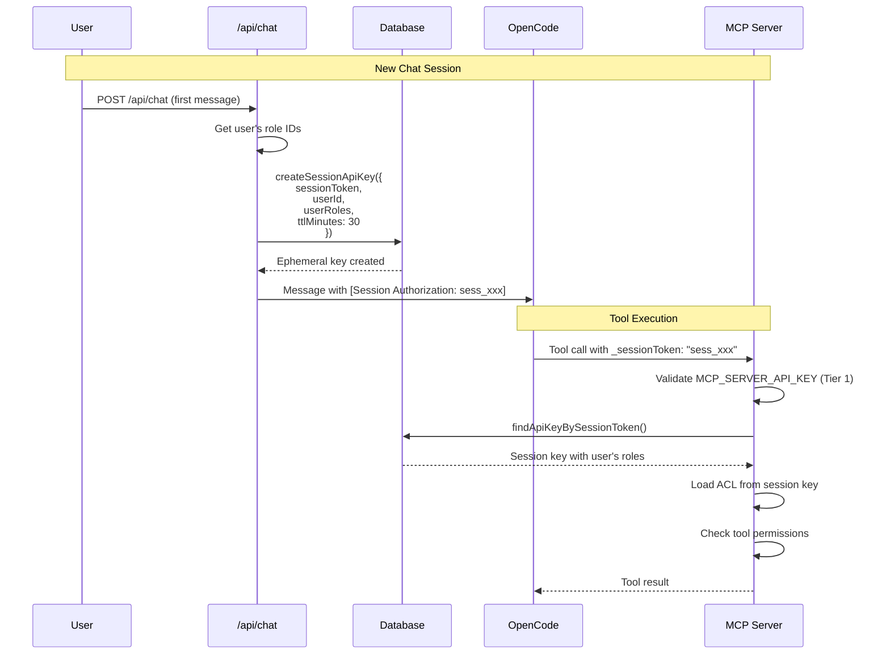

### Session Token Flow

1. **Session Creation**: When a new chat starts, the API creates an ephemeral key:
   - Inherits user's role IDs from their JWT
   - Expires after 30 minutes (TTL)
   - Linked to user via `sessionUserId`

2. **Token Injection**: Session token is prepended to the user's message:
   ```
   [Session Authorization: sess_abc123def456...]

   User's actual message here
   ```

3. **AI Instruction**: OpenCode is instructed (via AGENTS.md) to include `_sessionToken` in all tool calls

4. **Tool Execution**: MCP server extracts token, resolves permissions, executes with user context

### Environment Variables

| Variable             | Required | Description                                    |
| -------------------- | -------- | ---------------------------------------------- |
| `MCP_SERVER_API_KEY` | Yes      | Static key for server-level MCP authentication |
| `OPENCODE_URL`       | No       | OpenCode server URL (default: localhost:4096)  |

### API Key Entity Extension

The `api_keys` table includes session-specific fields:

```typescript
// packages/core/src/modules/api_keys/data/entities.ts
@Entity({ tableName: 'api_keys' })
export class ApiKey {
  // ... existing fields ...

  /** Session token for ephemeral session-scoped keys (used by AI chat) */
  @Property({ name: 'session_token', type: 'text', nullable: true })
  sessionToken?: string | null

  /** User ID who owns this session (for ephemeral keys) */
  @Property({ name: 'session_user_id', type: 'uuid', nullable: true })
  sessionUserId?: string | null
}
```

### Session Key Service Functions

```typescript
// packages/core/src/modules/api_keys/services/apiKeyService.ts

// Generate a unique session token
generateSessionToken(): string  // Returns: "sess_xxxxxxxxxxxxxxxxxxxxxxxxxxxxxxxx"

// Create an ephemeral API key for a chat session
createSessionApiKey(em, {
  sessionToken: string,
  userId: string,
  userRoles: string[],      // Role IDs (not names)
  tenantId?: string | null,
  organizationId?: string | null,
  ttlMinutes?: number       // Default: 30
}): Promise<{ keyId, secret, sessionToken }>

// Look up a session key
findApiKeyBySessionToken(em, sessionToken): Promise<ApiKey | null>

// Delete a session key
deleteSessionApiKey(em, sessionToken): Promise<void>
```

### Security Considerations

1. **Token Expiration**: Session keys auto-expire after 30 minutes
2. **User Binding**: Keys are bound to specific users via `sessionUserId`
3. **Role Inheritance**: Ephemeral keys inherit user's role IDs, not role names
4. **Soft Delete**: Keys are soft-deleted, maintaining audit trail
5. **No Secret Storage**: API key secrets are never stored; only hashed values

### Debugging Authentication Issues

| Symptom                              | Likely Cause                      | Solution                           |
| ------------------------------------ | --------------------------------- | ---------------------------------- |
| "MCP server not properly configured" | `MCP_SERVER_API_KEY` not set      | Add to `.env`                      |
| "Invalid API key"                    | Wrong key in OpenCode config      | Match `opencode.jsonc` with `.env` |
| "Session token required"             | AI didn't include `_sessionToken` | Check AGENTS.md instructions       |
| "Invalid or expired session token"   | Token expired or not found        | Start new chat session             |
| "Insufficient permissions"           | User lacks required features      | Check user's role assignments      |

### AGENTS.md Instructions

The AI is instructed to include session tokens via `docker/opencode/AGENTS.md`:

```markdown
## Session Authorization

**CRITICAL:** Every conversation includes a session authorization token in the format:
[Session Authorization: sess_xxxxxxxxxxxxxxxxxxxxxxxxxxxxxxxx]

**You MUST include this token in EVERY tool call** as the `_sessionToken` parameter.
```

---

### Extending the System

#### Adding New SSE Event Handlers

1. Update type in `opencode-handlers.ts`:
```typescript
export type OpenCodeStreamEvent =
  | { type: 'thinking' }
  | { type: 'text'; content: string }
  | { type: 'your-new-event'; data: YourType }  // Add here
  | ...
```

2. Handle in SSE switch statement:
```typescript
switch (type) {
  case 'your.new.event':
    await onEvent({ type: 'your-new-event', data: properties })
    break
}
```

3. Process in frontend hook:
```typescript
if (event.type === 'your-new-event') {
  // Handle in UI
}
```

## License

Proprietary - Open Mercato


# OpenCode API Documentation

API documentation for OpenCode server (v0.0.3)

## Base URL

```
http://localhost:4096
```

## Authentication

Set credentials via environment variables:
- `OPENCODE_SERVER_PASSWORD` - Enable HTTP basic auth
- `OPENCODE_SERVER_USERNAME` - Username (defaults to "opencode")

## Core Endpoints

### Sessions

**Create Session**
```http
POST /session?directory=/path/to/project
Content-Type: application/json

{
  "title": "My Session",
  "parentID": "ses_...",  // optional - for forking
  "permission": []        // optional - permission rules
}
```

**List Sessions**
```http
GET /session?directory=/path&limit=50&roots=true&search=query
```

Query parameters:
- `directory` - Filter by project directory
- `roots` - Only return root sessions (no parentID)
- `start` - Filter by timestamp (ms since epoch)
- `search` - Filter by title (case-insensitive)
- `limit` - Max results

**Get Session**
```http
GET /session/{sessionID}?directory=/path
```

**Send Message**
```http
POST /session/{sessionID}/message
Content-Type: application/json

{
  "parts": [
    { "type": "text", "text": "Your prompt here" },
    { "type": "file", "mime": "image/png", "url": "..." }
  ],
  "model": {
    "providerID": "anthropic",
    "modelID": "claude-sonnet-4"
  },
  "agent": "build"  // optional
}
```

**Get Messages**
```http
GET /session/{sessionID}/message?limit=100
```

**Fork Session**
```http
POST /session/{sessionID}/fork
Content-Type: application/json

{
  "messageID": "msg_..."  // fork from this message
}
```

**Abort Session**
```http
POST /session/{sessionID}/abort
```

**Delete Session**
```http
DELETE /session/{sessionID}
```

### Files & Search

**Read File**
```http
GET /file/content?path=/relative/path&directory=/project
```

**List Directory**
```http
GET /file?path=/relative/path&directory=/project
```

**Search Text (ripgrep)**
```http
GET /find?pattern=search_term&directory=/project
```

Returns matches with line numbers and context.

**Find Files**
```http
GET /find/file?query=filename&type=file&limit=200&directory=/project
```

**Find Symbols (LSP)**
```http
GET /find/symbol?query=functionName&directory=/project
```

**File Status (git)**
```http
GET /file/status?directory=/project
```

### Configuration

**Get Config**
```http
GET /config?directory=/project
```

**Update Config**
```http
PATCH /config?directory=/project
Content-Type: application/json

{
  "theme": "catppuccin-mocha",
  "model": "anthropic/claude-sonnet-4"
}
```

### Providers & Models

**List Providers**
```http
GET /provider?directory=/project
```

Returns all available providers, connected providers, and default models.

**List Agents**
```http
GET /agent?directory=/project
```

**List Commands**
```http
GET /command?directory=/project
```

### Events (Server-Sent Events)

**Subscribe to Events**
```http
GET /event?directory=/project
```

Returns SSE stream with events:
- `message.updated` - Message created/updated
- `message.part.updated` - Streaming message parts (with delta)
- `session.created` / `session.updated` / `session.deleted`
- `session.status` - Session state changes (idle/busy/retry)
- `permission.asked` / `permission.replied`
- `question.asked` / `question.replied`
- `file.edited` - File modifications
- `pty.created` / `pty.updated` / `pty.exited`

**Global Events**
```http
GET /global/event
```

Events from all instances (includes `directory` field).

### Permissions & Questions

**List Pending Permissions**
```http
GET /permission?directory=/project
```

**Reply to Permission**
```http
POST /permission/{requestID}/reply
Content-Type: application/json

{
  "reply": "once" | "always" | "reject",
  "message": "Optional explanation"
}
```

**List Pending Questions**
```http
GET /question?directory=/project
```

**Reply to Question**
```http
POST /question/{requestID}/reply
Content-Type: application/json

{
  "answers": [
    ["selected_option_label"],  // for each question
    ["option1", "option2"]      // multiple if allowed
  ]
}
```

**Reject Question**
```http
POST /question/{requestID}/reject
```

### PTY (Pseudo-Terminal)

**Create PTY**
```http
POST /pty?directory=/project
Content-Type: application/json

{
  "command": "bash",
  "args": ["-l"],
  "cwd": "/path",
  "title": "Terminal",
  "env": { "KEY": "value" }
}
```

**Connect to PTY (WebSocket)**
```http
GET /pty/{ptyID}/connect?directory=/project
```

Upgrades to WebSocket for bidirectional PTY communication.

**List PTYs**
```http
GET /pty?directory=/project
```

**Delete PTY**
```http
DELETE /pty/{ptyID}?directory=/project
```

### MCP Servers

**Get MCP Status**
```http
GET /mcp?directory=/project
```

**Add MCP Server**
```http
POST /mcp?directory=/project
Content-Type: application/json

{
  "name": "server-name",
  "config": {
    "type": "local",
    "command": ["node", "server.js"],
    "environment": { "KEY": "value" }
  }
}
```

**Connect/Disconnect**
```http
POST /mcp/{name}/connect?directory=/project
POST /mcp/{name}/disconnect?directory=/project
```

**MCP OAuth Flow**
```http
POST /mcp/{name}/auth
POST /mcp/{name}/auth/callback
DELETE /mcp/{name}/auth
```

### Project & Path

**Get Current Project**
```http
GET /project/current?directory=/project
```

**Get Paths**
```http
GET /path?directory=/project
```

Returns home, state, config, worktree, and directory paths.

**Get VCS Info**
```http
GET /vcs?directory=/project
```

Returns current git branch.

### Health & Status

**Health Check**
```http
GET /global/health
```

```json
{
  "healthy": true,
  "version": "0.0.3"
}
```

## Common Patterns

### Creating and Using a Session

```javascript
// 1. Create session
const session = await fetch('http://localhost:4096/session', {
  method: 'POST',
  headers: { 'Content-Type': 'application/json' },
  body: JSON.stringify({ title: 'My Chat' })
}).then(r => r.json())

// 2. Send message
const response = await fetch(`http://localhost:4096/session/${session.id}/message`, {
  method: 'POST',
  headers: { 'Content-Type': 'application/json' },
  body: JSON.stringify({
    parts: [{ type: 'text', text: 'Hello!' }],
    model: { providerID: 'anthropic', modelID: 'claude-sonnet-4' }
  })
}).then(r => r.json())

// 3. Listen to streaming events
const eventSource = new EventSource('http://localhost:4096/event')
eventSource.addEventListener('message.part.updated', (e) => {
  const event = JSON.parse(e.data)
  if (event.properties.part.sessionID === session.id) {
    console.log('Delta:', event.properties.delta)
  }
})
```

### Handling Streaming Responses

Messages stream via SSE. Listen for:
1. `message.updated` - Initial message creation
2. `message.part.updated` - Incremental text deltas
3. `session.idle` - Response complete

```javascript
eventSource.addEventListener('message.part.updated', (e) => {
  const { part, delta } = JSON.parse(e.data).properties
  if (part.type === 'text' && delta) {
    appendText(delta)  // Append incremental text
  }
})
```

## Error Responses

**400 Bad Request**
```json
{
  "success": false,
  "data": {},
  "errors": [{ "field": "message" }]
}
```

**404 Not Found**
```json
{
  "name": "NotFoundError",
  "data": { "message": "Session not found" }
}
```

## Rate Limits & Timeouts

- Default timeout: 300000ms (5 minutes)
- Override per provider in config: `provider.{id}.options.timeout`
- Set to `false` to disable timeout

## Notes

- All session/message IDs follow patterns: `ses_...`, `msg_...`, `prt_...`
- The `directory` query parameter is optional but recommended for multi-project setups
- Event streams use `text/event-stream` content type
- File attachments use base64-encoded URLs or file paths

## Full OpenAPI Spec

Available at: `http://localhost:4096/doc`