# AI Assistant Module

AI-powered assistance capabilities for Open Mercato, featuring a Raycast-style command palette interface, agentic AI chat with tool execution, and MCP (Model Context Protocol) integration.

## Features

- **Command Palette** - Raycast-style single dialog interface (Cmd+K)
- **Agentic AI Chat** - AI that can use tools to perform actions
- **MCP Server** - Exposes tools from all modules to external AI clients
- **Multi-Provider Support** - OpenAI, Anthropic, Google AI
- **Tool Auto-Discovery** - Automatically registers tools from all modules
- **ACL-Based Access Control** - Tools filtered by user permissions

## Architecture Overview

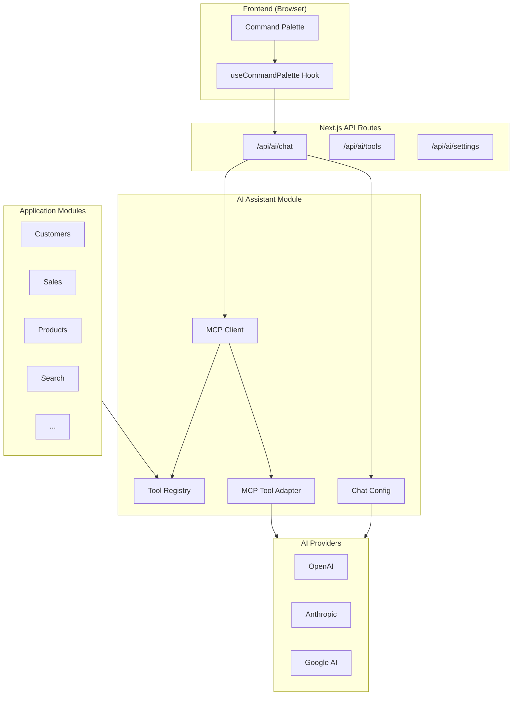

## User Interaction Flow


## Tool Execution Flow

```mermaid
flowchart TD
    subgraph User Query
        A[User asks: "Find all customers in New York"]
    end

    subgraph AI Processing
        B[AI receives query + available tools]
        C{AI decides to call tool}
        D[AI calls search_query tool]
    end

    subgraph Server Side Execution
        E[Tool executed via MCP Client]
        F[Tool Registry finds handler]
        G[Handler executes with auth context]
        H[Results returned to AI]
    end

    subgraph AI Response
        I[AI interprets results]
        J[AI generates human-friendly response]
        K["Response: 'I found 15 customers in New York...'"]
    end

    A --> B
    B --> C
    C -->|Yes| D
    D --> E
    E --> F
    F --> G
    G --> H
    H --> I
    I --> J
    J --> K
    C -->|No| J
```

## SSE Streaming Protocol

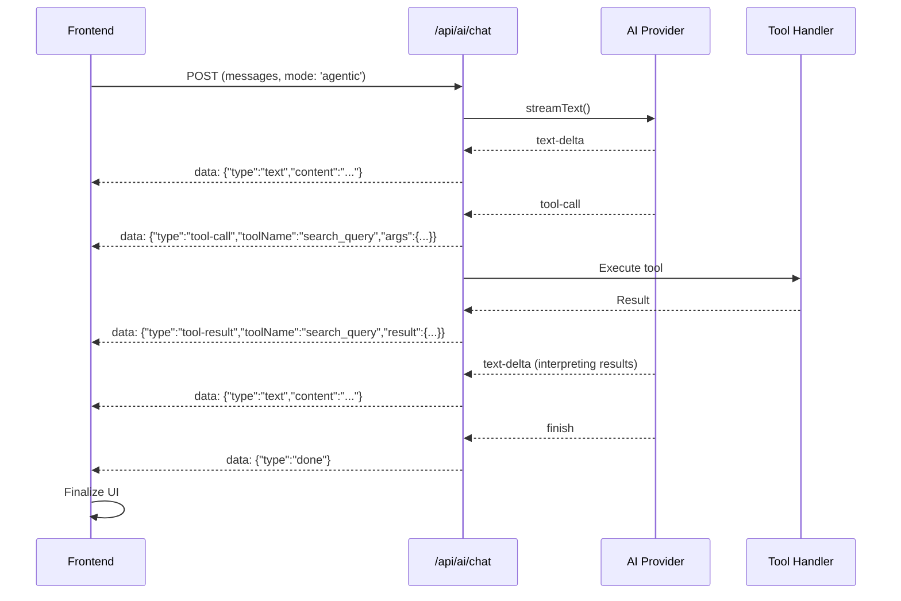

## Tool Registration Flow

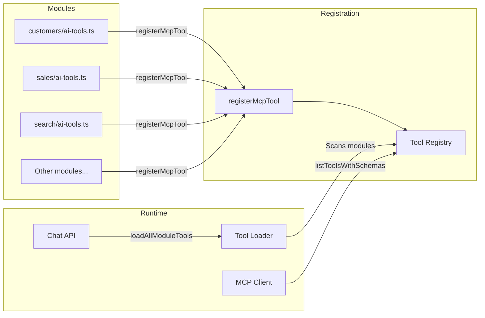

## Command Palette State Machine

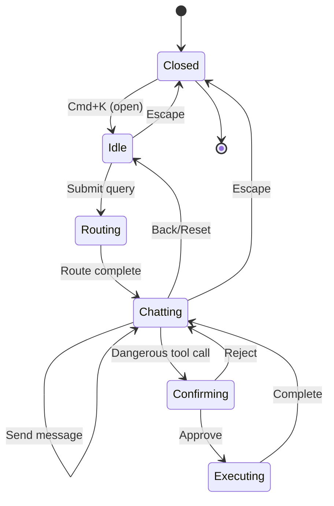

## Component Architecture

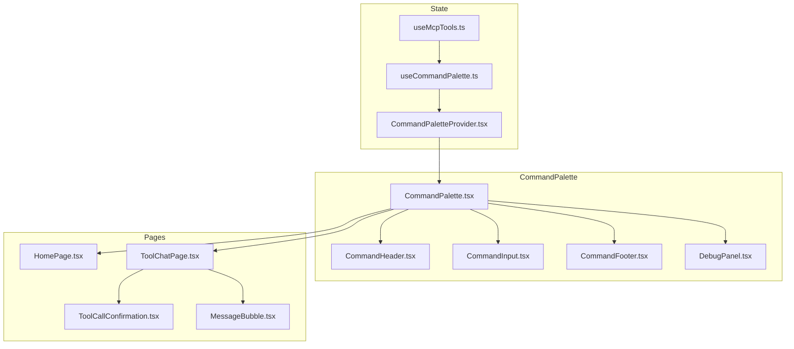

## Chat Modes

| Mode | Description | Tool Execution | Use Case |
|------|-------------|----------------|----------|
| `agentic` | AI has access to all tools | Server-side, automatic | Main chat interface |
| `default` | Simple text streaming | N/A | Fallback mode |

## Tool Safety Classification

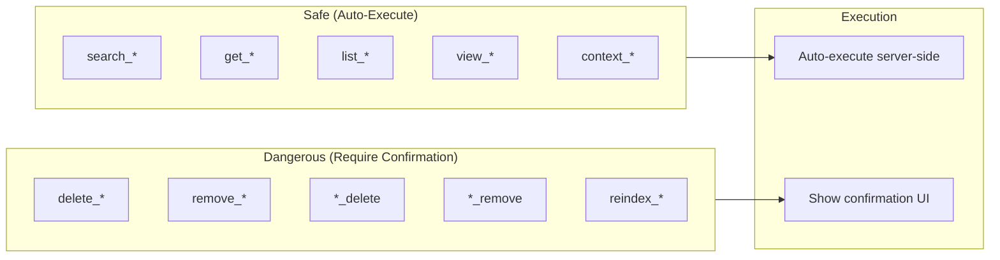

## API Routes

| Route | Method | Description |
|-------|--------|-------------|
| `/api/ai/chat` | POST | Streaming chat with AI (supports modes) |
| `/api/ai/tools` | GET | List all available tools |
| `/api/ai/tools/execute` | POST | Execute a specific tool |
| `/api/ai/settings` | GET/POST | AI provider configuration |
| `/api/ai/mcp-servers` | GET/POST | External MCP server list/create |
| `/api/ai/mcp-servers/[id]` | GET/PUT/DELETE | Single MCP server operations |

## Quick Start

### 1. Configure AI Provider

Set one of these environment variables:

```bash
OPENAI_API_KEY=sk-...
ANTHROPIC_API_KEY=sk-ant-...
GOOGLE_GENERATIVE_AI_API_KEY=...
```

### 2. Register a Tool

```typescript
import { registerMcpTool } from '@open-mercato/ai-assistant/tools'
import { z } from 'zod'

registerMcpTool({
  name: 'my_module_action',
  description: 'Description of what this tool does',
  inputSchema: z.object({
    param1: z.string().describe('Description of param1'),
    param2: z.number().optional(),
  }),
  requiredFeatures: ['my_module.action'],
  handler: async (input, ctx) => {
    // Access DI container
    const service = ctx.container.resolve('myService')
    // Execute logic
    return { success: true, data: result }
  }
}, { moduleId: 'my_module' })
```

### 3. Use Command Palette

Press `Cmd+K` (or `Ctrl+K`) to open the command palette and start chatting with the AI.

## Debug Mode

Click the "Debug" button in the command palette footer to see:
- Tool call events
- Tool result events
- SSE stream events
- Connection status

## Directory Structure

```
packages/ai-assistant/
├── src/
│   ├── frontend/
│   │   ├── components/CommandPalette/  # UI components
│   │   ├── hooks/                       # React hooks
│   │   └── types.ts                     # Frontend types
│   │
│   └── modules/ai_assistant/
│       ├── lib/
│       │   ├── mcp-tool-adapter.ts     # Zod schema conversion
│       │   ├── in-process-client.ts    # MCP client
│       │   ├── tool-registry.ts        # Tool registration
│       │   └── chat-config.ts          # Provider config
│       │
│       └── frontend/components/         # Settings page
│
├── AGENTS.md                            # Technical guide for AI agents
└── README.md                            # This file
```

## Technical Notes

### Zod 4 Schema Handling

The module includes a fix for "Date cannot be represented in JSON Schema" errors when using Zod 4 with the Vercel AI SDK. See [AGENTS.md](./AGENTS.md) for details.

### SSE Event Types

```typescript
type SSEEvent =
  | { type: 'text', content: string }
  | { type: 'tool-call', id: string, toolName: string, args: object }
  | { type: 'tool-result', id: string, toolName: string, result: unknown }
  | { type: 'error', error: string }
  | { type: 'done' }
```

---

## OpenCode Integration

The AI Assistant uses **OpenCode** as the AI agent backend. OpenCode is a headless AI coding agent that connects to our MCP server for tool access.

### System Architecture with OpenCode

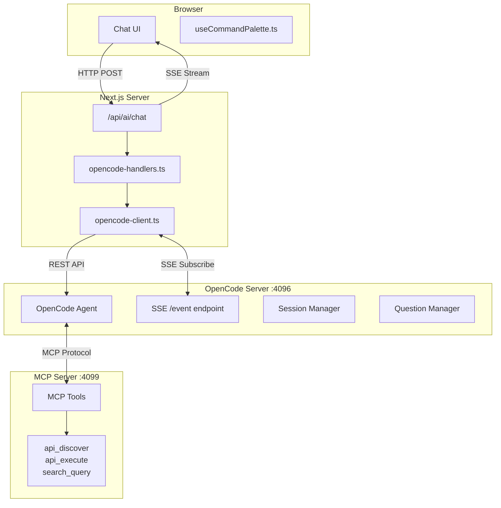

### Complete Message Flow

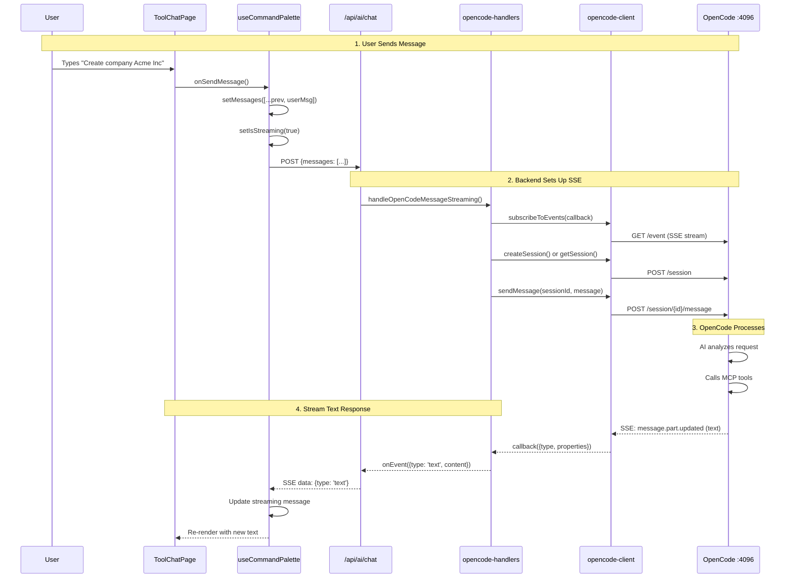

### Question/Answer Flow (Confirmations)

When OpenCode needs user confirmation (e.g., before creating/updating/deleting data):

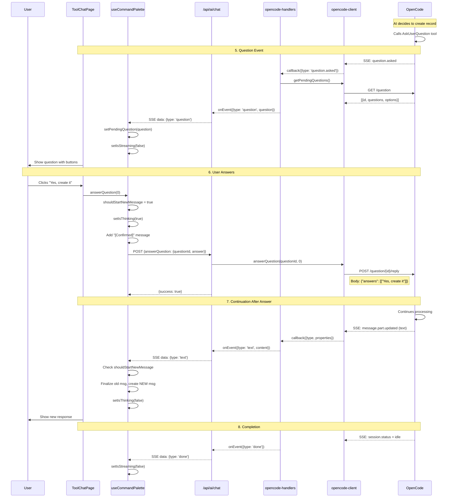

### OpenCode SSE Events

Events received from OpenCode's `/event` endpoint:

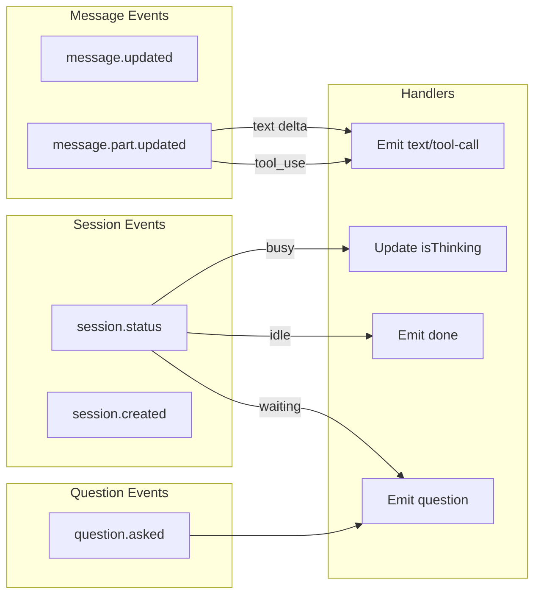

### Key State Variables

| Variable | Type | Purpose |
|----------|------|---------|
| `messages` | `ChatMessage[]` | All chat messages |
| `isStreaming` | `boolean` | API request in progress |
| `isThinking` | `boolean` | OpenCode is processing |
| `pendingQuestion` | `OpenCodeQuestion \| null` | Question awaiting answer |
| `opencodeSessionId` | `string \| null` | Persists conversation |
| `shouldStartNewMessage` | `Ref<boolean>` | Create new msg after answer |
| `answeredQuestionIds` | `Ref<Set<string>>` | Prevent duplicate questions |

### Message State Machine

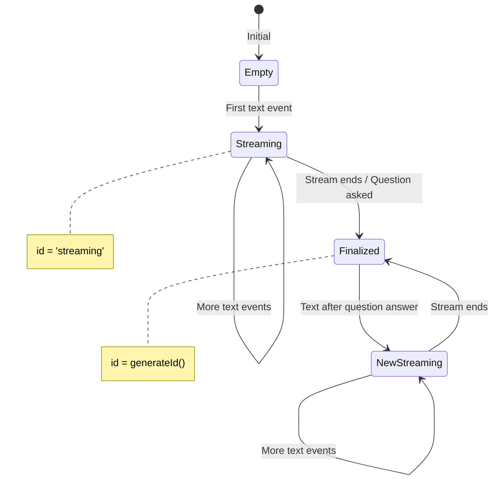

### OpenCode API Reference

| Endpoint | Method | Purpose |
|----------|--------|---------|
| `/event` | GET | SSE event stream |
| `/session` | POST | Create new session |
| `/session/{id}` | GET | Get session |
| `/session/{id}/message` | POST | Send message |
| `/question` | GET | List pending questions |
| `/question/{id}/reply` | POST | Answer question |
| `/question/{id}/reject` | POST | Reject question |
| `/global/health` | GET | Health check |
| `/mcp` | GET | MCP connection status |

### Answer Question Format

```typescript
// POST /question/{requestID}/reply
{
  "answers": [
    ["selected label"]  // Array of selected option labels
  ]
}

// Example - single selection
{ "answers": [["Yes, create it"]] }

// Example - multi-selection (if supported)
{ "answers": [["Option A", "Option B"]] }

// Example - multiple questions
{
  "answers": [
    ["Answer to Q1"],
    ["Answer to Q2"]
  ]
}
```

### Debugging Tips

#### Enable Debug Panel
Click "Debug" in the chat footer to see all SSE events in real-time.

#### Console Log Prefixes
- `[startAgenticChat]` - Initial chat setup
- `[sendAgenticMessage]` - Follow-up messages
- `[answerQuestion]` - Question answering
- `[OpenCode SSE]` - Backend SSE processing
- `[OpenCode Client]` - API client calls
- `[AI Chat]` - API route handling

#### Common Issues

| Issue | Cause | Solution |
|-------|-------|----------|
| Loader stays on | `isThinking` not reset | Ensure text events call `setIsThinking(false)` |
| Text appends to old msg | Same content variable | Check `shouldStartNewMessage` flag |
| Question not answered | Wrong endpoint/format | Use `/question/{id}/reply` with `{"answers": [["label"]]}` |
| Duplicate questions | Same question emitted | Track in `answeredQuestionIds` ref |
| Stream never ends | Heartbeat not triggering | Check session status polling |

### Extending the System

#### Adding New SSE Event Handlers

1. Update type in `opencode-handlers.ts`:
```typescript
export type OpenCodeStreamEvent =
  | { type: 'thinking' }
  | { type: 'text'; content: string }
  | { type: 'your-new-event'; data: YourType }  // Add here
  | ...
```

2. Handle in SSE switch statement:
```typescript
switch (type) {
  case 'your.new.event':
    await onEvent({ type: 'your-new-event', data: properties })
    break
}
```

3. Process in frontend hook:
```typescript
if (event.type === 'your-new-event') {
  // Handle in UI
}
```

## License

Proprietary - Open Mercato
