# AI Assistant Module

AI-powered assistance capabilities for Open Mercato, featuring MCP (Model Context Protocol) server integration and OpenCode as the AI backend.

## Quick Start (5 minutes)

### Step 1: Set Environment Variables

Add these to your `.env` file:

```bash
# MCP Server API Key - can be ANY secure string you choose
# This authenticates communication between OpenCode and the MCP server
MCP_SERVER_API_KEY=my-super-secret-key-12345

# OpenCode AI provider configuration
OPENCODE_PROVIDER=anthropic
OPENCODE_ANTHROPIC_API_KEY=sk-ant-api03-...
```

> **Important:** The `MCP_SERVER_API_KEY` is a shared secret between OpenCode and the MCP server. You can use any secure string - it doesn't need to be generated or obtained from anywhere. Just make sure it matches in both places.

### Step 2: Start the Services

```bash
# Terminal 1: Start MCP server
yarn mcp:serve

# Terminal 2: Start OpenCode container
docker-compose up opencode

# Terminal 3: Start Next.js app
yarn dev
```

### Step 3: Use the AI Assistant

- **Keyboard:** Press `Cmd+J` (Mac) or `Ctrl+J` (Windows/Linux) to open AI chat
- **Header:** Click the sparkles icon in the top header
- **Search:** Press `Cmd+K` to open the command palette, then ask a question

---

## Features

- **MCP Server** - HTTP server exposing platform tools via Model Context Protocol
- **OpenCode Integration** - AI backend for natural language processing and tool execution
- **API Discovery Tools** - Meta-tools for dynamic API access (`api_discover`, `api_execute`, `api_schema`)
- **Two-Tier Authentication** - Server-level API key + user-level session tokens
- **Session Management** - Ephemeral API keys with configurable TTL for secure tool execution
- **Dockable Chat Panel** - Resizable panel that can dock to right, left, bottom, or float as modal
- **Keyboard Shortcuts** - Quick access via `Cmd+K` (palette) and `Cmd+J` (direct chat)

---

## Keyboard Shortcuts

| Shortcut | Action |
|----------|--------|
| `Cmd+K` / `Ctrl+K` | Open command palette |
| `Cmd+J` / `Ctrl+J` | Open AI chat directly |
| `Escape` | Close palette or reset to idle |
| `Enter` | Submit query |

---

## UI Components

### Dockable Chat Panel

The AI chat panel can be positioned in different modes:

| Mode | Description |
|------|-------------|
| **Modal** | Centered overlay (default) |
| **Dock Right** | Fixed panel on right side |
| **Dock Left** | Fixed panel on left side |
| **Dock Bottom** | Fixed panel at bottom |

Click the position icons in the chat header to switch modes. Position preference is persisted in localStorage.

### Integration

```tsx
import {
  AiAssistantIntegration,
  AiChatHeaderButton,
} from '@open-mercato/ai-assistant/frontend'

function Layout({ children }) {
  return (
    <AiAssistantIntegration tenantId={auth.tenantId} organizationId={auth.orgId}>
      <Header>
        <AiChatHeaderButton />
      </Header>
      {children}
    </AiAssistantIntegration>
  )
}
```

## Architecture Overview


## Message Flow

```mermaid
sequenceDiagram
    participant User
    participant API as /api/chat
    participant DB as Database
    participant OC as OpenCode :4096
    participant MCP as MCP Server :3001

    User->>API: POST {messages, sessionId?}

    alt New Chat Session
        API->>DB: createSessionApiKey(userId, roles)
        DB-->>API: sessionToken (sess_xxx)
        API->>API: Inject token into message
    end

    API-->>User: SSE: {type: 'thinking'}
    API->>OC: POST /session/{id}/message

    loop Tool Execution
        OC->>MCP: Tool call with _sessionToken
        MCP->>MCP: Validate x-api-key (Tier 1)
        MCP->>DB: findApiKeyBySessionToken()
        DB-->>MCP: User's roles & permissions
        MCP->>MCP: Check tool permissions
        MCP-->>OC: Tool result
    end

    OC-->>API: SSE: message.part.updated
    API-->>User: SSE: {type: 'text', content: '...'}
    OC-->>API: SSE: session.status = idle
    API-->>User: SSE: {type: 'done', sessionId}
```



## Two-Tier Authentication


## Session Token Flow


## API Discovery Tools

```mermaid
flowchart LR
    subgraph "User Query"
        Q[User: "Find customers in New York"]
    end

    subgraph "AI Processing"
        A1[api_discover<br/>'customers search']
        A2[api_schema<br/>'/api/v1/customers']
        A3[api_execute<br/>GET /api/v1/customers]
    end

    subgraph "Results"
        R[15 customers found]
        Response[AI: "I found 15 customers<br/>in New York..."]
    end

    Q --> A1
    A1 -->|"Found endpoints"| A2
    A2 -->|"Got schema"| A3
    A3 --> R
    R --> Response
```

| Tool | Description |
|------|-------------|
| `api_discover` | Search for APIs by keyword, module, or HTTP method |
| `api_schema` | Get detailed schema for a specific endpoint |
| `api_execute` | Execute an API call with parameters |

---

## Detailed Configuration

### Environment Variables

```bash
# MCP Server API Key (required for production)
# This can be ANY secure string - just ensure it matches between .env and opencode.json
MCP_SERVER_API_KEY=your-secure-server-key-here

# OpenCode URL (default: http://localhost:4096)
OPENCODE_URL=http://localhost:4096
```

> **Note:** The `MCP_SERVER_API_KEY` is a shared secret you define yourself. It must be configured:
> 1. In your `.env` file (for the MCP server)
> 2. In OpenCode's `opencode.json` as the `x-api-key` header

### Verify Connectivity

```bash
curl http://localhost:3001/health          # MCP health
curl http://localhost:4096/global/health   # OpenCode health
curl http://localhost:4096/mcp             # MCP connection status
```

---

## MCP Server Modes

The module provides two MCP HTTP server modes for different use cases:

### Development Server (`yarn mcp:dev`)

A simplified HTTP server for local development. Authenticates once at startup using an API key.

**Features:**
- HTTP transport on port 3001 (configurable via `MCP_DEV_PORT`)
- Direct API key authentication (no session tokens needed)
- Tools filtered by API key permissions at startup
- Ideal for local testing and development

**Configuration (`.mcp.json`):**
```json
{
  "mcpServers": {
    "open-mercato": {
      "type": "http",
      "url": "http://localhost:3001/mcp",
      "headers": {
        "x-api-key": "omk_your_api_key_here"
      }
    }
  }
}
```

**Running:**
```bash
# API key from .mcp.json headers.x-api-key
yarn mcp:dev

# Or from environment variable
OPEN_MERCATO_API_KEY=omk_xxx yarn mcp:dev

# Custom port
MCP_DEV_PORT=3002 yarn mcp:dev

# Enable debug logging
MCP_DEBUG=true yarn mcp:dev
```

**Endpoints:**
- `POST http://localhost:3001/mcp` - MCP protocol endpoint
- `GET http://localhost:3001/health` - Health check

### Production Server (`yarn mcp:serve`)

A stateless HTTP server for production use. Requires two-tier authentication.

**Features:**
- HTTP transport on port 3001
- Two-tier authentication:
  1. Server-level: `x-api-key` header validated against `MCP_SERVER_API_KEY`
  2. User-level: `_sessionToken` parameter in each tool call
- Per-request permission checks based on user's session
- Ephemeral session tokens with 120-minute TTL

**Environment Variables:**
```bash
MCP_SERVER_API_KEY=your-secure-server-key-here
```

**How it works:**
1. Chat API creates a session token for the logged-in user
2. OpenCode connects with static `MCP_SERVER_API_KEY`
3. Each tool call includes `_sessionToken` in arguments
4. MCP server resolves user permissions from session token
5. Tool executes with user's ACL context

### Comparison

| Feature | Dev (`mcp:dev`) | Production (`mcp:serve`) |
|---------|-----------------|-------------------------|
| Authentication | API key only | API key + session tokens |
| Permission Check | Once at startup | Per tool call |
| Session Tokens | Not required | Required (`_sessionToken`) |
| Use Case | Local development | Web AI chat interface |
| User Context | From API key | From session token |

---

## OpenCode Integration

The AI Assistant uses **OpenCode** as the AI agent backend. OpenCode is a Go-based headless AI agent that connects to our MCP server for tool access.

### OpenCode SSE Events


### OpenCode Configuration

**Environment Variables:**
```bash
# Provider selection (required)
OPENCODE_PROVIDER=anthropic  # Options: anthropic, openai, google

# Model override (optional - uses provider default if not set)
OPENCODE_MODEL=

# Provider API keys (set the one matching OPENCODE_PROVIDER)
OPENCODE_ANTHROPIC_API_KEY=sk-ant-...
OPENCODE_OPENAI_API_KEY=sk-...
OPENCODE_GOOGLE_API_KEY=AIza...
```

**Default Models by Provider:**

| Provider | Default Model | Context Window |
|----------|---------------|----------------|
| `anthropic` | `claude-haiku-4-5-20251001` | 200K tokens |
| `openai` | `gpt-5-mini` | 128K tokens |
| `google` | `gemini-3-flash-preview` | 1M tokens |

**Example `opencode.json`:**
```json
{
  "provider": "anthropic",
  "model": "claude-haiku-4-5-20251001",
  "mcp": {
    "open-mercato": {
      "type": "sse",
      "url": "http://host.docker.internal:3001/mcp",
      "headers": {
        "x-api-key": "your-secure-server-key-here"
      }
    }
  }
}
```

### OpenCode API Reference

| Endpoint | Method | Purpose |
|----------|--------|---------|
| `/event` | GET | SSE event stream |
| `/session` | POST | Create new session |
| `/session/{id}` | GET | Get session |
| `/session/{id}/message` | POST | Send message |
| `/question` | GET | List pending questions |
| `/question/{id}/reply` | POST | Answer question |
| `/global/health` | GET | Health check |
| `/mcp` | GET | MCP connection status |

---

## API Key Entity Extension

The `api_keys` table includes session-specific fields:

```typescript
@Entity({ tableName: 'api_keys' })
export class ApiKey {
  // ... existing fields ...

  @Property({ name: 'session_token', type: 'text', nullable: true })
  sessionToken?: string | null

  @Property({ name: 'session_user_id', type: 'uuid', nullable: true })
  sessionUserId?: string | null
}
```

### Session Key Service Functions

```typescript
// Generate a unique session token
generateSessionToken(): string  // Returns: "sess_xxxxxxxx..."

// Create an ephemeral API key for a chat session
createSessionApiKey(em, {
  sessionToken: string,
  userId: string,
  userRoles: string[],      // Role IDs (not names)
  tenantId?: string | null,
  organizationId?: string | null,
  ttlMinutes?: number       // Default: 120
}): Promise<{ keyId, secret, sessionToken }>

// Look up a session key
findApiKeyBySessionToken(em, sessionToken): Promise<ApiKey | null>

// Delete a session key
deleteSessionApiKey(em, sessionToken): Promise<void>
```

---

## API Routes

| Route | Method | Description |
|-------|--------|-------------|
| `/api/chat` | POST | Streaming chat with AI (SSE) |
| `/api/tools` | GET | List all available tools |
| `/api/tools/execute` | POST | Execute a specific tool |
| `/api/settings` | GET/POST | AI provider configuration |
| `/api/mcp-servers` | GET/POST | External MCP server management |
| `/api/mcp-servers/[id]` | GET/PUT/DELETE | Single MCP server operations |

### Chat API Request/Response

**Request**:
```typescript
{
  messages: Array<{ role: 'user' | 'assistant'; content: string }>
  sessionId?: string  // Optional, for continuing conversation
}
```

**SSE Events**:
```typescript
type ChatSSEEvent =
  | { type: 'thinking' }
  | { type: 'text'; content: string }
  | { type: 'tool-call'; id: string; toolName: string; args: unknown }
  | { type: 'tool-result'; id: string; toolName: string; result: unknown }
  | { type: 'question'; question: OpenCodeQuestion }
  | { type: 'metadata'; model?: string; provider?: string; tokens?: { input: number; output: number } }
  | { type: 'done'; sessionId?: string }
  | { type: 'error'; error: string }
```

---

## Directory Structure

```
packages/ai-assistant/
├── src/
│   ├── index.ts                    # Package exports
│   ├── di.ts                       # Dependency injection setup
│   ├── types.ts                    # Shared TypeScript types
│   │
│   ├── modules/ai_assistant/
│   │   ├── index.ts                # Module exports
│   │   ├── acl.ts                  # Permission definitions
│   │   ├── cli.ts                  # CLI commands (mcp:serve, mcp:dev)
│   │   ├── di.ts                   # Module DI container
│   │   │
│   │   ├── lib/
│   │   │   ├── opencode-client.ts      # OpenCode server client
│   │   │   ├── opencode-handlers.ts    # Request handlers for OpenCode
│   │   │   ├── api-discovery-tools.ts  # api_discover, api_execute, api_schema
│   │   │   ├── api-endpoint-index.ts   # OpenAPI endpoint indexing
│   │   │   ├── http-server.ts          # MCP HTTP server implementation
│   │   │   ├── mcp-server.ts           # MCP stdio server implementation
│   │   │   ├── tool-registry.ts        # Global tool registration
│   │   │   ├── tool-executor.ts        # Tool execution logic
│   │   │   ├── tool-loader.ts          # Discovers tools from modules
│   │   │   ├── mcp-tool-adapter.ts     # Converts MCP tools to AI SDK format
│   │   │   └── types.ts                # Module-specific types
│   │   │
│   │   ├── api/chat/
│   │   │   └── route.ts            # POST /api/chat handler
│   │   │
│   │   └── frontend/components/
│   │       ├── AiAssistantSettingsPageClient.tsx
│   │       └── McpServersSection.tsx
│   │
│   └── frontend/
│       ├── index.ts                # Frontend exports
│       ├── types.ts                # Frontend TypeScript types
│       └── hooks/
│           └── useMcpTools.ts      # Tool fetching and execution
│
├── AGENTS.md                       # Technical guide for AI agents
└── README.md                       # This file
```

---

## Registering Tools


Register tools via `registerMcpTool()`:

```typescript
import { registerMcpTool } from '@open-mercato/ai-assistant/tools'
import { z } from 'zod'

registerMcpTool({
  name: 'my_module_action',
  description: 'Description of what this tool does',
  inputSchema: z.object({
    param1: z.string().describe('Description of param1'),
    param2: z.number().optional(),
  }),
  requiredFeatures: ['my_module.action'],
  handler: async (input, ctx) => {
    const service = ctx.container.resolve('myService')
    return { success: true, data: result }
  }
}, { moduleId: 'my_module' })
```

---

## Permissions (ACL)

| Feature ID | Description |
|------------|-------------|
| `ai_assistant.view` | View AI Assistant |
| `ai_assistant.settings.manage` | Manage AI settings |
| `ai_assistant.mcp.serve` | Start MCP Server |
| `ai_assistant.tools.list` | List MCP Tools |
| `ai_assistant.mcp_servers.view` | View MCP server configs |
| `ai_assistant.mcp_servers.manage` | Manage MCP server configs |

---

## Troubleshooting

| Symptom | Likely Cause | Fix |
|---------|--------------|-----|
| "Agent is working..." forever | OpenCode not responding | Check `curl http://localhost:4096/global/health` |
| "MCP connection failed" | MCP server not running | Start with `yarn mcp:serve` or `yarn mcp:dev` |
| Empty response | OpenCode not connected to MCP | Check `curl http://localhost:4096/mcp` |
| "Unauthorized" error | Missing/invalid API key | Check x-api-key in opencode.json matches MCP_SERVER_API_KEY |
| "Session expired" errors | Session token TTL exceeded | Start new chat session (creates new 120-min token) |
| Tools fail with UNAUTHORIZED | Missing _sessionToken | Verify AI is passing token in tool args |
| "Insufficient permissions" | User lacks required features | Check user's role assignments |

---

## Technical Notes

### Zod 4 Schema Handling

The module includes handling for Zod 4 schemas with the Vercel AI SDK. See [AGENTS.md](./AGENTS.md) for implementation details.

### Docker Configuration

```yaml
# docker-compose.yml
services:
  opencode:
    build: ./docker/opencode
    container_name: mercato-opencode
    ports:
      - "${OPENCODE_PORT:-4096}:4096"
    environment:
      # Provider selection (anthropic, openai, google)
      OPENCODE_PROVIDER: ${OPENCODE_PROVIDER:-anthropic}
      OPENCODE_MODEL: ${OPENCODE_MODEL:-}
      # Provider API keys (set the one matching OPENCODE_PROVIDER)
      ANTHROPIC_API_KEY: ${OPENCODE_ANTHROPIC_API_KEY:-}
      OPENAI_API_KEY: ${OPENCODE_OPENAI_API_KEY:-}
      GOOGLE_GENERATIVE_AI_API_KEY: ${OPENCODE_GOOGLE_API_KEY:-}
      # MCP configuration
      OPENCODE_MCP_URL: ${OPENCODE_MCP_URL:-http://host.docker.internal:3001/mcp}
      MCP_SERVER_API_KEY: ${MCP_SERVER_API_KEY:-}
    extra_hosts:
      - "host.docker.internal:host-gateway"
```

---

## License

Proprietary - Open Mercato
