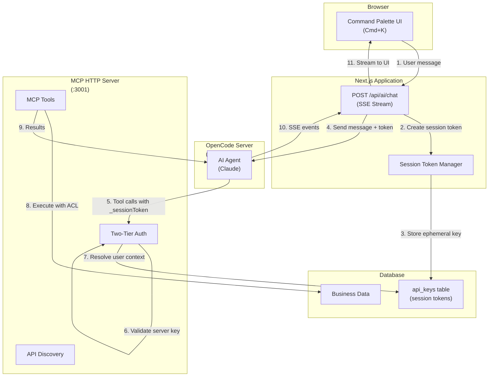
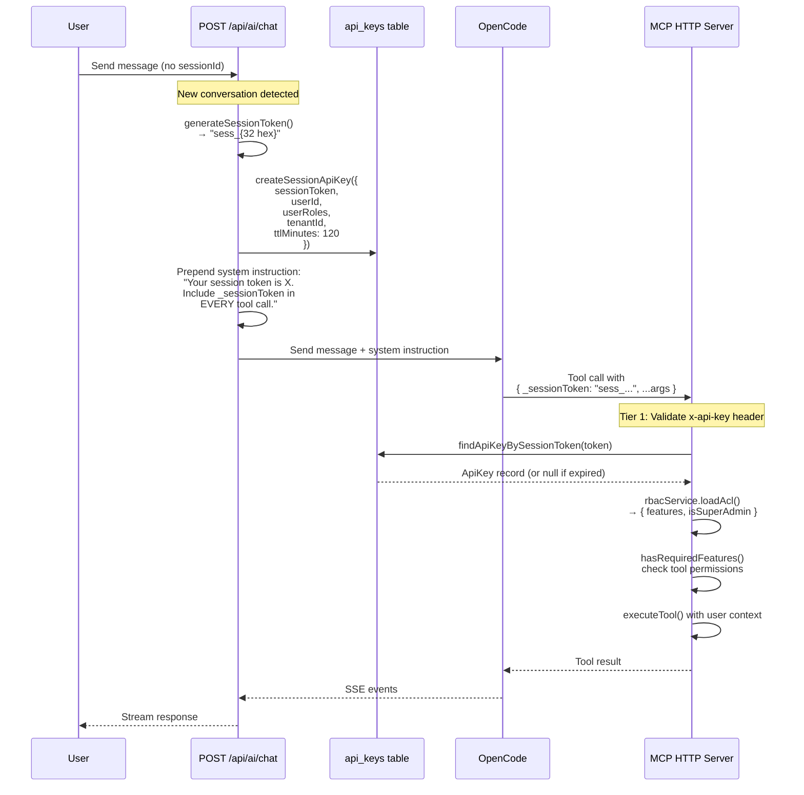
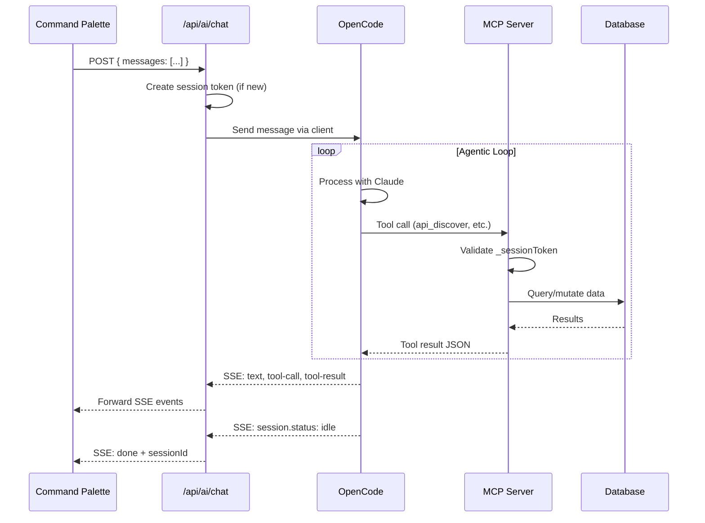
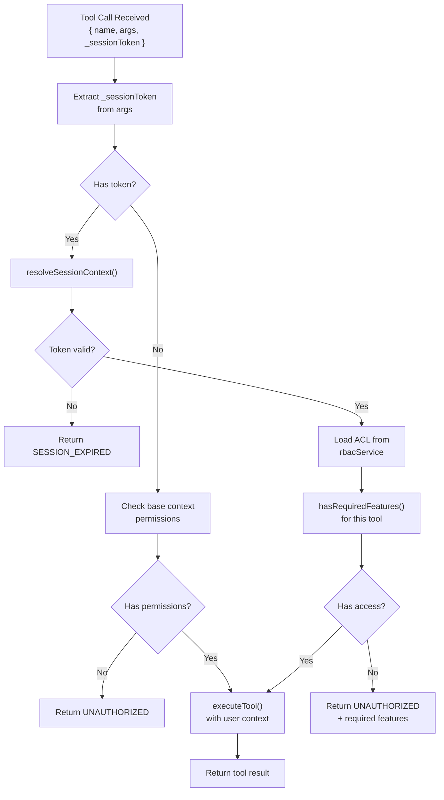
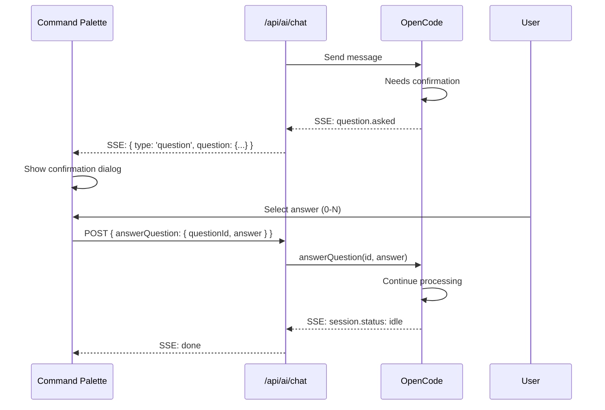

# AI Assistant Module - Architecture Documentation

## Overview

The `ai_assistant` module provides AI-powered assistance capabilities for Open Mercato through a multi-layered architecture. It exposes business logic via MCP (Model Context Protocol) tools that external AI agents (like OpenCode) can invoke to search, analyze, and manipulate data on behalf of authenticated users.

### Key Capabilities

- **MCP HTTP Server** - Exposes tools to external AI agents via Model Context Protocol
- **API Discovery Tools** - Meta-tools for dynamic API access (`api_discover`, `api_execute`, `api_schema`)
- **Hybrid Search** - Combines fulltext, vector, and keyword search for tool/API discovery
- **Two-Tier Authentication** - Server-level + user-level authorization with session tokens
- **SSE Streaming** - Real-time event streaming for chat interactions

---

## Configuration

### Environment Variables

| Variable | Description | Required |
|----------|-------------|----------|
| `MCP_SERVER_API_KEY` | Static API key for server-level authentication | Yes |
| `MCP_SERVER_URL` | MCP server endpoint (e.g., `http://host.docker.internal:3001/mcp`) | Yes |
| `OPENCODE_PROVIDER` | AI provider: `anthropic`, `openai`, or `google` (default: `anthropic`) | No |
| `OPENCODE_ANTHROPIC_API_KEY` | Anthropic API key (when using `anthropic` provider) | Yes* |
| `OPENCODE_OPENAI_API_KEY` | OpenAI API key (when using `openai` provider) | Yes* |
| `OPENCODE_GOOGLE_API_KEY` | Google API key (when using `google` provider) | Yes* |
| `OPENCODE_MODEL` | Override default model (e.g., `anthropic/claude-sonnet-4-20250514`) | No |

*Set the API key matching your chosen `OPENCODE_PROVIDER`.

### OpenCode Configuration (`opencode.jsonc`)

The configuration is generated at container startup via `docker/opencode/entrypoint.sh`. Values are injected from environment variables - **never hardcode secrets**.

```jsonc
{
  "$schema": "https://opencode.ai/config.json",
  "provider": {
    "anthropic": {}  // Provider configured via OPENCODE_PROVIDER env var
  },
  "model": "anthropic/claude-haiku-4-5-20251001",  // Override via OPENCODE_MODEL
  "instructions": ["AGENTS.md"],
  "tools": {
    // Disable file system tools - MCP provides all capabilities
    "write": false, "bash": false, "edit": false,
    "read": false, "glob": false, "grep": false,
    "todoread": false, "todowrite": false
  },
  "mcp": {
    "open-mercato": {
      "type": "remote",
      "url": "${MCP_SERVER_URL}",      // Injected from env (e.g., http://host.docker.internal:3001/mcp)
      "headers": {
        "x-api-key": "${MCP_SERVER_API_KEY}"  // Injected from env
      },
      "enabled": true
    }
  },
  "permission": "allow",
  "server": {
    "port": 4096,
    "hostname": "0.0.0.0"
  }
}
```

**Docker Compose Configuration:**

```yaml
services:
  opencode:
    build: ./docker/opencode
    environment:
      - OPENCODE_PROVIDER=${OPENCODE_PROVIDER:-anthropic}
      - OPENCODE_MODEL=${OPENCODE_MODEL:-anthropic/claude-haiku-4-5-20251001}
      - OPENCODE_ANTHROPIC_API_KEY=${OPENCODE_ANTHROPIC_API_KEY}
      - MCP_SERVER_URL=http://host.docker.internal:3001/mcp
      - MCP_SERVER_API_KEY=${MCP_SERVER_API_KEY}
```

---

## System Architecture



---

## Two-Tier Authentication System

The MCP HTTP server implements a two-tier authentication model to ensure secure multi-tenant access:

### Tier 1: Server-Level Authentication

**Purpose**: Validates that the request comes from an authorized AI agent (OpenCode)

- **Header**: `x-api-key`
- **Value**: Static API key from `MCP_SERVER_API_KEY` environment variable
- **Validation**: Direct string comparison
- **Scope**: Grants access to call MCP endpoints (but no user permissions)

```typescript
// http-server.ts:370-391
const providedApiKey = extractApiKeyFromHeaders(headers)
if (providedApiKey !== serverApiKey) {
  res.writeHead(401, { 'Content-Type': 'application/json' })
  res.end(JSON.stringify({ error: 'Invalid API key' }))
  return
}
```

### Tier 2: User-Level Authentication

**Purpose**: Identifies the user and loads their permissions (ACL) for each tool call

- **Parameter**: `_sessionToken` (injected into every tool call)
- **Format**: `sess_{32 hex chars}` (e.g., `sess_a1b2c3d4...`)
- **TTL**: 120 minutes (2 hours)
- **Storage**: `api_keys` table with `sessionToken`, `sessionUserId`, `rolesJson` columns
- **Resolution**: `findApiKeyBySessionToken()` → `rbacService.loadAcl()`

```typescript
// http-server.ts:32-88 - resolveSessionContext()
const sessionKey = await findApiKeyBySessionToken(em, sessionToken)
const acl = await rbacService.loadAcl(`api_key:${sessionKey.id}`, {
  tenantId: sessionKey.tenantId ?? null,
  organizationId: sessionKey.organizationId ?? null,
})
```

---

## Session Token Flow



### Key Functions

| Function | Location | Purpose |
|----------|----------|---------|
| `generateSessionToken()` | `apiKeyService.ts:99` | Creates `sess_{32 hex}` token |
| `createSessionApiKey()` | `apiKeyService.ts:107` | Stores token with user roles in DB |
| `findApiKeyBySessionToken()` | `apiKeyService.ts:143` | Looks up session by token |
| `resolveSessionContext()` | `http-server.ts:32` | Resolves user context from token |
| `hasRequiredFeatures()` | `auth.ts:127` | Checks tool ACL permissions |

---

## SSE Event Types

Events emitted during chat interactions:

| Event Type | Description | Payload |
|------------|-------------|---------|
| `session-authorized` | Session token created for new chat | `{ sessionToken: "sess_..." }` |
| `thinking` | Agent started processing | `{}` |
| `text` | Response text chunk | `{ content: string }` |
| `tool-call` | Tool invocation | `{ id, toolName, args }` |
| `tool-result` | Tool response | `{ id, result }` |
| `question` | Agent asking for confirmation | `{ question: OpenCodeQuestion }` |
| `metadata` | Model/token info | `{ model, provider, tokens, durationMs }` |
| `debug` | Internal debugging info | `{ partType, data }` |
| `done` | Processing complete | `{ sessionId }` |
| `error` | Error occurred | `{ error: string }` |

---

## Communication Flow Diagrams

### Complete Message Flow



### Tool Execution Flow



### Question/Confirmation Flow



---

## Key Files Reference

| File | Purpose |
|------|---------|
| `lib/http-server.ts` | MCP HTTP server with two-tier auth |
| `lib/auth.ts` | Authentication helpers, ACL checks |
| `lib/opencode-handlers.ts` | SSE streaming, question handling |
| `lib/opencode-client.ts` | OpenCode API client |
| `lib/tool-executor.ts` | Tool execution with context |
| `lib/tool-registry.ts` | Global tool registration |
| `lib/api-discovery-tools.ts` | `api_discover`, `api_execute`, `api_schema` tools |
| `lib/api-endpoint-index.ts` | OpenAPI endpoint indexing |
| `api/chat/route.ts` | Chat endpoint, session token creation |
| `@open-mercato/core/.../apiKeyService.ts` | Session token generation/lookup |

---

## MCP HTTP Server Details

### Stateless Request Model

Each HTTP request creates a new MCP server instance:

```typescript
// http-server.ts:95-278
function createMcpServerForRequest(config, toolContext): McpServer {
  const server = new McpServer(...)

  // Register ALL tools - ACL checked per-call via _sessionToken
  for (const tool of tools) {
    // Inject _sessionToken parameter into schema
    properties._sessionToken = {
      type: 'string',
      description: 'Session authorization token (REQUIRED for all tool calls)',
    }

    server.registerTool(tool.name, { inputSchema }, async (args) => {
      const sessionToken = args._sessionToken
      const effectiveContext = await resolveSessionContext(sessionToken, ...)
      // Execute with user's permissions
    })
  }
}
```

### Schema Transformation

Tool schemas are transformed to include `_sessionToken`:

1. Convert Zod schema to JSON Schema
2. Inject `_sessionToken` property
3. Convert back to Zod with `.passthrough()`
4. AI agent sees token as required parameter

### Per-Tool ACL Checks

```typescript
// http-server.ts:219-239
if (tool.requiredFeatures?.length) {
  const hasAccess = hasRequiredFeatures(
    tool.requiredFeatures,
    effectiveContext.userFeatures,
    effectiveContext.isSuperAdmin
  )
  if (!hasAccess) {
    return { error: 'Insufficient permissions', code: 'UNAUTHORIZED' }
  }
}
```
