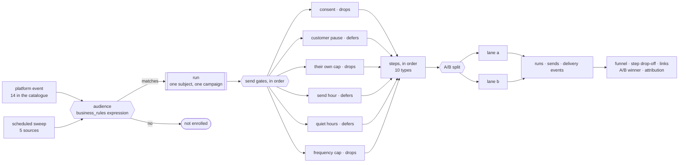

# @open-mercato/marketing-automation

Campaigns for Open Mercato: a merchant authors a journey on a canvas, the platform's own events start it, and
every message it sends is answerable for afterwards — who got it, who did not, and why.

Open Mercato had no marketing automation. Two analyses in this repository name the gap: `ANALYSIS-008` ("OM has
`CustomerTag` for grouping but no dynamic segmentation engine", "Marketing Workflows — OUT OF SCOPE") and
`ANALYSIS-002` ("Mercato has no marketing automation module"). This is an optional package that fills it without
changing how any existing module behaves.

## What a merchant can do

- **Author a journey visually** — triggers, an audience built with the platform's existing condition builder, and
  an ordered chain of steps, one of which may be an A/B split.
- **Target by behaviour, not by tag** — order counts and totals, recency, purchased SKUs and categories, sales
  channel, engagement and silence, RFM quintiles computed over the shop's own buyers, projected value, loyalty
  tier, saved segments.
- **See the volume before publishing** — "the next scheduled pass will start this journey for at most 6 people,
  and each can receive up to 2 messages", asked at the click that starts it.
- **Read what happened** — a funnel counted in people, the drop-off step by step inside the journey, which links
  were clicked, per-variant A/B results with a winner decided on clicks or on attributed revenue, and linear
  multi-touch attribution per currency.
- **Answer "why didn't this customer get it?"** — for one campaign and one person, which gate refused: audience,
  consent, their own pause or cap, the send hour, quiet hours, the frequency cap.
- **Honour "take me off the list"** — from the message, from a portal preference centre, recorded on a customer's
  behalf by whoever answers the phone, or imported in bulk from the tool the shop is leaving.

## The execution model

A campaign is a **spine, not a general workflow graph**. Any one of its triggers starts a run for one subject;
the audience decides whether that run proceeds; the steps then execute in order. The only branch is an A/B split,
and which lane a subject walks is decided by the engine and recorded on the run — never recomputed, or every
historical result would become fiction the moment an author edited the split.

**The two kinds of stop are never conflated.** A wait has done its job, so the run resumes *after* it; quiet hours
have not let the message out, so it resumes *at the same step*. Swapping them either drops a send or sends twice.

**Consent is checked before any timing gate.** Permission is not "not yet": a refused message is dropped and
recorded as suppressed, never deferred, because deferring it only sends it later.

## What it reuses rather than rebuilds

| Need | Reused |
|---|---|
| audience conditions | `business_rules` — the same builder and evaluator the rest of the platform uses. No second condition language |
| tagging | the `customers.tags.assign` command. **No new tag storage** |
| email | `sendEmail` from `@open-mercato/shared`; transports come from `communication_channels` |
| triggers | the platform event bus, through convention subscribers |
| canvas | `@xyflow/react`, already a dependency |
| background work | `@open-mercato/queue`; `@open-mercato/scheduler` as an **optional** peer |
| CRUD, tables, forms | `makeCrudRoute`, `DataTable`, `CrudForm` |

A dedicated engine rather than `workflows` or `business_rules` actions, for reasons written out in the spec:
`workflows`' `ActivityType` is a frozen contract surface and its `SEND_EMAIL` resolves a DI key nothing registers
in production, and `business_rules`' action handler map has no extension point. Reusing either would have turned a
self-contained package into a pull request that changes core.

## What is in the box

| | |
|---|---|
| Entities / migrations | 23 / 23 |
| Step types | 10 — send email, wait, add tag, add points, assign owner, A/B split, notify a colleague, emit a signal, issue a referral code, ask an NPS question |
| Triggers | 14 platform events, plus 5 periodic sweep sources |
| API routes | 53, each with an OpenAPI block; 5 of them public and authorised only by a signed token |
| Backend screens | 15, plus a customer-portal preference centre |
| ACL features | 6, with publishing gated separately from editing |
| Translations | 5 locales, 732 keys — zero missing, zero unused, zero hardcoded strings |
| Tests | **1039 unit**, **256 integration**, 41 of them driving real screens in a browser |

## Architecture rules that are checked, not just written

`.dependency-cruiser.cjs` in this package turns four sentences from its `AGENTS.md` into a gate: `lib/engine/` may
not reach for React, an ORM, Next or the container; it may not import ORM entities; nothing may form an import
cycle; and nothing here may reach into the commercial `packages/enterprise`. It found two real cycles the first
time it ran. `knip.json` beside it reports exports and types nothing imports — this module shipped a write-only
column once and would rather not again.

The engine's purity is the point: `lib/engine/` is the sequencing logic, and it is testable without a database
because nothing in it knows one exists. The journey preview drives the *real* executor with recording effects
rather than re-implementing it, so a preview cannot drift from what the campaign will actually do.

## Deliberately not built

Abandoned cart, browse abandonment and build-a-cart (need a cart and a storefront — `SPEC-029`); SMS, WhatsApp and
push to customers (a channel provider belongs in its own `packages/channel-*`, and customer push needs a device
registry the platform keys to staff users); back-in-stock (the availability contract); delivered/bounced status
(provider feedback webhooks); per-customer coupons (a promotions engine — `SPEC-055` is approved and
unimplemented, and a code nothing redeems is a promise the shop cannot keep). Email is the only channel that
reaches a customer today. Each item's reason is recorded in the roadmap rather than left as a gap.

## Where to read more

| | |
|---|---|
| Specification | [`.ai/specs/2026-09-28-marketing-automation-module.md`](../../.ai/specs/2026-09-28-marketing-automation-module.md) |
| Roadmap and the parity audit | [`.ai/specs/2026-09-28-marketing-automation-full-port-roadmap.md`](../../.ai/specs/2026-09-28-marketing-automation-full-port-roadmap.md) |
| Working on this module | [`src/modules/marketing_automation/AGENTS.md`](src/modules/marketing_automation/AGENTS.md) — invariants, reference files, and the mistakes already made once |
